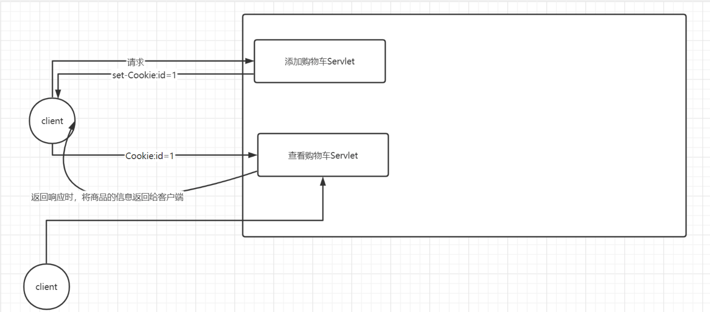
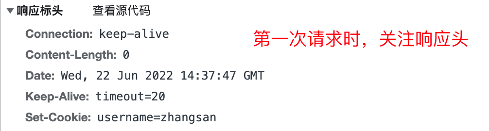
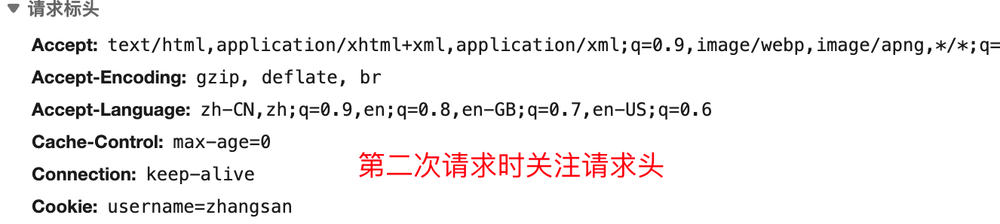
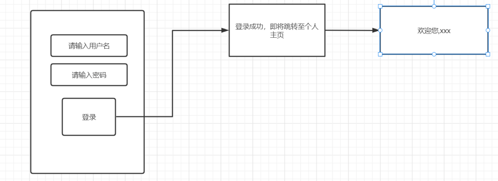
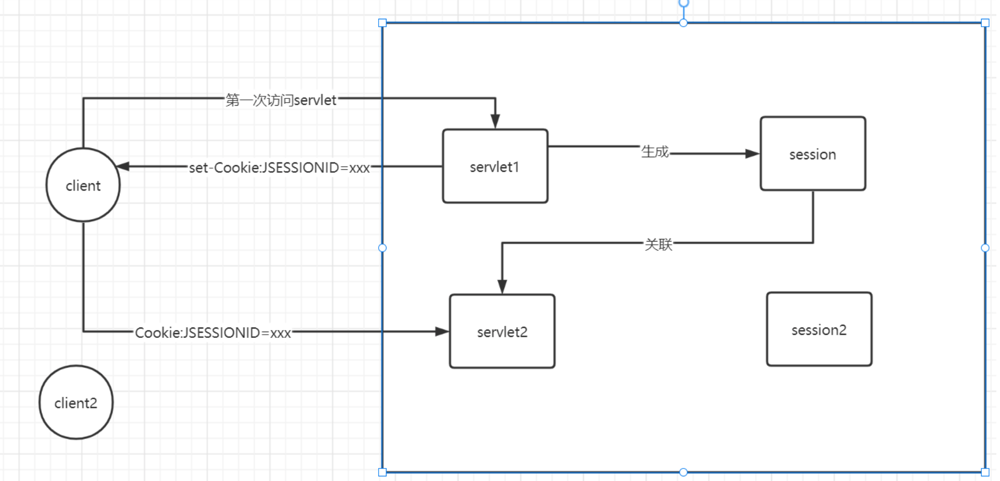
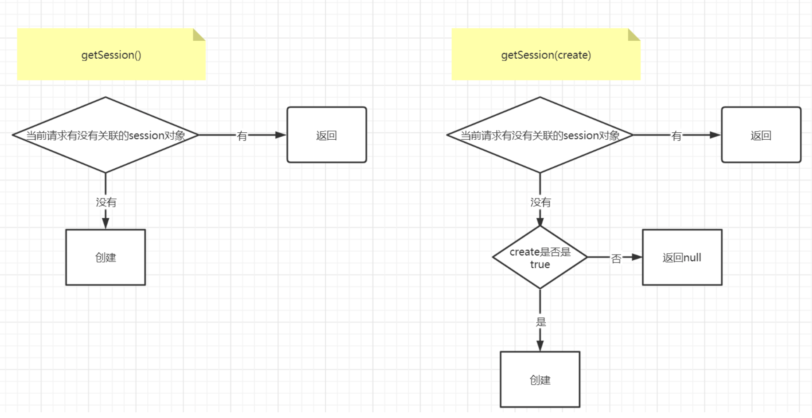
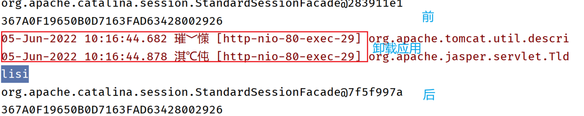
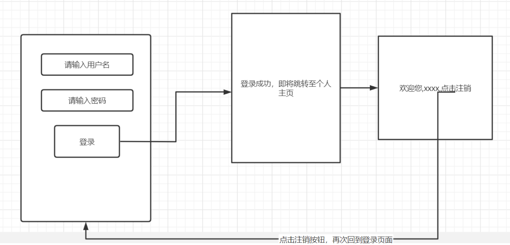

# 会话技术

## HTTP协议无状态性及会话技术

HTTP协议是无状态的。意味着服务器无法区分多个请求之间的区别，也就是无法识别出请求究竟来自于哪个客户端，也就无法给不同客户端返回不同的信息。通过一个实验我们来验证。在服务器部署如下代码，然后使用不同的客户端分别向当前地址发送HTTP请求。

```java
package com.cskaoyan.cookie;

import javax.servlet.ServletException;
import javax.servlet.annotation.WebServlet;
import javax.servlet.http.HttpServlet;
import javax.servlet.http.HttpServletRequest;
import javax.servlet.http.HttpServletResponse;
import java.io.IOException;
import java.util.Enumeration;

/**
 * @ClassName ${NAME}
 * @Description: TODO
 * @Author 远志 zhangsong@cskaoyan.onaliyun.com
 * @Version V1.0
 **/
@WebServlet("/cookie1")
public class CookieServlet extends HttpServlet {
    protected void doPost(HttpServletRequest request, HttpServletResponse response) throws ServletException, IOException {

    }

    protected void doGet(HttpServletRequest request, HttpServletResponse response) throws ServletException, IOException {
        //打印出不同客户端访问当前servlet时，请求报文   请求行、请求头
        String remoteAddr = request.getRemoteAddr();
        int remotePort = request.getRemotePort();
        System.out.println("来自于" + remoteAddr + "客户端使用" + remotePort + "端口号访问了服务器，相应的请求报文如下：");
        String method = request.getMethod();
        String requestURI = request.getRequestURI();
        String protocol = request.getProtocol();
        System.out.println(method + " " + requestURI + " " + protocol);

        Enumeration<String> headerNames = request.getHeaderNames();
        while (headerNames.hasMoreElements()){
            String headerName = headerNames.nextElement();
            String headerValue = request.getHeader(headerName);
            System.out.println(headerName + ":" + headerValue);
        }
    }
}
```

```
来自于192.168.13.157客户端使用52720端口号访问了服务器，相应的请求报文如下：
GET /app/cookie1 HTTP/1.1
host:192.168.13.82
connection:keep-alive
upgrade-insecure-requests:1
user-agent:Mozilla/5.0 (Windows NT 10.0; Win64; x64) AppleWebKit/537.36 (KHTML, like Gecko) Chrome/102.0.5005.63 Safari/537.36
accept:text/html,application/xhtml+xml,application/xml;q=0.9,image/avif,image/webp,image/apng,*/*;q=0.8,application/signed-exchange;v=b3;q=0.9
accept-encoding:gzip, deflate
accept-language:zh-CN,zh;q=0.9

来自于192.168.13.145客户端使用59265端口号访问了服务器，相应的请求报文如下：
GET /app/cookie1 HTTP/1.1
host:192.168.13.82
connection:keep-alive
upgrade-insecure-requests:1
user-agent:Mozilla/5.0 (Windows NT 10.0; Win64; x64) AppleWebKit/537.36 (KHTML, like Gecko) Chrome/101.0.4951.64 Safari/537.36 Edg/101.0.1210.53
accept:text/html,application/xhtml+xml,application/xml;q=0.9,image/webp,image/apng,*/*;q=0.8,application/signed-exchange;v=b3;q=0.9
accept-encoding:gzip, deflate
accept-language:zh-CN,zh;q=0.9,en;q=0.8,en-GB;q=0.7,en-US;q=0.6
```

结论：不同的客户端访问同一个服务器上面的资源时，请求报文基本上是一模一样的。

**对于服务器来说，客户端发送的HTTP请求报文，在服务器看来都是一模一样的。不可能通过HTTP请求报文区分出请求是来自于哪个客户端。这个现象也叫作HTTP协议无状态性。**

但是，在实际的web访问过程中，我们发现实际却并非如此。比如接下来的地址：

(http://shopping.dangdang.com/shoppingcart/shopping_cart.aspx?product_ids=0&referer=http://shopping.dangdang.com/shoppingcart/shopping_cart.aspx&prev_referer=http://shopping.dangdang.com/shoppingcart/shopping_cart_add.aspx?product_ids=29212910&referer=http://search.dangdang.com/?key=%D6%A3%D4%A8%BD%E0&act=input&prev_referer=http://www.dangdang.com/)

这是当当网的购物车链接。在访问当前地址之前，我向购物车中加入了某个商品，随后访问该地址时，购物车中可以显示出我刚刚加入的这个商品。但是我将链接分享给大家，大家打开之后看到的结果大概率和我不同。这个过程和上述结论是相互违背的。**为什么此时服务器可以识别出请求来自于哪个客户端呢？主要在于在实际的web访问过程中，HTTP协议中引入了会话技术。会话技术的出现就是为了解决HTTP协议无状态性。**


如果将客户端和服务器之间的通讯过程用拟人化的语句来表示：

客户端：帮我打开商品1的页面

服务器：打开了该页面

客户端：将这个商品加入到我的购物车

服务器：？？？？？？（对于我，理解不了）

会话技术的出现主要是为了解决服务器无法记住我是谁，这个问题；帮助服务器去记住我是谁。


会话技术可以分为两类，一类是客户端技术，代表是cookie；一类是服务器技术，代表是session

## 客户端技术-Cookie

### 原理

> Creates a cookie, a small amount of information **sent by a servlet to a Web browser**, **saved by the browser**, and **later sent back to the server**. A cookie's value can uniquely identify a client, so cookies are commonly used for session management.

cookie数据产生是位于服务器，产生了数据之后会通过HTTP响应报文（set-Cookie响应头）传输给客户端，客户端随即会将该部分数据保存，当客户端下次再去访问服务器，那么会把这部分数据通过HTTP请求报文（Cookie请求头）再次携带回来，通过这种方式，就可以知道了请求来自于哪个客户端。

**Cookie的本质其实就是在HTTP请求报文和HTTP响应报文中分别引入了Cookie请求头以及set-Cookie响应头。**



### 实操

- 生成cookie数据
- 将cookie数据通过HTTP响应报文返回给客户端
- 客户端下次再去访问服务器时，会把cookie信息再次携带回来，服务器需要从请求报文中获取到cookie信息

```java
package com.cskaoyan.cookie;

import javax.servlet.ServletException;
import javax.servlet.annotation.WebServlet;
import javax.servlet.http.Cookie;
import javax.servlet.http.HttpServlet;
import javax.servlet.http.HttpServletRequest;
import javax.servlet.http.HttpServletResponse;
import java.io.IOException;

/**
 * @ClassName ${NAME}
 * @Description: TODO
 * @Author 远志 zhangsong@cskaoyan.onaliyun.com
 * @Version V1.0
 **/
@WebServlet("/cookie2")
public class CookieServlet2 extends HttpServlet {
    protected void doPost(HttpServletRequest request, HttpServletResponse response) throws ServletException, IOException {

    }

    protected void doGet(HttpServletRequest request, HttpServletResponse response) throws ServletException, IOException {
        //编写代码去获取客户端提交过来的cookie Cookie请求头
        Cookie[] cookies = request.getCookies();
        if(cookies != null){
            for (Cookie cookie : cookies) {
                System.out.println(cookie.getName() + "=" + cookie.getValue());
            }
        }

        //生成cookie数据 Cookie(java.lang.String name, java.lang.String value)
        Cookie cookie = new Cookie("username", "zhangsan");
        //将生成的cookie数据返回给客户端  响应报文的响应头  set-Cookie响应头
//        response.setHeader("set-Cookie", "username=zhangsan");
        //实际上，ee规范同样给我们提供了一个简化的api
        response.addCookie(cookie);
    }
}
```

随后抓包进行验证，第一次请求中着重关注是否有set-Cookie响应头；第二次请求中着重关注是否有Cookie请求头





### 案例1

利用cookie会话技术来实现一个简单登录功能，要求在个人主页可以显示出用户的用户名。

使用不同的浏览器来验证，不同的用户登录了当前网站之后，显示的用户名是不同的。



```html
<!DOCTYPE html>
<html lang="en">
<head>
    <meta charset="UTF-8">
    <title>Title</title>
</head>
<body>
    <form action="/app/user/login" method="post">
        <input type="text" name="username" placeholder="请输入用户名"><br>
        <input type="password" name="password" placeholder="请输入密码"><br>
        <input type="submit">
    </form>
</body>
</html>
```

```java
package com.cskaoyan.cookie;

import javax.servlet.ServletException;
import javax.servlet.annotation.WebServlet;
import javax.servlet.http.Cookie;
import javax.servlet.http.HttpServlet;
import javax.servlet.http.HttpServletRequest;
import javax.servlet.http.HttpServletResponse;
import java.io.IOException;

/**
 * @ClassName ${NAME}
 * @Description: TODO
 * @Author 远志 zhangsong@cskaoyan.onaliyun.com
 * @Version V1.0
 **/
@WebServlet("/user/*")
public class UserServlet extends HttpServlet {
    protected void doPost(HttpServletRequest request, HttpServletResponse response) throws ServletException, IOException {
        //首先进行方法的分发
        String requestURI = request.getRequestURI();
        String op = requestURI.replace(request.getContextPath() + "/user/", "");
        if("login".equals(op)){
            login(request, response);
        }
    }

    private void login(HttpServletRequest request, HttpServletResponse response) {
        //1.获取请求参数 因为此时不涉及文件上传，就是使用的普通的表单来提交数据
        String username = request.getParameter("username");
        String password = request.getParameter("password");

        //需要跳转至另外一个页面/user/info  显示出用户名
        //需要两个servlet运行时共享数据，context域（存储用户的数据不合适）、request域（严格的条件，转发）
        //采取的策略是将username的数据返回给客户端，让客户端自行去保存，下一次访问时，再次把数据携带回来
        Cookie cookie = new Cookie("username", username);
        //这一行代码的作用是发送一个set-Cookie：username=xxx
        response.addCookie(cookie);

        response.setHeader("refresh", "2;url=" + request.getContextPath() + "/user/info");
    }

    protected void doGet(HttpServletRequest request, HttpServletResponse response) throws ServletException, IOException {
        String requestURI = request.getRequestURI();
        String op = requestURI.replace(request.getContextPath() + "/user/", "");
        if("info".equals(op)){
            info(request, response);
        }

    }

    private void info(HttpServletRequest request, HttpServletResponse response) throws IOException {
        //需要显示出欢迎您，xxxx
        Cookie[] cookies = request.getCookies();
        if(cookies != null){
            for (Cookie cookie : cookies) {
                if("username".equals(cookie.getName())){
                    response.getWriter().println("欢迎您," + cookie.getValue());
                }
            }
        }
    }
}
```

### 案例2

页面中显示出用户上次访问当前页面的时间。

```java
package com.cskaoyan.cookie;

import javax.servlet.ServletException;
import javax.servlet.annotation.WebServlet;
import javax.servlet.http.Cookie;
import javax.servlet.http.HttpServlet;
import javax.servlet.http.HttpServletRequest;
import javax.servlet.http.HttpServletResponse;
import java.io.IOException;
import java.util.Date;

/**
 * @ClassName ${NAME}
 * @Description: TODO
 * @Author 远志 zhangsong@cskaoyan.onaliyun.com
 * @Version V1.0
 **/
@WebServlet("/last")
public class LastLoginServlet extends HttpServlet {
    protected void doPost(HttpServletRequest request, HttpServletResponse response) throws ServletException, IOException {

    }

    protected void doGet(HttpServletRequest request, HttpServletResponse response) throws ServletException, IOException {
        //显示用户上次访问当前页面的时间
        //获取客户端提交过来的cookie
        Cookie[] cookies = request.getCookies();
        if(cookies != null){
            for (Cookie cookie : cookies) {
                if("time".equals(cookie.getName())){
                    //  "123" ---->  123
                    response.getWriter().println(new Date(Long.parseLong(cookie.getValue())));
                }
            }
        }
        //cookie的value值不可以有空格
        Cookie cookie = new Cookie("time", System.currentTimeMillis() + "");
        response.addCookie(cookie);
    }
}
```

### 设置存活时间

默认情况下，cookie仅存在于浏览器的内存中，也就是说浏览器的开启这段时间是有效的；如果浏览器关闭， 则cookie失效；如果希望cookie能够进行持久化保存，可以设置一个时间。

```java
Cookie cookie = new Cookie("time", System.currentTimeMillis() + "");
//单位是秒
cookie.setMaxAge(180);
response.addCookie(cookie);
```

设置正数，表示的是在硬盘存活多少秒

设置负数，表示的是存在于浏览器的内存中

**设置0，表示的是删除cookie**

```java
package com.cskaoyan.cookie;

import javax.servlet.ServletException;
import javax.servlet.annotation.WebServlet;
import javax.servlet.http.Cookie;
import javax.servlet.http.HttpServlet;
import javax.servlet.http.HttpServletRequest;
import javax.servlet.http.HttpServletResponse;
import java.io.IOException;
import java.util.Date;

/**
 * @ClassName ${NAME}
 * @Description: TODO
 * @Author 远志 zhangsong@cskaoyan.onaliyun.com
 * @Version V1.0
 **/
@WebServlet("/last2")
public class LastLoginServlet2 extends HttpServlet {
    protected void doPost(HttpServletRequest request, HttpServletResponse response) throws ServletException, IOException {

    }

    protected void doGet(HttpServletRequest request, HttpServletResponse response) throws ServletException, IOException {
        //显示用户上次访问当前页面的时间
        //获取客户端提交过来的cookie
        Cookie[] cookies = request.getCookies();
        if(cookies != null){
            for (Cookie cookie : cookies) {
                if("time".equals(cookie.getName())){
                    //  "123" ---->  123
                    response.getWriter().println(new Date(Long.parseLong(cookie.getValue())));
                    cookie.setMaxAge(0);
                    //因为cookie是存储在客户端的，而上面这行代码设置的是服务器中的一个对象，
                    //再次将所做的修改发送给客户端，让客户端去删除cookie
                    response.addCookie(cookie);
                }
            }
        }
    }
}
```

### 设置路径

**在没有设置路径的情况下，只有在请求和当前serlvet同路径的情况下才会携带cookie中的数据，包括同级目录以及下级目录。**

比如在访问http://localhost/app/a/b/c/servlet1时设置了一个cookie，如果没有主动设置path，

那么当访问http://localhost/app/a/b/c/servlet2时会携带cookie

访问http://localhost/app/a/b/c/d/servlet1时也会携带cookie

但是访问http://localhost/app/a/b时不会携带

访问http://localhost/app/a时不会携带

**如果设置了路径，那么当访问当前路径以及当前路径的下级目录时会携带。**

```java
package com.sz.test1;

import javax.servlet.ServletException;
import javax.servlet.annotation.WebServlet;
import javax.servlet.http.Cookie;
import javax.servlet.http.HttpServlet;
import javax.servlet.http.HttpServletRequest;
import javax.servlet.http.HttpServletResponse;
import java.io.IOException;

@WebServlet("/a/b/c/servlet1")
public class CookieServlet2 extends HttpServlet {
    @Override
    protected void doGet(HttpServletRequest request, HttpServletResponse response) throws ServletException, IOException {
        Cookie cookie = new Cookie("path", "ppppp");
        cookie.setPath(request.getContextPath() + "/a");
        response.addCookie(cookie);
    }

    @Override
    protected void doPost(HttpServletRequest request, HttpServletResponse response) throws ServletException, IOException {

    }
}
```

特别需要注意的是如果设置了路径，那么删除cookie时，需要重新设置一遍cookie，否则cookie无法删除。

```java
package com.sz.test1;

import javax.servlet.ServletException;
import javax.servlet.annotation.WebServlet;
import javax.servlet.http.Cookie;
import javax.servlet.http.HttpServlet;
import javax.servlet.http.HttpServletRequest;
import javax.servlet.http.HttpServletResponse;
import java.io.IOException;

@WebServlet("/a/b/c/servlet2")
public class CookieServlet3 extends HttpServlet {
    @Override
    protected void doGet(HttpServletRequest request, HttpServletResponse response) throws ServletException, IOException {
        Cookie[] cookies = request.getCookies();
        if(cookies != null){
            for (Cookie cookie : cookies) {
                if("path".equals(cookie.getName())){
                    response.getWriter().println(cookie.getValue());
                    cookie.setMaxAge(0);
                    cookie.setPath(request.getContextPath() + "/a");
                    response.addCookie(cookie);
                }
            }
        }
    }

    @Override
    protected void doPost(HttpServletRequest request, HttpServletResponse response) throws ServletException, IOException {

    }
}
```

**设置路径最大的意义在于可以实现跨应用之间的数据共享。**

### 设置域名

正常情况下，如果没有设置域名的情况下，仅会访问当前域名下页面时才会携带cookie。如果希望可以跨域名间携带cookie，则需要对cookie设置域名。但是需要特别注意的是，浏览器也不会允许设置和当前域名无关域名的cookie。比如当前所在的域名是localhost，希望设置一个jd.com域名的cookie，实际上浏览器是不会保存的。必须要在相关域名之下设置才可以。

首先，在hosts文件中映射几个不存在的域名

```
127.0.0.1     ccc.com
127.0.0.1     sub.ccc.com
127.0.0.1     third.sub.ccc.com
```

因为我们需要设置ccc.com域名相关的cookie，则必须处于ccc.com相关域名之下才可以。所以必须设置该域名对应的ip地址为本机才可以进行操作。

```java
package com.cskaoyan.cookie;

import javax.servlet.ServletException;
import javax.servlet.annotation.WebServlet;
import javax.servlet.http.Cookie;
import javax.servlet.http.HttpServlet;
import javax.servlet.http.HttpServletRequest;
import javax.servlet.http.HttpServletResponse;
import java.io.IOException;

/**
 * @ClassName ${NAME}
 * @Description: TODO
 * @Author 远志 zhangsong@cskaoyan.onaliyun.com
 * @Version V1.0
 **/
@WebServlet("/domain")
public class DomainServlet extends HttpServlet {
    protected void doPost(HttpServletRequest request, HttpServletResponse response) throws ServletException, IOException {

    }

    protected void doGet(HttpServletRequest request, HttpServletResponse response) throws ServletException, IOException {
        //比如登录成功，设置域名
        Cookie cookie = new Cookie("login", "ccc");
        //这行代码运行时，运行环境必须要求在ccc.com域名之下运行才可以
        cookie.setDomain("ccc.com");
        response.addCookie(cookie);
    }
}
```

该设置比较有用，一般情况下用在一个类似于集团的系统中。

比如登录成功，设置xxx.com域名的cookie

接下来当访问search.xxx.com时，浏览器会自动携带cookie，通过这种方式，就可以实现用户登录状态的共享。

### Cookie优缺点

优点：客户端存储，缓解了服务器的压力；轻便；跨多主机间数据共享（利用域名）

缺点：只可以存储字符串类型；只可以存储一些非敏感数据；大小也有限制（4kb）

## 服务器技术

### 原理

数据的产生以及数据的存储均是在服务器完成的。服务器在特定的场景下，给客户端开辟了一块内存空间，那么该内存空间就专门给当前客户端来服务。如果今后当前客户端需要存储共享数据，那么就可以在该内存空间中进行。



session的本质：

服务器生成一个session对象，将该对象的编号通过cookie返回给客户端，那么客户端就和session对象建立了联系。后续客户端每次访问服务器时，都会把session的编号携带过来，那么服务器就可以获取到对应的session对象，就可以始终利用同一个session对象来进行数据的存取。

### 使用

- 创建session对象

  > ```
  > public interface HttpSession
  > ```
  >
  > Provides a way to identify a user across more than one page request or visit to a Web site and to store information about that user.
  >
  > The servlet container uses this interface to create a session between an HTTP client and an HTTP server. The session persists for a specified time period, across more than one connection or page request from the user. **A session usually corresponds to one user, who may visit a site many times.** The server can maintain a session in many ways such as using cookies or rewriting URLs.
  >
  > HttpSession提供了一种可以在访问多个页面时界定是否是同一个用户的一种机制，或者在访问一个网站时，服务器可以给客户端保存一些数据。

  获取HttpSession对象，我们需要使用HttpServletRequest。

  > - #### getSession
  >
  >   ```
  >   HttpSession getSession()
  >   ```
  >
  >   Returns the current session associated with this request, or if the request does not have a session, creates one.
  >
  >   - **Returns:**
  >
  >     the `HttpSession` associated with this request
  >
  >   - **See Also:**
  >
  >     [`getSession(boolean)`](https://tomcat.apache.org/tomcat-8.5-doc/servletapi/javax/servlet/http/HttpServletRequest.html#getSession(boolean))

  > - #### getSession
  >
  >   ```
  >   HttpSession getSession(boolean create)
  >   ```
  >
  >   Returns the current `HttpSession` associated with this request or, if there is no current session and `create` is true, returns a new session.
  >
  >   If `create` is `false` and the request has no valid `HttpSession`, this method returns `null`.
  >
  >   To make sure the session is properly maintained, you must call this method before the response is committed. If the container is using cookies to maintain session integrity and is asked to create a new session when the response is committed, an IllegalStateException is thrown.
  >
  >   - **Parameters:**
  >
  >     `create` - `true` to create a new session for this request if necessary; `false` to return `null` if there's no current session
  >
  >   - **Returns:**
  >
  >     the `HttpSession` associated with this request or `null` if `create` is `false` and the request has no valid session
  >
  >   - **See Also:**
  >
  >     [`getSession()`](https://tomcat.apache.org/tomcat-8.5-doc/servletapi/javax/servlet/http/HttpServletRequest.html#getSession())

  上述两个API，在何种情况下，结果是一致的？



- session存取数据

  session域。方法和之前的域操作方法是一模一样的。

  ```java
  package com.cskaoyan.session;
  
  import javax.servlet.ServletException;
  import javax.servlet.annotation.WebServlet;
  import javax.servlet.http.HttpServlet;
  import javax.servlet.http.HttpServletRequest;
  import javax.servlet.http.HttpServletResponse;
  import javax.servlet.http.HttpSession;
  import java.io.IOException;
  
  /**
   * @ClassName ${NAME}
   * @Description: TODO
   * @Author 远志 zhangsong@cskaoyan.onaliyun.com
   * @Version V1.0
   **/
  @WebServlet("/ss1")
  public class SessionServlet extends HttpServlet {
      protected void doPost(HttpServletRequest request, HttpServletResponse response) throws ServletException, IOException {
  
      }
  
      protected void doGet(HttpServletRequest request, HttpServletResponse response) throws ServletException, IOException {
          //第一次访问时，因为没有携带cookie:JSESSIONID=xxx，所以肯定会创建一个新的session对象
          //只要创建了新的session对象，那么就一定会有一个set-Cookie响应头发送出去
  
          //第二次访问时，默认携带Cookie:JSESSIONID=xxxx，所以服务器通过该请求头，判断出当前请求关联的session对象，进而返回给引用
          HttpSession session = request.getSession();
          session.setAttribute("username", "lisi");
          System.out.println(session);
          System.out.println(session.getId());
      }
  }
  ```

  ```java
  package com.cskaoyan.session;
  
  import javax.servlet.ServletException;
  import javax.servlet.annotation.WebServlet;
  import javax.servlet.http.HttpServlet;
  import javax.servlet.http.HttpServletRequest;
  import javax.servlet.http.HttpServletResponse;
  import javax.servlet.http.HttpSession;
  import java.io.IOException;
  
  /**
   * @ClassName ${NAME}
   * @Description: TODO
   * @Author 远志 zhangsong@cskaoyan.onaliyun.com
   * @Version V1.0
   **/
  @WebServlet("/ss2")
  public class SessionServlet2 extends HttpServlet {
      protected void doPost(HttpServletRequest request, HttpServletResponse response) throws ServletException, IOException {
  
      }
  
      protected void doGet(HttpServletRequest request, HttpServletResponse response) throws ServletException, IOException {
          //第一次访问时，因为没有携带cookie:JSESSIONID=xxx，所以肯定会创建一个新的session对象
          //只要创建了新的session对象，那么就一定会有一个set-Cookie响应头发送出去
  
          //第二次访问时，默认携带Cookie:JSESSIONID=xxxx，所以服务器通过该请求头，判断出当前请求关联的session对象，进而返回给引用
          HttpSession session = request.getSession();
          Object username = session.getAttribute("username");
          System.out.println(username);
      }
  }
  ```


### 常见问题

- getSession()执行逻辑是啥，究竟是根据什么判断出当前请求是否有关联的session对象

  其实就是根据当前请求头中是否携带了有效的Cookie:JSESSIONID=xxx

- 关闭浏览器，session对象会销毁吗？数据会访问不到吗？

  对象并不会立刻销毁，只是访问不到；数据会访问不到

- 关闭服务器，session对象会销毁吗？数据会访问不到吗？

  session对象会销毁，但是数据依然可以访问到


​		**演示过程不可以使用idea的tomcat进行演示，得不出正确的结论。**

​		使用tomcat给我们提供的应用管理器（加载、卸载应用）来验证

​		*如何配置应用管理器？*

​		*1.本地tomcat中确保webapps目录下有一个manager应用*

​		*2.本地tomcat的conf/tomcat-users.xml文件中增加如下配置*

```xml
<role rolename="manager-gui"/>
<user username="tomcat" password="tomcat" roles="manager-gui"/>
```

*通过http://主机:端口号/manager来访问应用管理器*



通过观察日志输出：

**1关闭服务器之后，session对象里面的数据依然是存在的，依然是可以访问到的**

**2.session的地址发生了变化是，但是session的id没有发生变化**


**可能的原因是什么？**

序列化、反序列化

正常情况下来说，当应用即将被卸载时，session的编号以及sesion中的数据会以序列化的方式保存在硬盘上；当应用再次重启，会重新读取该序列化文件并且生成新的session对象用来去存储这些数据。

不要通过idea来验证，得不出正确的结论。原因在于idea每次重新启动时，都会删除原有配置文件，重新读取tomcat新的配置文件。

可以尝试使用本地的tomcat来验证。将项目部署在本地tomcat中。思考：如何使用本地tomcat来部署idea中编写的项目？

### Session的生命周期

session对象的创建：通过调用request.getSession()


session数据的创建:调用session域的方法 session.setAttribute


session对象的销毁：应用被卸载、服务器关闭


session数据的销毁：有效期到达（默认是30min有效期）、主动调用session.invalidate()

```xml
<!-- ==================== Default Session Configuration ================= -->
  <!-- You can set the default session timeout (in minutes) for all newly   -->
  <!-- created sessions by modifying the value below.                       -->

    <session-config>
        <session-timeout>30</session-timeout>
    </session-config>
```

## 禁用cookie之后的策略

session底层依赖于cookie的，如果浏览器禁用了cookie之后，session还可以使用吗？

也是可以的。session提供了一种叫做url重写的方式（凡是涉及到页面的代码，全部都需要进行重写）

## 登录案例

