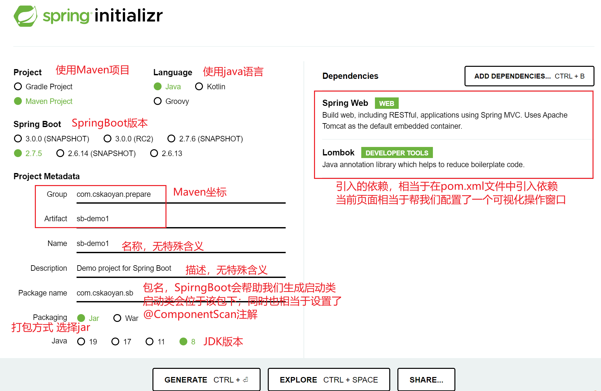
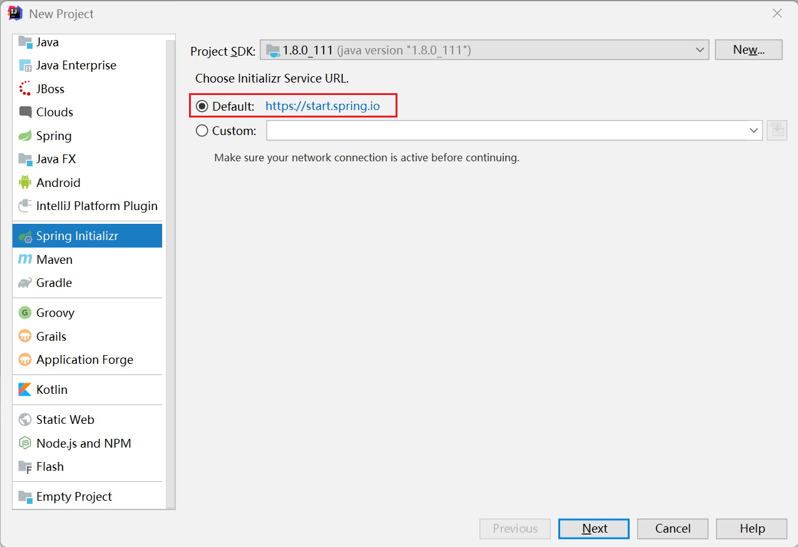
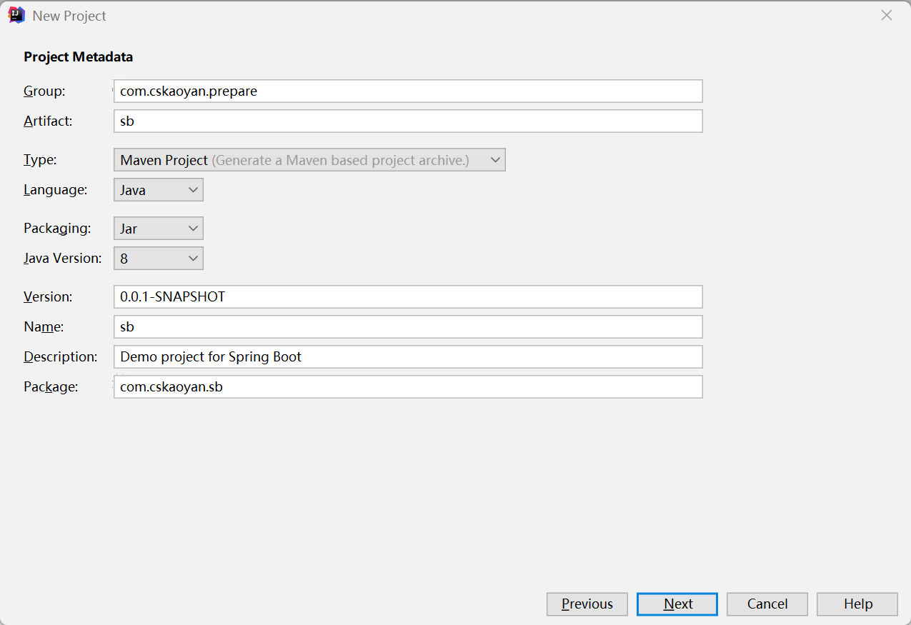
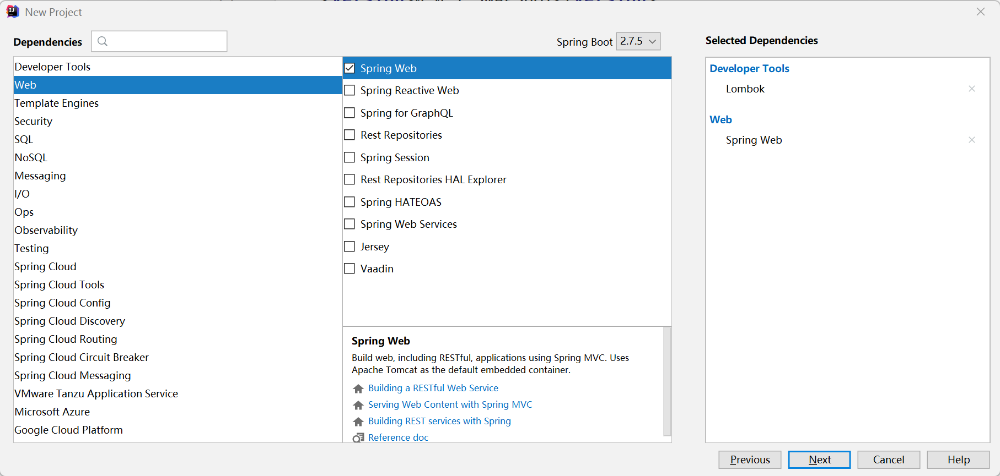
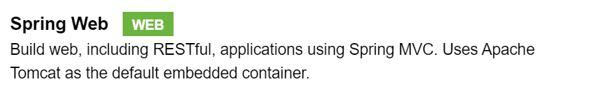
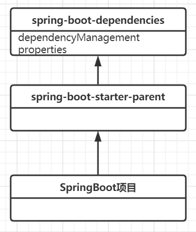
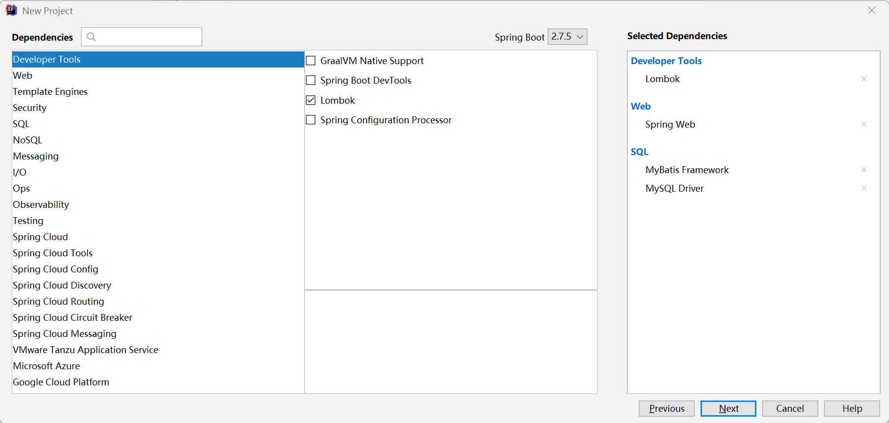

# SpringBoot

## 介绍

在前面的课程中，我们介绍了`Spring`以及`SpringMVC`的内容。相信大家学完这些内容之后，会有一个非常直观的感受，那就是到处充斥着各种各样的配置类，非常的繁琐;同时也需要引入大量的第三方jar包类库（整合各种框架、工具类）。`SpringBoot`的出现就是为了进一步去简化`Spring`项目。

主要优势如下：

- 轻量级的开源框架，可以非常方便整合其他框架。
- 内嵌`Tomcat`等服务器，无需依赖外部服务器应用。
- 以`jar`包的形式可以独立进行运行。
- `SpringBoot`的核心特征：约定大于配置。`SpringBoot`内部提供了非常多的配置信息，开发者只需要进行极少数配置项。

下面的文档中有关于SpringBoot的详细介绍说明：<a href='https://spring.io/projects/spring-boot'>Why SpringBoot</a>

## SpringBoot快速入门

### Spring Initializr

位于https://start.spring.io/网站



### IDEA整合Spring Initializr







之后运行启动类即可。

## 剖析pom.xml文件

- 父子工程

```xml
<parent>
        <groupId>org.springframework.boot</groupId>
        <artifactId>spring-boot-starter-parent</artifactId>
        <version>2.7.5</version>
        <relativePath/> <!-- lookup parent from repository -->
    </parent>
```

当前`SpringBoot`项目是一个子工程。为什么要采取父子工程的形式呢？父工程中可以给我们当前应用配置一些通用的工具类。如果希望修改`SpringBoot`的版本，只需要修改`version`即可。

- 依赖管理

  ```xml
  <dependency>
              <groupId>org.springframework.boot</groupId>
              <artifactId>spring-boot-starter-web</artifactId>
          </dependency>
  ```

  该依赖其实就是我们导入的Spring Web。

  

  其中特别需要注意的是，`SpringBoot`项目中引入的依赖没有标注`version`。那其实这就是约定大于配置的一个体现。原因在于我们编写的SpringBoot的父工程是`spring-boot-starter-parent`,而这个父工程的父工程为`spring-boot-dependencies`.在这个工程中做了大量的配置，其中`dependencyManagement`标签以及`properties`标签中已经对经常使用到的依赖配置做了配置。如果我们的`SpringBoot`项目中没有标注引入依赖的版本，那么便会使用爷爷工程中标注的版本。

  

- **starter依赖**

  `SpringBoot`项目中最核心的一个starter依赖就是`spring-boot-starter`依赖。在我们编写的SpringBoot项目中，并没有直接引入该依赖，而是通过间接引入的方式。比如我们引入`spring-boot-starter-web`依赖，而该依赖引入了`spring-boot-starter`依赖。

  > 小tips：`spring-boot-starter-xxx`：是Spring官方提供的依赖。比如之前我们引入的`spring-boot-starter-web`就是对于`web`的支持。而`xxx-spring-boot-starter`:则是第三方框架提供的。用于`SpringBoot`对于`Mybatis`的依赖支持。

  `starter`依赖最大的意义在于：**如果希望引入某个框架或者新功能，那么只需要引入其对应的`starter`依赖即可**。

  - `starter`依赖会自动引入所需要的其他依赖。
  - **同时也会引入`autoconfigure`依赖，该依赖可以进行自动的配置。也就是约定大于配置的由来。**

  根据上述说明，我们的`SpringBoot`项目中如果希望引入对于`mybatis`的支持，则只需要引入如下依赖即可：

  ```xml
  <dependency>
              <groupId>org.mybatis.spring.boot</groupId>
              <artifactId>mybatis-spring-boot-starter</artifactId>
              <version>2.2.2</version>
  </dependency>
  ```

## SpringBoot配置文件

### 配置文件格式

**名字必须是**：

- `application.properties`或者`application*.properties`。一般情况下，后者我们写成如下形式：`application-xxx.properties`

- `application.yml`或者`application*.yml`。同理，后者一般写成`application-xxx.yml`。

  > yml和yaml是一致的，两种写法是完全等价的。

**语法**：

`properties`配置文件的语法：`key=value`键值对

```properties
mall.db.username=root
mall.db.password=123456
mall.db.driverClassName=com.mysql.jdbc.Driver
mall.domain=http://localhost:8080
```

`yml`配置文件的语法如下：

- `key: value`表示键值对信息，冒号后面必须要有一个空格
- 使用空格缩进来表示出数据和数据之间的层级关系；空格的数量没有要求，只要是左对齐的一列数据，那么便是同一个层级
- **大小写敏感**
- **缩进时不允许写Tab键，只允许写空格**

将上述的`properties`配置文件改造成`yaml`文件：

```yaml
# key中有.则转换成冒号、换行、空格 username、password左对齐
mall:
  db:
    username: root
    password: 123456
    driverClassName: com.mysql.jdbc.Driver
  domain: http://localhost:8080  

```

`yml`配置文件相较于`properties`配置文件有何优缺点呢？

优点：配置项相对集中，可以复用一部分`key`值;可以较为轻松地描述出数据和数据之间的层级关系

缺点：配置项较多时，可读性较为差一些

> 特别注意事项：正常情况下来说，`yml`配置文件中字符串是无需添加单引号、或者双引号的;但是在下面这个场景中，我们可以添加单引号。将password的值用单引号扣起来，否则会把其当做八进制数字来进行解析处理。
>
> ```yaml
> mall:
>   db:
>     username: root
>     password: '01234'
> ```

### 内置变量

在`SpringBoot`的项目中，存在着一些内置的和`Tomcat`相关联的变量。比如：

`server.port`  表示的是Tomcat的监听端口号

`server.servlet.context-path` 应用上下文的名字，也就是应用名

### 获取配置文件的值

```yaml
cskaoyan:
  db:
    url: jdbc:mysql://localhost:3306/testdb
    user: root
    password: 123456
    driverClassName: com.mysql.jdbc.Driver
  domain: http://localhost:80
server:
  servlet:
    context-path: /demo1
  port: 80
```

我们编写一个配置类从yaml文件中获取该数据，如何获取呢？

#### @Value注解

**我们需要使用到一个`@Value`注解，注解内的key值为`${key}`，也就是yml文件中的key值。那么便可以把key对应的value值获取到。**

```java
package com.cskaoyan.sb.config;

import com.alibaba.druid.pool.DruidDataSource;
import org.springframework.beans.factory.annotation.Value;
import org.springframework.context.annotation.Bean;
import org.springframework.context.annotation.Configuration;

import javax.sql.DataSource;

/**
 * @ClassName DataSourceConfiguration
 * @Description: TODO
 * @Author 远志 zhangsong@cskaoyan.onaliyun.com
 * @Date 2022/11/22 9:50
 * @Version V1.0
 **/
@Configuration
public class DataSourceConfiguration {
    @Value("${cskaoyan.db.user}")
    private String username;

    @Value("${cskaoyan.db.password}")
    private String password;

    @Value("${cskaoyan.db.url}")
    private String url;

    @Value("${cskaoyan.db.driverClassName}")
    private String driverClassName;

    @Bean
    public DataSource dataSource(){
        DruidDataSource dataSource = new DruidDataSource();
        dataSource.setUsername(username);
        dataSource.setPassword(password);
        dataSource.setUrl(url);
        dataSource.setDriverClassName(driverClassName);
        return dataSource;
    }
}
```

#### @ConfigurationProperties注解

在上述案例编写过程中，`@Value(${key})`中的key具有相同的前缀，编写过程中略显繁琐。因此，我们可以采取如下方式，简化操作：

组件类标注`@ConfigurationProperties(prefix = "cskaoyan.db")`注解，提供`getter`和`setter`方法。保证成员变量的名称和配置文件里面的`key`值相同，那么便可以获取到数据。原理其实就是利用`prefix`和成员变量进行拼接，如果配置文件存在该`key`，那么便调用`setter`方法来完成赋值。

注意事项：

- **不同配置类上面的@ConfigurationProperties注解内的prefix不可以相同。**

```java
package com.cskaoyan.sb.config;

import com.alibaba.druid.pool.DruidDataSource;
import lombok.Data;
import org.springframework.beans.factory.annotation.Value;
import org.springframework.boot.context.properties.ConfigurationProperties;
import org.springframework.context.annotation.Bean;
import org.springframework.context.annotation.Configuration;

import javax.sql.DataSource;

/**
 * @ClassName DataSourceConfiguration
 * @Description: TODO
 * @Author 远志 zhangsong@cskaoyan.onaliyun.com
 * @Date 2022/11/22 9:50
 * @Version V1.0
 **/
@Configuration
@ConfigurationProperties(prefix = "cskaoyan.db")
@Data
public class DataSourceConfiguration2 {

    private String user;

    private String password;

    private String url;

    private String driverClassName;

    @Bean
    public DataSource dataSource(){
        DruidDataSource dataSource = new DruidDataSource();
        dataSource.setUsername(user);
        dataSource.setPassword(password);
        dataSource.setUrl(url);
        dataSource.setDriverClassName(driverClassName);
        return dataSource;
    }
}
```

#### @ConfigurationProperties注解-配置类

在上述案例基础上，我们可以单独将user、password、url、driverClassName等单独封装到一个配置类中。

```java
@ConfigurationProperties(prefix = "cskaoyan.db")
@Component
@Data
public class DataSourceProperties {

    private String user;

    private String password;

    private String url;

    private String driverClassName;
}
```

需要获取配置文件中的数据时，直接从`DataSourceProperties`配置类中获取即可。

```java
@Configuration
public class DataSourceConfiguration3 {

    @Autowired
    DataSourceProperties properties;

    @Bean
    public DataSource dataSource(){
        DruidDataSource dataSource = new DruidDataSource();
        dataSource.setUsername(properties.getUser());
        dataSource.setPassword(properties.getPassword());
        dataSource.setUrl(properties.getUrl());
        dataSource.setDriverClassName(properties.getDriverClassName());
        return dataSource;
    }
}
```

#### @EnableConfigurationProperties注解

这种方式在使用上和上一种方式非常类似。只是`DataSourceProperties`配置类不需要设置`@Component`注解了。随后在

DataSourceConfiguration类上标注`@EnableConfigurationProperties(DataSourceProperties.class)`即可。

**说白了 `@EnableConfigurationProperties `相当于把使用 `@ConfigurationProperties` 的类进行了一次注入**

```java
@ConfigurationProperties(prefix = "cskaoyan.db")
//@Component  这是去掉的部分
@Data
public class DataSourceProperties {

    private String user;

    private String password;

    private String url;

    private String driverClassName;
}
```

```java
@Configuration
@EnableConfigurationProperties(DataSourceProperties.class) // 这是增加的部分
public class DataSourceConfiguration4 {

    @Autowired
    DataSourceProperties properties;

    @Bean
    public DataSource dataSource(){
        DruidDataSource dataSource = new DruidDataSource();
        dataSource.setUsername(properties.getUser());
        dataSource.setPassword(properties.getPassword());
        dataSource.setUrl(properties.getUrl());
        dataSource.setDriverClassName(properties.getDriverClassName());
        return dataSource;
    }
}
```

## SpringBoot对于web的支持

在`SpringBoot`中如果希望使用`SpringMVC`只需要导入`spring-boot-starter-web`依赖即可。

### 静态资源映射

`SpringBoot`中对于静态资源有默认的配置。之前在介绍`SpringMVC`时，有介绍`ResourceHandler`负责去处理静态资源文件的映射。

SpringBoot中默认的配置是`/**`和`classpath:/static/`目录下文件的映射

```java
registry.addResourceHandler("/**").addResourceLocations("classpath:/static/");
```

**方式一：**

如果希望修改该配置项，那么可以在配置文件中进行设置

```yaml
spring:
  web:
    resources:
      static-locations: file:D:/app/
  mvc:
    static-path-pattern: /pic/**
```

当访问`/pic/1.jpeg`时，那么会到`D:/app/1.jpeg`处加载该文件。

**方式二**：

和之前`SpringMVC`的使用方式类似

**特别注意：在单独使用`SpringMVC`时，我们使用`@EnableWebMvc`注解，但是当我们使用`SpringBoot`时，该注解会对其他整合的配置项产生影响，所以，不要使用该注解，而应当使用`@Configuration`注解。**

```java
@Configuration
public class ResourceConfiguration implements WebMvcConfigurer {

    @Override
    public void addResourceHandlers(ResourceHandlerRegistry registry) {
        registry.addResourceHandler("/pic2/**").addResourceLocations("file:D:/app2/");
        //继续追加写即可
    }
}
```

### 配置Filter

`Spring`官方建议使用`OncePerRequestFilter`。如果我们希望编写Filter，那么需要继承该类，同时注册为组件即可。

```java
@Component
public class ApplicationFilter extends OncePerRequestFilter {
    @Override
    protected void doFilterInternal(HttpServletRequest request, HttpServletResponse response, FilterChain filterChain) throws ServletException, IOException {
        System.out.println("hello filter");
        filterChain.doFilter(request, response);
    }
}
```

但是使用这种方式配置的Filter默认匹配范围是全局`/**`，如果希望只匹配某个特定的地址或者范围，可以使用如下方式：

利用`FilterRegistrationBean`来帮助我们配置`Filter`的`url-pattern`，并且放入到容器中。

```java
//@Component 该行去掉，不要注册为组件，我们通过配置的形式自己放入容器中
public class ApplicationFilter extends OncePerRequestFilter {
    @Override
    protected void doFilterInternal(HttpServletRequest request, HttpServletResponse response, FilterChain filterChain) throws ServletException, IOException {
        System.out.println("hello filter");
        filterChain.doFilter(request, response);
    }
}
```

```java
@Configuration
public class FilterRegisterConfig {

    @Bean
    public FilterRegistrationBean filterRegistrationBean(){
        FilterRegistrationBean<Filter> registrationBean = new FilterRegistrationBean<>();
        registrationBean.setFilter(new ApplicationFilter());
        registrationBean.setUrlPatterns(Arrays.asList("/pic/*"));
        return registrationBean;
    }
}
```

### WebMvc配置类

至于在`SpringBoot`中整合其他的组件，比如`Interceptor`等，那么和上述配置静态资源方式相同。

## SpringBoot对于Mybatis的支持

需要引入`mybatis-spring-boot-starter`依赖以及`mysql-connector-java`依赖。



同时还需要配置数据源`DataSource`以及`Mapper`文件的信息。

数据源在yml配置文件中进行配置

```yaml
spring:
  datasource:
    driver-class-name: com.mysql.jdbc.Driver
    url: jdbc:mysql://localhost:3306/45?characterEncoding=utf-8&useUnicode=true&useSSL=false
    username: root
    password: 123456
```

Mapper扫描包目录在启动类中进行配置

```java
@SpringBootApplication
@MapperScan("com.cskaoyan.sbmybatis.mapper")
public class SbMybatisApplication {

    public static void main(String[] args) {
        SpringApplication.run(SbMybatisApplication.class, args);
    }

}
```

That's all you should do.

