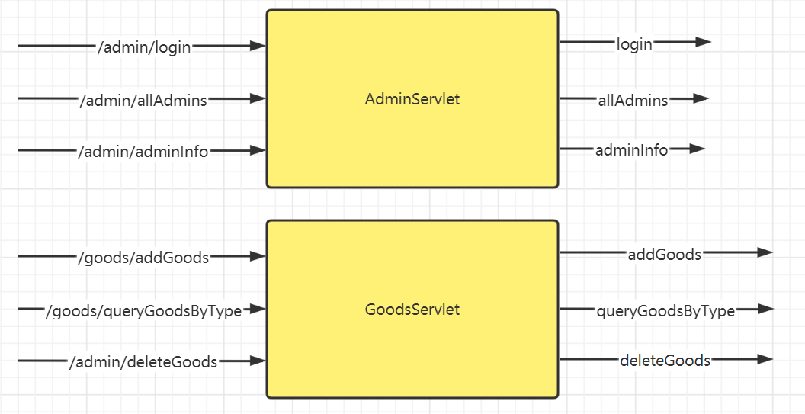
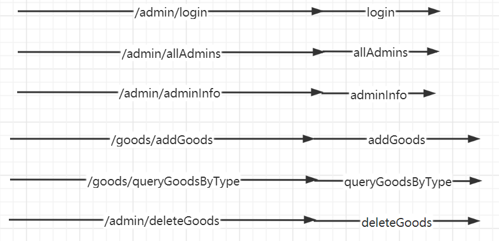
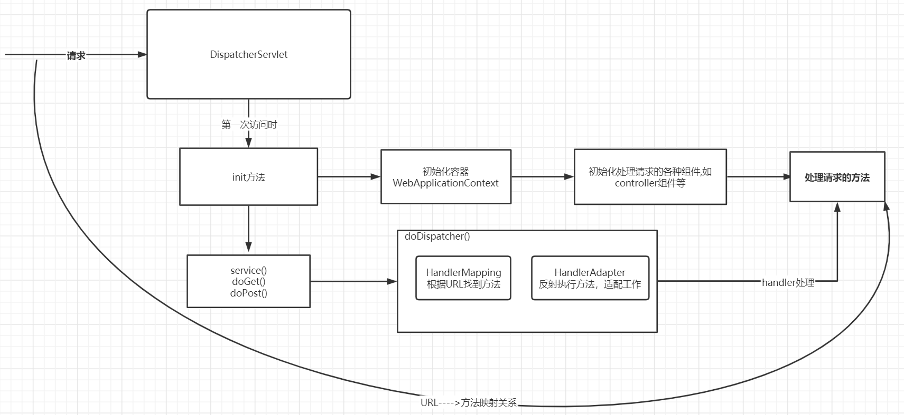
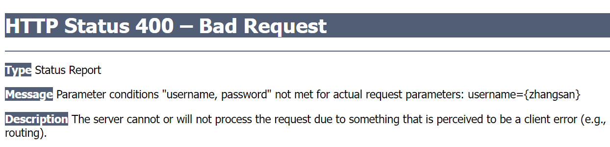
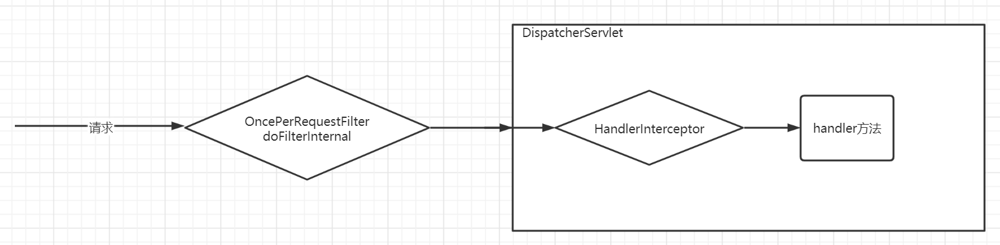
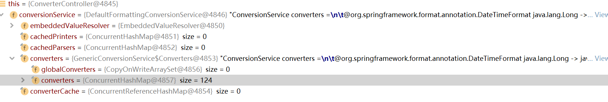
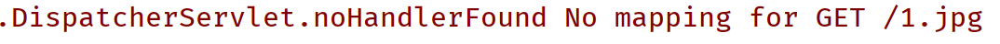

# SpringMVC笔记

## 为什么使用SpringMVC

SpringMVC其实就是Spring框架对于web框架的整合。回顾一下，在学习今天的课程之前，如果我们希望使用java语言来开发一个web项目，需要做哪些事情？web项目，我们也可以理解为服务器开发。针对客户发起的不同的HTTP请求，服务器需要有针对性的做出响应。



在使用Servlet开发动态web资源时，最为繁琐的事情便是根据客户端的请求，分发到不同的方法中。在这一步，我们需要识别客户端的请求，并且设定相应的模式，将请求分发到对应的方法之中。处理过程略微繁琐。我们希望这个过程可以按照如下方式来进行：



我们希望在请求的处理过程中可以将分发的步骤去除掉。这只是我们在使用Servlet开发动态web资源时的其中一个痛点。**具体总结如下：**

- **URL的映射分发不方便**
- **参数接收不方便，具体体现在：**
  - **如果是json字符串，我们需要自行解析获取请求体，然后将其解析成为java对象**
  - **如果提交的是key=value类型的数据，那么我们需要使用request.getParameter来主动获取；并且如果希望转换成数字等类型，也需要我们自行再去转换**
- **返回响应不方便，如果我们希望返回json字符串，同样需要自己手动解析处理为json字符串；随后将其写入到响应体中**

使用SrpingMVC可以很轻松的解决上述问题。

## 入门案例

**1.导入依赖**

```xml
<dependencies>
    <dependency>
        <groupId>javax.servlet</groupId>
        <artifactId>javax.servlet-api</artifactId>
        <version>3.1.0</version>
        <scope>provided</scope>
    </dependency>

    <dependency>
        <groupId>org.springframework</groupId>
        <artifactId>spring-webmvc</artifactId>
        <version>5.3.22</version>
    </dependency>
    <!-- https://mvnrepository.com/artifact/com.fasterxml.jackson.core/jackson-databind -->
    <dependency>
        <groupId>com.fasterxml.jackson.core</groupId>
        <artifactId>jackson-databind</artifactId>
        <version>2.13.3</version>
    </dependency>
</dependencies>
```

**2.配置SpringMVC的核心DispatcherServlet**

web.xml文件中配置如下参数

```xml
<?xml version="1.0" encoding="UTF-8"?>
<web-app xmlns="http://xmlns.jcp.org/xml/ns/javaee"
         xmlns:xsi="http://www.w3.org/2001/XMLSchema-instance"
         xsi:schemaLocation="http://xmlns.jcp.org/xml/ns/javaee http://xmlns.jcp.org/xml/ns/javaee/web-app_4_0.xsd"
         version="4.0">

    <servlet>
        <servlet-name>dispatcher</servlet-name>
        <servlet-class>org.springframework.web.servlet.DispatcherServlet</servlet-class>
        <init-param>
            <param-name>contextConfigLocation</param-name>
            <param-value>classpath:application.xml</param-value>
        </init-param>
    </servlet>

    <servlet-mapping>
        <servlet-name>dispatcher</servlet-name>
        <url-pattern>/</url-pattern>
    </servlet-mapping>

</web-app>
```

**3.resouces目录下的application.xml文件配置如下参数**

```xml
<?xml version="1.0" encoding="UTF-8"?>
<beans xmlns="http://www.springframework.org/schema/beans"
       xmlns:xsi="http://www.w3.org/2001/XMLSchema-instance"
       xmlns:mvc="http://www.springframework.org/schema/mvc"
       xmlns:context="http://www.springframework.org/schema/context"
       xsi:schemaLocation="http://www.springframework.org/schema/beans http://www.springframework.org/schema/beans/spring-beans.xsd http://www.springframework.org/schema/mvc http://www.springframework.org/schema/mvc/spring-mvc.xsd http://www.springframework.org/schema/context https://www.springframework.org/schema/context/spring-context.xsd">

    <mvc:annotation-driven/>

    <context:component-scan base-package="com.cskaoyan"/>

</beans>
```

**4.编写代码处理请求**

```java
@Controller
public class HelloController {

    @RequestMapping("/hello")
    @ResponseBody
    public ResultVO hello(){
        ResultVO resultVO = new ResultVO();
        resultVO.setCode(200);
        resultVO.setMessage("success");
        resultVO.setData("hello springmvc");
        return resultVO;
    }
}
```

## SpringMVC工作流程

在使用SpringMVC时，我们只需要配置@RequestMapping注解，便可以将请求和对应的方法关联起来。那么这两者之间是怎么关联起来的呢？

我们将DispatcherServlet作为我们的突破口，为什么呢？因为该Servlet配置的url-pattern为/，也就是任何没有其他Servlet可以处理的请求都会交给当前servlet来处理(实际上，我们编写的项目中并没有配置任何其他的servlet，所以你可以理解为除了访问jsp之外的全部请求都会交给DispatcherServlet来处理)

SpringMVC的核心处理流程便是由DispatcherServlet来进行处理的。在前面的学习过程中，我们已经清楚Servlet的生命周期init、service、destroy三个阶段。

**在DispatcherServlet的init阶段，会做如下事情：初始化容器(DispatcherServlet会持有容器的引用)、初始化处理请求的各种组件(包括我们编写的@Controller组件)、进而解析得到组件内的各个方法。**

**在DispatcherServlet的service阶段，无论最终访问的service(req,resp)，还是doGet(req,resp)，还是doPost(req,resp)最终都会交给doDispatcher()来处理，整体的逻辑便是根据URL查找相应的方法。**

总之，我们可以得到请求的URL和处理方法之间的映射关系。



## 使用配置类

在上述的入门案例中，我们只是编写了Controller组件，而在一个完整的项目中，在一个符合MVC设计模式的项目中，需要有三层架构。还额外需要service组件、mapper组件等。**那么我们在将SpringMVC和Spring整合的时候，我们需要考虑到一个点，将Controller组件的实例化、维护交给SpringMVC的容器来维护，而Service组件、Mapper组件的实例化、维护交给Spring容器来维护。所以配置文件需要注留意一下，否则可能会出现Controller组件被扫描注册两遍。**

- **启动类**

  ```java
  package com.cskaoyan.config;
  
  import org.springframework.web.servlet.support.AbstractAnnotationConfigDispatcherServletInitializer;
  
  /**
   * @ClassName ApplicationInitializer
   * @Description: TODO
   * @Author 远志 zhangsong@cskaoyan.onaliyun.com
   * @Date 2022/10/13 11:02
   * @Version V1.0
   **/
  public class ApplicationInitializer extends AbstractAnnotationConfigDispatcherServletInitializer {
  
      /**
       * 非web的设置
       * @return
       */
      @Override
      protected Class<?>[] getRootConfigClasses() {
          return new Class[]{SpringConfiguration.class};
      }
  
      /**
       * web的设置
       * @return
       */
      @Override
      protected Class<?>[] getServletConfigClasses() {
          return new Class[]{SpringMVCConfiguration.class};
      }
  
      /**
       * DispatcherServlet的作用范围
       * @return
       */
      @Override
      protected String[] getServletMappings() {
          return new String[]{"/"};
      }
  }
  ```

- **MVC配置类**

  ```java
  package com.cskaoyan.config;
  
  import org.springframework.context.annotation.ComponentScan;
  import org.springframework.context.annotation.Configuration;
  import org.springframework.web.servlet.config.annotation.EnableWebMvc;
  import org.springframework.web.servlet.config.annotation.WebMvcConfigurer;
  
  /**
   * @ClassName SpringMVCConfiguration
   * @Description: TODO web config
   * 如果我们设置了EnableWebMvc注解，那么就无需在设置Configuration注解了
   * 如果我们希望可以做一些SpringMVC的个性化配置，可以实现WebMvcConfigurer接口
   * @Author 远志 zhangsong@cskaoyan.onaliyun.com
   * @Date 2022/10/13 11:20
   * @Version V1.0
   **/
  @ComponentScan("com.cskaoyan.controller")
  //@Configuration
  @EnableWebMvc
  public class SpringMVCConfiguration implements WebMvcConfigurer {
      //todo 实现了该接口，今后可以针对SpringMVC做一些个性化设置，目前暂不需要，所以不重写方法即可
  }
  ```

- **Spring配置类**

  ```java
  package com.cskaoyan.config;
  
  import org.springframework.context.annotation.ComponentScan;
  import org.springframework.context.annotation.Configuration;
  import org.springframework.context.annotation.FilterType;
  import org.springframework.stereotype.Controller;
  import org.springframework.web.servlet.config.annotation.EnableWebMvc;
  
  /**
   * @ClassName SpringConfiguration
   * @Description: non-web config
   * 扫描com.cskaoyan包下面的class，但是不会去扫描包含@Controller注解的类
   * @Author 远志 zhangsong@cskaoyan.onaliyun.com
   * @Date 2022/10/13 11:19
   * @Version V1.0
   **/
  @ComponentScan(value = "com.cskaoyan",
          //excludeFilters = {@ComponentScan.Filter(type = FilterType.ANNOTATION, value = {Controller.class, EnableWebMvc.class})})
          //filter只写了一个，所以可以简化一下写的形式
  //excludeFilters = @ComponentScan.Filter(type = FilterType.ANNOTATION, value = {Controller.class, EnableWebMvc.class}))
          //进一步简化，type省去不写，因为type的默认值就是注解
  //excludeFilters = @ComponentScan.Filter(value = {Controller.class, EnableWebMvc.class}))
          //再进一步简化,如果里面只有值的话，那么就是value值
  excludeFilters = @ComponentScan.Filter({Controller.class, EnableWebMvc.class}))
  @Configuration
  public class SpringConfiguration {
  }
  ```

  所需要做的配置就是上述那么多。你没有看错。就是这么神奇。

  后续编写Controller去处理请求即可。

  ```java
  package com.cskaoyan.controller;
  
  import com.cskaoyan.vo.ResultVO;
  import org.springframework.stereotype.Controller;
  import org.springframework.web.bind.annotation.RequestMapping;
  import org.springframework.web.bind.annotation.ResponseBody;
  
  /**
   * @ClassName HelloController
   * @Description: TODO
   * @Author 远志 zhangsong@cskaoyan.onaliyun.com
   * @Date 2022/10/13 15:58
   * @Version V1.0
   **/
  @Controller
  public class HelloController {
  
      @RequestMapping("/hello")
      @ResponseBody
      public ResultVO hello(){
          ResultVO resultVO = new ResultVO();
          resultVO.setCode(200);
          resultVO.setMessage("hello spring mvc config");
          return resultVO;
      }
  }
  ```

  通过http://localhost/app/hello便可以访问到相应的方法。

  为什么可以实现该功能呢？

  原理主要是在Servlet3.0版本起，Web容器启动时提供了一种新的给第三方组件初始化的方式。凡是第三方组件类库中实现了`javax.servlet.ServletContainerInitializer`,那么容器启动时便会调用该类对应的方法。而在上述过程中，我们编写的启动类恰好被这种方式进行了加载，初始化了Spring容器。

## @RequestMapping

用来设置请求的地址和handle方法的映射关系。

```java
package org.springframework.web.bind.annotation;

import java.lang.annotation.Documented;
import java.lang.annotation.ElementType;
import java.lang.annotation.Retention;
import java.lang.annotation.RetentionPolicy;
import java.lang.annotation.Target;

import org.springframework.core.annotation.AliasFor;
//该注解可以写在类上，也可以写在方法上
@Target({ElementType.TYPE, ElementType.METHOD})
@Retention(RetentionPolicy.RUNTIME)
@Documented
@Mapping
public @interface RequestMapping {

   /**
    * Assign a name to this mapping.
    * <p><b>Supported at the type level as well as at the method level!</b>
    * When used on both levels, a combined name is derived by concatenation
    * with "#" as separator.
    * @see org.springframework.web.servlet.mvc.method.annotation.MvcUriComponentsBuilder
    * @see org.springframework.web.servlet.handler.HandlerMethodMappingNamingStrategy
    */
   String name() default "";

   /**
    * The primary mapping expressed by this annotation.
    * <p>This is an alias for {@link #path}. For example,
    * {@code @RequestMapping("/foo")} is equivalent to
    * {@code @RequestMapping(path="/foo")}.
    * <p><b>Supported at the type level as well as at the method level!</b>
    * When used at the type level, all method-level mappings inherit
    * this primary mapping, narrowing it for a specific handler method.
    * <p><strong>NOTE</strong>: A handler method that is not mapped to any path
    * explicitly is effectively mapped to an empty path.
    */
   @AliasFor("path")
    //value和path是一致的，都是表示匹配的url
   String[] value() default {};

   /**
    * The path mapping URIs (e.g. {@code "/profile"}).
    * <p>Ant-style path patterns are also supported (e.g. {@code "/profile/**"}).
    * At the method level, relative paths (e.g. {@code "edit"}) are supported
    * within the primary mapping expressed at the type level.
    * Path mapping URIs may contain placeholders (e.g. <code>"/${profile_path}"</code>).
    * <p><b>Supported at the type level as well as at the method level!</b>
    * When used at the type level, all method-level mappings inherit
    * this primary mapping, narrowing it for a specific handler method.
    * <p><strong>NOTE</strong>: A handler method that is not mapped to any path
    * explicitly is effectively mapped to an empty path.
    * @since 4.2
    */
   @AliasFor("value")
   String[] path() default {};

   /**
    * The HTTP request methods to map to, narrowing the primary mapping:
    * GET, POST, HEAD, OPTIONS, PUT, PATCH, DELETE, TRACE.
    * <p><b>Supported at the type level as well as at the method level!</b>
    * When used at the type level, all method-level mappings inherit this
    * HTTP method restriction.
    */
    //HTTP请求方法的限定，比如get、post请求
   RequestMethod[] method() default {};

   /**
    * The parameters of the mapped request, narrowing the primary mapping.
    * <p>Same format for any environment: a sequence of "myParam=myValue" style
    * expressions, with a request only mapped if each such parameter is found
    * to have the given value. Expressions can be negated by using the "!=" operator,
    * as in "myParam!=myValue". "myParam" style expressions are also supported,
    * with such parameters having to be present in the request (allowed to have
    * any value). Finally, "!myParam" style expressions indicate that the
    * specified parameter is <i>not</i> supposed to be present in the request.
    * <p><b>Supported at the type level as well as at the method level!</b>
    * When used at the type level, all method-level mappings inherit this
    * parameter restriction.
    */
    //请求参数的限定，必须要携带哪些请求参数
   String[] params() default {};

   /**
    * The headers of the mapped request, narrowing the primary mapping.
    * <p>Same format for any environment: a sequence of "My-Header=myValue" style
    * expressions, with a request only mapped if each such header is found
    * to have the given value. Expressions can be negated by using the "!=" operator,
    * as in "My-Header!=myValue". "My-Header" style expressions are also supported,
    * with such headers having to be present in the request (allowed to have
    * any value). Finally, "!My-Header" style expressions indicate that the
    * specified header is <i>not</i> supposed to be present in the request.
    * <p>Also supports media type wildcards (*), for headers such as Accept
    * and Content-Type. For instance,
    * <pre class="code">
    * &#064;RequestMapping(value = "/something", headers = "content-type=text/*")
    * </pre>
    * will match requests with a Content-Type of "text/html", "text/plain", etc.
    * <p><b>Supported at the type level as well as at the method level!</b>
    * When used at the type level, all method-level mappings inherit this
    * header restriction.
    * @see org.springframework.http.MediaType
    */
    //请求头的限定，比如要携带何种请求头
   String[] headers() default {};

   /**
    * Narrows the primary mapping by media types that can be consumed by the
    * mapped handler. Consists of one or more media types one of which must
    * match to the request {@code Content-Type} header. Examples:
    * <pre class="code">
    * consumes = "text/plain"
    * consumes = {"text/plain", "application/*"}
    * consumes = MediaType.TEXT_PLAIN_VALUE
    * </pre>
    * Expressions can be negated by using the "!" operator, as in
    * "!text/plain", which matches all requests with a {@code Content-Type}
    * other than "text/plain".
    * <p><b>Supported at the type level as well as at the method level!</b>
    * If specified at both levels, the method level consumes condition overrides
    * the type level condition.
    * @see org.springframework.http.MediaType
    * @see javax.servlet.http.HttpServletRequest#getContentType()
    */
    //Content-Type请求头的限定，也就是发送该请求时，必须要携带设定的Content-Type
   String[] consumes() default {};

   /**
    * Narrows the primary mapping by media types that can be produced by the
    * mapped handler. Consists of one or more media types one of which must
    * be chosen via content negotiation against the "acceptable" media types
    * of the request. Typically those are extracted from the {@code "Accept"}
    * header but may be derived from query parameters, or other. Examples:
    * <pre class="code">
    * produces = "text/plain"
    * produces = {"text/plain", "application/*"}
    * produces = MediaType.TEXT_PLAIN_VALUE
    * produces = "text/plain;charset=UTF-8"
    * </pre>
    * <p>If a declared media type contains a parameter (e.g. "charset=UTF-8",
    * "type=feed", "type=entry") and if a compatible media type from the request
    * has that parameter too, then the parameter values must match. Otherwise
    * if the media type from the request does not contain the parameter, it is
    * assumed the client accepts any value.
    * <p>Expressions can be negated by using the "!" operator, as in "!text/plain",
    * which matches all requests with a {@code Accept} other than "text/plain".
    * <p><b>Supported at the type level as well as at the method level!</b>
    * If specified at both levels, the method level produces condition overrides
    * the type level condition.
    * @see org.springframework.http.MediaType
    */
    //Accept请求头的限定值，必须要符合我们设置的Accpet
   String[] produces() default {};

}
```

- **value属性**

  **1.value属性是数组， 意味着可以设置多个值，也就是说可以将多个不同的URL映射到同一个handle方法中。**

  ```java
  @RequestMapping({"/hello","/hello2","/hello3"})
      @ResponseBody
      public ResultVO hello(){
          ResultVO resultVO = new ResultVO();
          resultVO.setCode(200);
          resultVO.setMessage("hello spring mvc config");
          return resultVO;
      }
  ```

  **2.value属性同样可以设置通配符 ***

  ```java
  @RequestMapping("/good/*")
      @ResponseBody
      public ResultVO good(){
          ResultVO resultVO = new ResultVO();
          resultVO.setCode(200);
          resultVO.setMessage("good");
          return resultVO;
      }
  ```

  **3.窄化路径：比如在处理用户的登录、注册、查询、修改等功能时，前端页面发送过来的请求URL会是这种模式:`/user/login`、`、user/register`、`/user/query`、`/user/update`。如果全部都有方法来去实现该路由，那么会显得过于繁琐。我们可以将一部分相同的部分抽提出来，写在类的@RequestMapping注解上面。**

  ```java
  package com.cskaoyan.controller;
  
  import org.springframework.stereotype.Controller;
  import org.springframework.web.bind.annotation.RequestMapping;
  import org.springframework.web.bind.annotation.ResponseBody;
  
  /**
   * @ClassName UserController
   * @Description: TODO
   * @Author 远志 zhangsong@cskaoyan.onaliyun.com
   * @Date 2022/10/14 16:57
   * @Version V1.0
   **/
  @Controller
  @RequestMapping("user")
  public class UserController {
  
      @RequestMapping("register")
      @ResponseBody
      public String register(){
          return "register";
      }
  
      @RequestMapping("login")
      @ResponseBody
      public String login(){
          return "login";
      }
  }
  ```

- **method属性**：限定发送请求的请求方法。比如为get或者为post。

  限定get方法。

  ```java
  @RequestMapping(value = "get",method = RequestMethod.GET)
  ```

  限定post方法。

  ```java
  @RequestMapping(value = "post",method = RequestMethod.POST)
  ```

  get和post方法均可。

  ```java
  @RequestMapping(value = "double", method = {RequestMethod.GET,RequestMethod.POST})
  ```

  引申，@GetMapping注解等价于上述限定get方法的注解。同理@PostMapping注解也等价于上述限定post方法的注解。

  ```java
  @Controller
  @RequestMapping("method")
  public class MethodLimitController {
  
      //@RequestMapping(value = "get",method = RequestMethod.GET)
      @GetMapping("get")
      @ResponseBody
      public ResultVO methodGet(){
          ResultVO resultVO = new ResultVO();
          resultVO.setMessage("method get");
          resultVO.setCode(200);
          return resultVO;
      }
  
  //    @RequestMapping(value = "post",method = RequestMethod.POST)
      @PostMapping("post")
      @ResponseBody
      public ResultVO methodPost(){
          ResultVO resultVO = new ResultVO();
          resultVO.setMessage("method post");
          resultVO.setCode(200);
          return resultVO;
      }
  
      @RequestMapping(value = "double", method = {RequestMethod.GET,RequestMethod.POST})
      @ResponseBody
      public ResultVO methodIgnore(){
          ResultVO resultVO = new ResultVO();
          resultVO.setMessage("method double");
          resultVO.setCode(200);
          return resultVO;
      }
  }
  ```

- **param属性**：限定必须要有某个或者某些请求参数。如果值为多个，表示需要同时存在这些参数。经典错误状态码400.

  

  ```java
  @Controller
  @RequestMapping("param")
  public class ParamLimitController {
  	//表示必须同时存在请求参数username、password
      @RequestMapping(value = "login",method = RequestMethod.GET ,params = {"username", "password"})
      @ResponseBody
      public ResultVO login(){
          ResultVO resultVO = new ResultVO();
          resultVO.setMessage("param limit");
          resultVO.setCode(200);
          return resultVO;
      }
  }
  ```

- **header属性**：限定必须要有某个或者某些请求头。如果值为多个，表示需要同时存在这些请求头。

  ```java
  @Controller
  @RequestMapping("header")
  public class HeaderLimitController {
  
      @RequestMapping(value = "limit", method = RequestMethod.GET, headers = {"abc","def"})
      @ResponseBody
      public ResultVO limit(){
          ResultVO resultVO = new ResultVO();
          resultVO.setMessage("header limit");
          resultVO.setCode(200);
          return resultVO;
      }
  }
  ```

- **consumes属性**：限定Content-Type类型。该值后面应该携带一个MIME类型。比如text/html等。如果客户端发送过来的请求资源类型是text/html类型，但是我当前编写的handle方法consume限定只可以处理application/json类型，那么最终请求就会发送失败。

  ```java
  @RequestMapping(value = "consume", consumes = "application/json")
  @ResponseBody
  public ResultVO consume(){
      ResultVO resultVO = new ResultVO();
      resultVO.setMessage("content-type limit");
      resultVO.setCode(200);
      return resultVO;
  }
  ```

- **produces属性**：限定Accept属性。表示当前请求可以允许接收的类型。该值也是需要携带一个MIME类型。比如我们响应json字符串时，该类型是application/json类型。比如handle方法的produces设置为application/json类型，但是Accept请求头不允许接收application/json类型，那么便会出现错误，请求便会发送失败。所以produces会把请求头中的Accept请求头进行比对，如果不匹配，则请求发送失败。

  ```java
  @RequestMapping(value = "produce", produces = "application/json")
  @ResponseBody
  public ResultVO produces(){
      ResultVO resultVO = new ResultVO();
      resultVO.setMessage("Accept limit");
      resultVO.setCode(200);
      return resultVO;
  }
  ```

## Handler方法返回值

- JSON类型

  如果我们希望Handler方法的返回值是JSON类型，那么需要满足如下三个条件：

  1.需要引入jackson-databind依赖

  2.需要xml文件添加mvc:annotation-driven设置或者设置@EnableWebMvc

  3.在Handler方法上面添加注解@ResponseBody

  满足上述三点之后，Handler方法的返回值对象会转换成json字符串。

  这里面提及一个引申注解：@RestController，该注解相当于@Controller + @ResponseBody的功能。

  ```java
  @RequestMapping("json")
  //@Controller
  //@ResponseBody
  @RestController
  public class JsonController {
  
      @RequestMapping("hello")
  //    @ResponseBody
      public ResultVO hello(){
          ResultVO resultVO = new ResultVO();
          resultVO.setCode(200);
          resultVO.setMessage("json");
          return resultVO;
      }
  
      @RequestMapping("hello2")
  //    @ResponseBody
      public ResultVO hello2(){
          ResultVO resultVO = new ResultVO();
          resultVO.setCode(200);
          resultVO.setMessage("json2");
          return resultVO;
      }
  }
  ```

- **ModelAndView(了解)**

  ModelAndView主要的功能是用在返回页面。目前来说，主流的架构采取前后端分离，所以这部分功能仅做了解即可。

  ```java
  @Controller
  @RequestMapping("mav")
  public class ModelAndViewController {
  
      @RequestMapping("hello")
      public ModelAndView hello(){
          ModelAndView modelAndView = new ModelAndView();
          //应用根目录下某个jsp文件
          modelAndView.setViewName("/hello.jsp");
          //此外，还可以返回model数据
          modelAndView.addObject("key1", "zhangsan");
          modelAndView.addObject("key2", "lisi");
          return modelAndView;
      }
  }
  ```

  应用根目录下hello.jsp文件中，如下设置，上述设置的key1和key2的值便会出现在页面中。

  ```jsp
  <%@ page contentType="text/html;charset=UTF-8" language="java" %>
  <html>
  <head>
      <title>Title</title>
  </head>
  <body>
  hello.jsp!!!!!
  key1:${key1}
  key2:${key2}
  </body>
  </html>
  ```

  除了采用上述这种方式之外，还可以使用下面这种方式

  ```java
  @RequestMapping("hello2")
      public String hello2(Model model){
          model.addAttribute("key1", "wangwu");
          model.addAttribute("key2", "zhaoliu");
          return "/hello.jsp";
      }
  ```

  **注意：如果要返回ModelAndView，那么一定不要出现@ResponseBody或者@RestController；同样，如果返回json类型数据，那么一定要携带注解。**

## Handler方法参数

### 常规请求参数

http://localhost:80/mvc/param/key?**username**=zhangsan&**password**=lisi

**直接在Handler方法形参直接去接收即可。如果希望按照这种方式直接去接收，那么需要满足请求参数的名称和形参的名称保持一致。**

```java
@RestController
@RequestMapping("param")
public class ParamController {

    @GetMapping("key")
    public ResultVO keyValue(String username, String password){
        System.out.println(username);
        System.out.println(password);
        ResultVO resultVO = new ResultVO();
        resultVO.setCode(200);
        resultVO.setMessage("ok");
        return resultVO;
    }
    
    //建议使用Integer类型，如果此时没有传递age，那么程序此时会出错
    @GetMapping("key2")
    //public ResultVO keyValue2(String username, String password, int age){
    public ResultVO keyValue2(String username, String password, Integer age){

            System.out.println(username);
        System.out.println(password);
        ResultVO resultVO = new ResultVO();
        resultVO.setCode(200);
        resultVO.setMessage("ok");
        return resultVO;
    }
    
    //http://localhost:80/mvc/param/key3?birthday=1999/10/01
    @GetMapping("key3")
    public ResultVO keyValue3(Date birthday){
        ResultVO resultVO = new ResultVO();
        resultVO.setCode(200);
        resultVO.setMessage(birthday.toString());
        return resultVO;
    }
    
    //如果希望使用指定的时间类型，则使用如下注解
    //http://localhost:80/mvc/param/key4?birthday=1999-10-01
    @GetMapping("key4")
    public ResultVO keyValue4(@DateTimeFormat(pattern = "yyyy-MM-dd") Date birthday){
        ResultVO resultVO = new ResultVO();
        resultVO.setCode(200);
        resultVO.setMessage(birthday.toString());
        return resultVO;
    }
    
    //http://localhost:80/mvc/param/key5?course=python&course=java&course=c&id=1&id=2&id=3
    @GetMapping("key5")
    public ResultVO keyValue5(String[] course, Integer[] id){
        ResultVO resultVO = new ResultVO();
        resultVO.setCode(200);
        resultVO.setMessage(Arrays.toString(course));
        return resultVO;
    }
}
```

一般情况下，我们使用最频繁的就是去接收**字符串**类型的请求参数，但是也有一些其他的情形也可以处理。比如**基本数据类型以及对应的包装类**、`java.util.Date`(默认处理日期的类型格式是  **yyyy/MM/dd**)、**数组**、**上传的文件**等均可以处理。正常情况下来说，SpringMVC仅可以完成字符串的接收，但是在SpringMVC中存在一系列的Converter类型转换器可以将这些数据转换成对应的类型


**数字等类型：建议使用包装类类型来接收。**

**日期类型：默认情况下可以处理yyyy/MM/dd类型的日期，如果希望可以处理其他格式的时间，参数需要设置`@DateTimeFormat(pattern = "yyyy-MM-dd")`注解。**

**数组类型：可以接收上述基本数据类型的数组。**

**文件类型：使用SpringMVC来接收文件数据，需要满足如下几个条件：**

1. **导入commons-fileupload依赖**

   ```xml
   <dependency>
               <groupId>commons-fileupload</groupId>
               <artifactId>commons-fileupload</artifactId>
               <version>1.4</version>
           </dependency>
   ```

2. **在容器中注册MultipartResolver组件（但是组件的id必须是multipartResolver，否则无法处理）**

   ```java
   @ComponentScan("com.cskaoyan.controller")
   //@Configuration
   @EnableWebMvc
   public class SpringMVCConfiguration implements WebMvcConfigurer {
       //todo 实现了该接口，今后可以针对SpringMVC做一些个性化设置，目前暂不需要，所以不重写方法即可
       @Bean
       public MultipartResolver multipartResolver(){
           return new CommonsMultipartResolver();
       }
   }
   ```

   ```jsp
   <%@ page contentType="text/html;charset=UTF-8" language="java" %>
   <html>
   <head>
       <title>Title</title>
   </head>
   <body>
       <form action="/mvc/upload/file" method="post" enctype="multipart/form-data">
           <input type="file" name="image"><br>
           <input type="submit">
       </form>
   </body>
   </html>
   ```

   ```java
   @RestController
   @RequestMapping("upload")
   public class UploadController {
   
       //变量的名称一定需要和上传的文件name属性相同
       @PostMapping("file")
       public ResultVO uploadFile(MultipartFile image) throws IOException {
           //文件处理的过程不需要开发者再去处理，直接告诉组件文件保存在何处即可
           String filename = image.getOriginalFilename();
           image.transferTo(new File("D:\\test", filename));
           ResultVO resultVO = new ResultVO();
           resultVO.setCode(200);
           resultVO.setMessage("upload success");
           return resultVO;
       }
   }
   ```

   如果同时上传多个文件，处理过程也是类似：

   ```jsp
    <form action="/mvc/upload/file2" method="post" enctype="multipart/form-data">
           <input type="file" multiple name="image"><br>
           <input type="submit">
       </form>
   ```

   ```java
   @PostMapping("file2")
       public ResultVO uploadFile2(MultipartFile[] image) throws IOException {
           //文件处理的过程不需要开发者再去处理，直接告诉组件文件保存在何处即可
           for (MultipartFile multipartFile : image) {
               String filename = multipartFile.getOriginalFilename();
               multipartFile.transferTo(new File("D:\\test", filename));
           }
           ResultVO resultVO = new ResultVO();
           resultVO.setCode(200);
           resultVO.setMessage("upload success");
           return resultVO;
       }
   ```

上述介绍的数据类型（除了MultipartFile除外），除了可以使用上述方式来接收之外，还可以使用一个引用类型的对象来接收。要求是对象的成员变量的名称和请求参数的名称保持一致，那么框架会帮我们实例化对象，并通过反射封装相应的请求参数。

```java
//http://localhost:80/mvc/param/key6?course=python&course=java&course=c&username=zhangsan&password=admin123&gender=male&birthday=1999-10-01
    @GetMapping("key6")
    public ResultVO keyValue6(User user){
        ResultVO resultVO = new ResultVO();
        resultVO.setCode(200);
        resultVO.setMessage(user.toString());
        return resultVO;
    }
```

### JSON封装的引用类型

使用引用类型来接收json格式的数据，常用的形式是使用对象或者map的形式。

如果我们需要自己发送json格式的数据，除了使用前端的axios组件之外，还可以使用postman自己来构建请求信息。但是需要满足如下几个条件：

**1.请求方法必须是Post请求方法**

**2.请求头Content-Type:application/json类型**

接收的引用类型可以设置为对象，也可以设置为map。

```java
@RestController
@RequestMapping("json")
public class JsonController {

    @PostMapping("login1")
    public ResultVO login1(@RequestBody LoginUser user){
        ResultVO resultVO = new ResultVO();
        resultVO.setCode(200);
        resultVO.setMessage(user.toString());
        return resultVO;
    }
    
    @PostMapping("login2")
    public ResultVO login2(@RequestBody Map<String, String> map){
        String username = map.get("username");
        String password = map.get("password");
        ResultVO resultVO = new ResultVO();
        resultVO.setCode(200);
        resultVO.setMessage(username + password);
        return resultVO;
    }
}
```

两种封装形式都可以使用。如果参数比较少，那么可以使用map类型；如果参数比较多，那么建议此时可以采用对象来接收。另外一点考虑，如果json字符串中包含数字等类型，如果用map类型来接收，那么可能会自动将其设置成Integer类型，但是如果你希望此时用Double来接收，就会比较麻烦，此时使用对象来进行接收更为合适一些。

### 其他类型的参数

#### HttpServletRequest、HttpServletResponse

如果希望使用request、response，直接在方法形参中进行接收就可以了。

```java
@RestController
@RequestMapping("http")
public class HttpController {

    @GetMapping("query1")
    public ResultVO query1(HttpServletRequest request, HttpServletResponse response){
        ResultVO resultVO = new ResultVO();
        resultVO.setCode(200);
        resultVO.setMessage("query1");
        return resultVO;
    }
}
```

#### Cookie、Session

如果希望使用cookie，则必须使用`request.getCookies()`来获取。

如果希望使用session，可以直接来接收，也可以利用`request.getSession()`来接收。

```java
@GetMapping("cookie")
    public ResultVO cookie(HttpServletRequest request){
        Cookie[] cookies = request.getCookies();
        if(cookies != null){
            for (Cookie cookie : cookies) {
                System.out.println(cookie.getName() + ":" + cookie.getValue());
            }
        }
        return new ResultVO();
    }
```

接收session的两种方式

```java
@GetMapping("session1")
    public ResultVO session1(HttpServletRequest request){
        HttpSession session = request.getSession();
        session.setAttribute("username", "admin");
        return new ResultVO();
    }

    @GetMapping("session2")
    public ResultVO session2(HttpSession session){
        Object username = session.getAttribute("username");
        System.out.println(username);
        return new ResultVO();
    }
```

## RESTful

全称为Resource Representational State Transfer(REST)。意思为表现层状态转移。RESTful即为符合REST风格的接口。

RESTful早期的形式和现在的形式具有比较大的差异。在早期时，描述用户的信息时，我们只使用/user来统一描述用户相关的操作。那么这些操作是如何区分的呢？

```
/user GET:查询用户信息
/user POST:提交用户信息
/user PUT:更新用户信息
/user DELETE:删除用户信息
```

但是目前来说，这种形式已经不再使用了(所以，这部分内容了解即可)。我们目前使用的请求方法基本都是GET和POST，所以我们利用请求资源来区分不同的操作。请求资源的编写遵循着 资源+操作的形式。比如

```
/user/list 查询所有的用户信息
/user/create 新增用户信息
/user/edit   修改用户信息
/user/remove 删除用户信息
```

在发送RESTful风格的请求时，我们也可以通过请求获取一些值，同样也可以利用Handler方法的形参来进行接收。可以获取以下内容：

1.请求URL（@PathVariable）

2.请求参数（@RequestParam）

3.请求头（@RequestHeader）

4.Cookie（@CookieValue）

5.Session（@SessionAttribute）


### @PathVariable

Handler方法的参数可以获取请求URL中一部分值。也就是说会把请求URL中的一部分值作为请求参数。

```java
@RestController
public class RESTfulController {

//    @RequestMapping("*/article/details/*")
//    public Result articleDetails(HttpServletRequest request){
//        //获取图中两处*位置的信息，之前需要利用requestURI来截取
//        request.getRequestURI(); //.....
//        return Result.ok();
//    }

    //http://localhost/admin123/article/details/122131
    @RequestMapping("{username}/article/details/{id}")
    public Result articleDetails(@PathVariable("username") String username,
                                 @PathVariable("id")  String id){
        System.out.println(username + ":" + id);
        return Result.ok();
    }
}
```

### @RequestParam

该注解使用场景并不是特别的多。如果不使用该注解，我们在前面的课程中也是可以比较方便地接收请求参数的。加了该注解之后，唯一的好处就是参数的名称可以叫param1、param2，而不是之前的username、password。但是其实没啥用处，也没有特别方便。所以，了解即可。

```java
//http://localhost/param?username=xxx&password=xxx
@RequestMapping("param")
public Result param(@RequestParam("username") String param1,
                    @RequestParam("password") String param2){
    return Result.ok();
}
```

### @RequestHeader

使用该请求头可以很方便地获取指定的请求头的值。可以使用字符串参数来接收，也可以使用字符串数组来接收，如果使用数组，那么默认情况下会按照逗号来进行分割。

```java
//获取Accept、Host请求头
@RequestMapping("header")
public Result header(@RequestHeader("Accept") String[] param1,
                    @RequestHeader("Host") String param2){
    System.out.println(param1 + param2);
    return Result.ok();
}
```

### @CookieValue

```java
//利用该注解获取指定cookie的key值对应的value值，并且赋值给形参
@RequestMapping("cookie")
public Result cookie(@CookieValue("username") String value){
    System.out.println(value);
    return Result.ok();
}
```

### @SessionAttribute

利用该注解，可以直接获取session域中指定key值对应的value值，并且赋值给形参。

```java
@RequestMapping("session2")
public Result session2(HttpSession session){
    session.setAttribute("username", "aasddsaaad");
    return Result.ok();
}

@RequestMapping("session")
public Result session(@SessionAttribute("username") String value){
    System.out.println(value);
    return Result.ok();
}
```

## Filter

### OncePerRequestFilter

`Filter`就是Java EE阶段提及到的那个Web组件。`Filter`和我们在SpringMVC中写的Handler方法之间存在着什么样的关系呢？

首先，`Filter`和相关联的`Servlet`之间是请求先经过`Filter`，再经过`Servlet`。而SpringMVC和的核心是`DispatcherServlet`，Handler里面的所有方法都会先经过`DispatcherServlet`。所以，正常情况下来说，Handler方法会先经过Filter。

但是在开发过程中，我们一般不会直接使用`Filter`来进行开发。主要原因是`Filter`可能会出现一次请求多次经过Filter的doFilter()的情形。比如转发、包含等情形。Spring框架中引入了一个`OncePerRequestFilter`，顾名思义就是 每个请求只会经过一次的`Filter`。

```java
public class ApplicationFilter1 extends OncePerRequestFilter {
    @Override
    protected void doFilterInternal(HttpServletRequest request, HttpServletResponse response, FilterChain filterChain) throws ServletException, IOException {
        //写法和之前filter.doFilter内的写法完全一致
        System.out.println("doFilterInternal");
        filterChain.doFilter(request, response);
    }
}
```

```java
public class ApplicationInitializer extends AbstractAnnotationConfigDispatcherServletInitializer {
    @Override
    protected Class<?>[] getRootConfigClasses() {
        return new Class[]{ApplicationConfig.class};
    }

    @Override
    protected Class<?>[] getServletConfigClasses() {
        return new Class[]{WebConfig.class};
    }

    @Override
    protected String[] getServletMappings() {
        return new String[]{"/"};
    }

    //对Filter做配置
    @Override
    protected Filter[] getServletFilters() {
        return new Filter[]{new ApplicationFilter1()};
    }
}
```

在Spring框架中，也有这种Filter的实现形式。比如CharacterEncodingFilter。

```java
//对Filter做配置
@Override
protected Filter[] getServletFilters() {
    CharacterEncodingFilter characterEncodingFilter = new CharacterEncodingFilter();
    characterEncodingFilter.setEncoding("utf-8");
    characterEncodingFilter.setForceRequestEncoding(true);
    characterEncodingFilter.setForceResponseEncoding(true);
    return new Filter[]{new ApplicationFilter1(), characterEncodingFilter};
}
```

### HandlerInterceptor

HandlerInterceptor可以发挥和Filter相类似的功能，但是它们二者之间的原理上面存在着较大的不同。

下图所示是HandlerInterceptor的执行过程以及和Filter之间的区别。



```java
public interface HandlerInterceptor {

	/**
	 * Interception point before the execution of a handler.
	 * Handler方法之前调用
	 */
	default boolean preHandle(HttpServletRequest request, HttpServletResponse response, Object handler)
			throws Exception {

		return true;
	}

	/**
	 * Interception point after successful execution of a handler.
	 * Handler方法之后调用
	 */
	default void postHandle(HttpServletRequest request, HttpServletResponse response, Object handler,
			@Nullable ModelAndView modelAndView) throws Exception {
	}

	/**
	 * Callback after completion of request processing, that is, after rendering
	 * the view. Will be called on any outcome of handler execution, thus allows
	 * for proper resource cleanup.
	 * 请求处理完毕之后调用，可以用来进行资源释放
	 */
	default void afterCompletion(HttpServletRequest request, HttpServletResponse response, Object handler,
			@Nullable Exception ex) throws Exception {
	}
}
```

#### 开发流程

**1.编写类实现`HandlerInterceptor`接口**

```java
public class CustomerInterceptor1 implements HandlerInterceptor {
    @Override
    public boolean preHandle(HttpServletRequest request, HttpServletResponse response, Object handler) throws Exception {
        //如果这一步返回false，则不再往后继续执行
        System.out.println("preHandler1");
        return true;
    }

    @Override
    public void postHandle(HttpServletRequest request, HttpServletResponse response, Object handler, ModelAndView modelAndView) throws Exception {
        System.out.println("postHandle1");

    }

    @Override
    public void afterCompletion(HttpServletRequest request, HttpServletResponse response, Object handler, Exception ex) throws Exception {
        System.out.println("afterCompletion1");

    }
}
```

**2.注册`Interceptor`**

```java
@ComponentScan("com.cskaoyan.controller")
@EnableWebMvc
public class WebConfig implements WebMvcConfigurer {

    @Override
    public void addInterceptors(InterceptorRegistry registry) {
        registry.addInterceptor(new CustomerInterceptor1()).addPathPatterns("/abc/*");
        registry.addInterceptor(new CustomerInterceptor2());
        registry.addInterceptor(new CustomerInterceptor3()).addPathPatterns("/hello");
        registry.addInterceptor(new CustomerInterceptor4()).addPathPatterns("/hello/*");
    }
}
```

#### 执行顺序

preHandler在handler方法执行之前执行，正序输出

postHandler在handler方法执行之后执行，倒序输出

afterCompletion在postHandle之后执行，倒序输出

**如果preHandler返回值为false，则执行中断；只会返回为true的部分afterCompletion**

**如果某一个preHandler返回值是false，则Handler方法和postHandler方法不会执行到**


多个`Interceptor`执行的先后顺序按照配置的先后顺序来。

```
preHandle2
preHandle4
/hello/bye
postHandle4
postHandle2
afterCompletion4
afterCompletion2
```

## Converter类型转换器

`SpringMVC`内置的`Converter`类型转换器可以将一种数据类型转换成另外一种数据类型。这也就是为何用户输入的参数可能是字符串格式的时间，但是我们接收却可以使用`Date`类型来接收的原因。`SpringMVC`内嵌了124个类型转换器，可以满足大多数的使用场景。



如果我们希望实现自定义`Converter`类型转换器，可以按照如下方式进行：

### 自定义Converter(了解)

1.编写一个类实现Converter接口

```java
public class String2UserConverter implements Converter<String, User> {
    @Override
    public User convert(String source) {
        User user = new User();
        user.setUsername(source);
        user.setPassword(source);
        return user;
    }
}
```

2.向容器中注册该Converter

```java
@ComponentScan("com.cskaoyan.controller")
@EnableWebMvc
public class WebConfig implements WebMvcConfigurer {
    @Override
    public void addFormatters(FormatterRegistry registry) {
        registry.addConverter(new String2UserConverter());
    }
}
```

最终访问时，输入的地址为/xxx?user=admin，需要将其封装到一个User对象中

可以正常进行封装的前提是参数的名称要和类型的名称保持一致。

```java
@RequestMapping("no3")
// /no3?user=admin,此时用User来接收，就无法接收到,通过编写自定义Converter可以实现
// User{username='admin', password='admin'}
public Result no3(User user){
    System.out.println(user);
    return Result.ok();
}
```

## 异常处理

正常情况下，如果没有异常处理，那么便会报出异常信息。为了提升用户的使用体验，我们可以对其进行异常处理。进行全局性的异常处理。

使用比较多的一种方式：

1.新建一个异常处理类，标注`@ControllerAdvice`注解或者标注`@RestControllerAdvice`(类似@RestController)

2.编写处理异常的方法，标注`@ExceptionHandler`注解，用来处理对应的异常。

```java
@RestControllerAdvice
public class ExceptionControllerAdvice {

    @ExceptionHandler(ArithmeticException.class)
    public Result exception1(){
        return Result.error("当前服务器正在升级维护中");
    }
}
```

## 静态资源处理

当我们使用`SpringMVC`框架来进行`web`开发时，正常情况下来说，静态资源文件是无法进行显示的。原因在于`DispatcherServlet`的`url-pattern`映射地址为`/`,并没有一个有效的`Handler`可以处理接下来的请求。



所以，我们需要进行自定义配置`ResourceHandler`来处理静态资源文件。

其中`addResourceHandler`位置的参数表示匹配的URI地址。比如访问/pic/1.jpg，那么会和第一个ResourceHandler相匹配。

`addResourceLocations`参数表示的是查找何处路径的文件。其中有三种写法：

**特别注意：以下三种路径都需要以`/`结尾。**

- /：表示在当前应用程序的应用根目录下查找文件。相当于`docBase`的位置。
- classpath:/：表示会在classpath目录下查找文件。该目录位于`${docBase}/WEB-INF/classes`目录。
- **file:${某个硬盘路径}**：表示会在硬盘指定位置查找文件。该种方式在后续的使用过程中应用较广。为什么呢？因为后续我们开发`web`项目会使用`SpringBoot`来进行开发。而`SpringBoot`项目的特征是最终会将全部代码打成`jar`包，而不是`war`包。那么`jar`包是无需解压缩的。所以我们访问静态资源时，一般会通过映射的方式来实现，也就是当前这种方式。

```java
@ComponentScan("com.cskaoyan.resource.controller")
@EnableWebMvc
public class WebMvcConfig implements WebMvcConfigurer {

    @Override
    public void addResourceHandlers(ResourceHandlerRegistry registry) {
        registry.addResourceHandler("/pic/**").addResourceLocations("/");
        registry.addResourceHandler("/pic2/**").addResourceLocations("classpath:/");
        registry.addResourceHandler("/pic3/**").addResourceLocations("file:D:/app/");
    }
}
```

