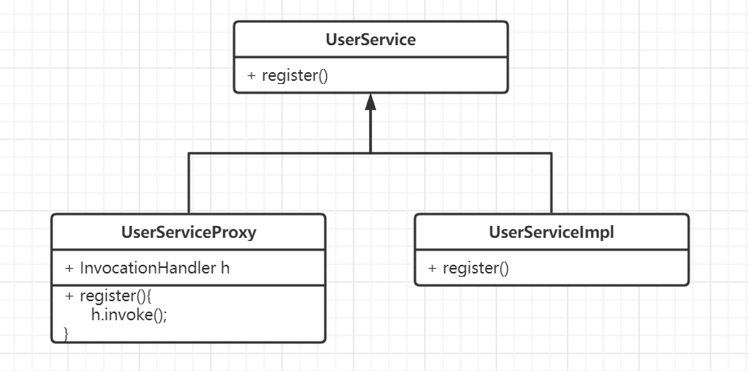
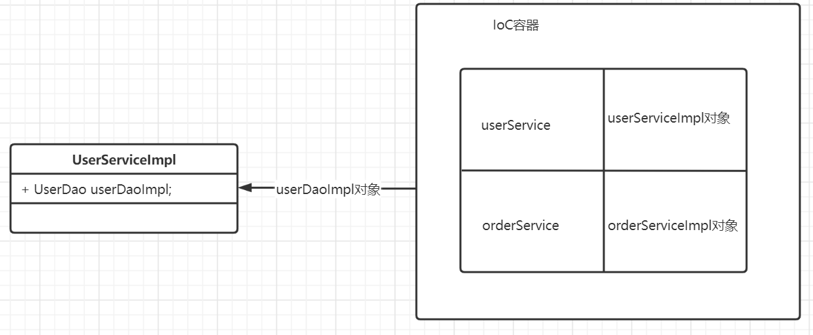
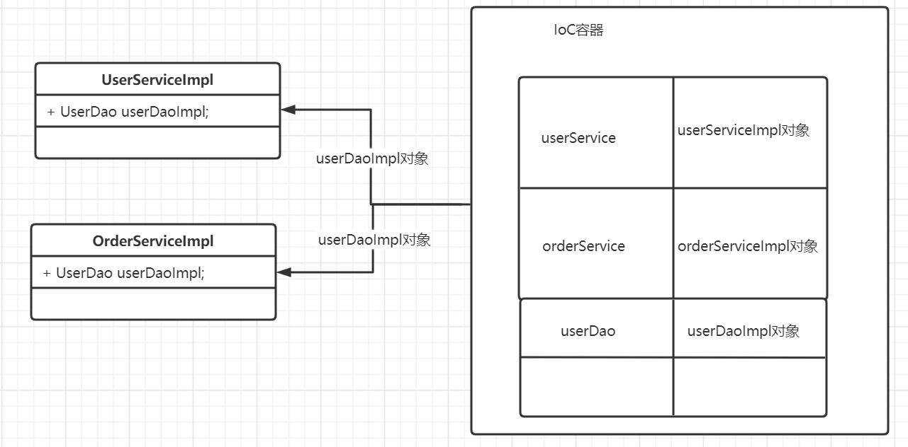
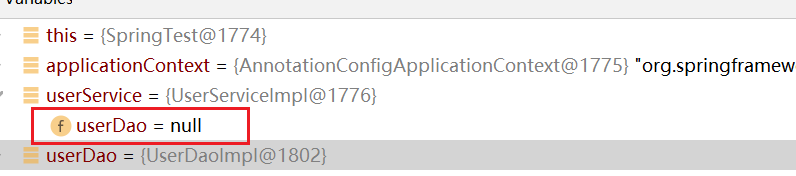
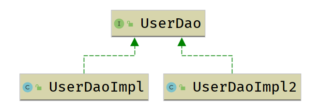
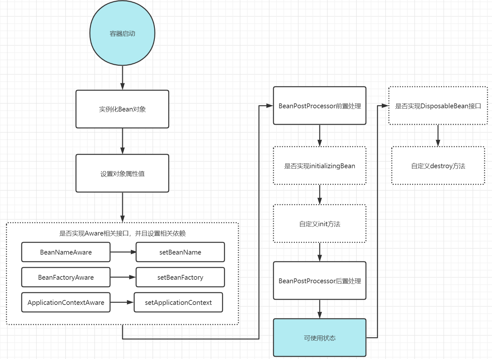
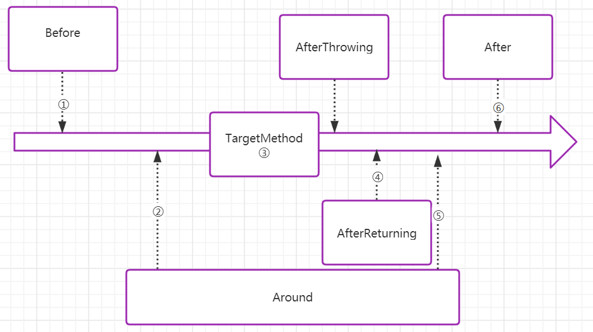
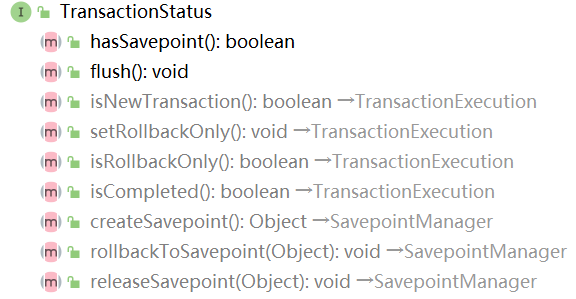
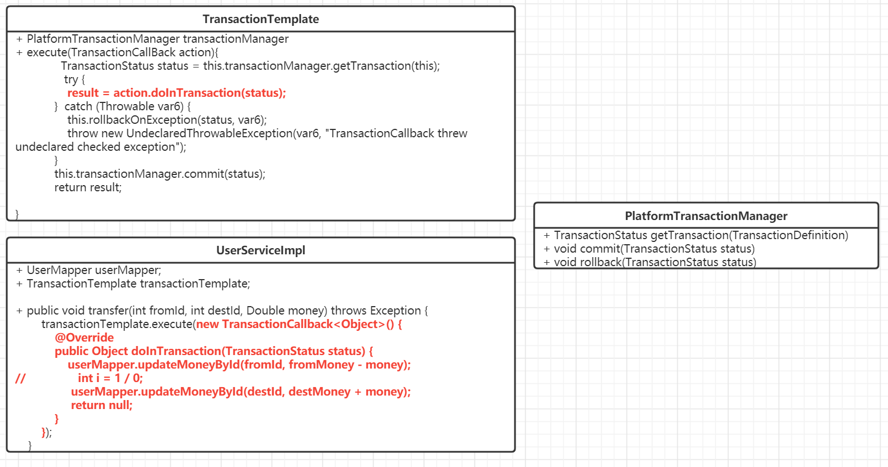

# Spring笔记

## 知识回顾

### 注解

注解可以理解为java代码中的元数据。这些数据可以在程序编译、类加载、运行时被程序读取到，并执行相应的处理。

> 元数据：metadata。[metadata在wiki中的解释](https://en.wikipedia.org/wiki/Metadata)是：Metadata is data [information] that provides information about other data。也就是为其他数据提供信息的数据。

注解可以内置注解和自定义注解。无论内置注解还是自定义注解，最为核心的部分就是元注解。元注解的主要功能就是给注解提供信息。元注解有如下几种：

- @Target

  **ElementType.TYPE：能修饰类、接口或枚举类型**
  **ElementType.FIELD：能修饰成员变量**
  **ElementType.METHOD：能修饰方法**
  ElementType.PARAMETER：能修饰参数
  ElementType.CONSTRUCTOR：能修饰构造器
  ElementType.LOCAL_VARIABLE：能修饰局部变量
  ElementType.ANNOTATION_TYPE：能修饰注解
  ElementType.PACKAGE：能修饰包

- @Retention：表示生命周期

  RetentionPolicy.SOURCE:注解只在源代码中存在，编译成class就没了。[@Override ](https://how2j.cn/k/annotation/annotation-system/1060.html#step4028)就是这种注解。

  RetentionPolicy.CLASS:注解在java文件编程成.class文件后，依然存在，但是运行就没了。@Retention的默认值，即当没有显式指定@Retention的时候，就会是这种类型。

  RetentionPolicy.RUNTIME:注解在运行之后依然存在，程序可以通过反射获取这些信息。

- @Inherited：表示该注解是否具有继承性

- @Documented：表示使用javadoc生成API文档时，文档会出现该注解的说明

## 动态代理

利用反射技术，在程序运行时创建生成代理类。代理类负责为委托类预处理消息、过滤消息、传递消息给委托类等。动态代理的实现方式由JDK动态代理和CGLib动态代理两种方式。

```java
//参数说明：
//loader：定义由哪个ClassLoader对象来对生成的代理对象进行加载
//interfaces：代理对象需要实现的接口
//InvocationHandler：代理对象的方法在执行时，会调用该对象中的invoke方法
Proxy.newProxyInstance(ClassLoader loader,Class<?>[] interfaces,InvocationHandler h)throws IllegalArgumentException{}
```

而位于InvocationHandler中的invoke方法也需要传递入三个参数：

```java
//proxy:代理对象
//method：调用的方法
//args：方法中的参数
public Object invoke(Object proxy, Method method, Object[] args) throws Throwable {
      return null;
}
```

```java
import com.cskaoyan.service.UserService;
import com.cskaoyan.service.UserServiceImpl;
import org.junit.Test;

import java.lang.reflect.InvocationHandler;
import java.lang.reflect.Method;
import java.lang.reflect.Proxy;

/**
 * @ClassName ProxyTest
 * @Description: TODO
 * @Author 远志 zhangsong@cskaoyan.onaliyun.com
 * @Date 2022/8/2 16:33
 * @Version V1.0
 **/
public class ProxyTest {


    @Test
    public void testProxy1() throws ClassNotFoundException, IllegalAccessException, InstantiationException {
        //为com.cskaoyan.service.UserServiceImpl生成代理对象，执行对应方法
        Class<?> aClass = Class.forName("com.cskaoyan.service.UserServiceImpl");
        //UserServiceImpl的一个实例化对象
        Object delegate = aClass.newInstance();
        UserService proxyInstance = (UserService) Proxy.newProxyInstance(aClass.getClassLoader(), aClass.getInterfaces(), new InvocationHandler() {
            @Override
            public Object invoke(Object proxy, Method method, Object[] args) throws Throwable {
                System.out.println("before register examine");
                Object invoke = method.invoke(delegate, args);
                System.out.println("after register save");
                return invoke;
            }
        });
        proxyInstance.register();
    }
}
```

JDK动态代理原理图：



在上述案例中，我们分别在method.invoke(obj, args)方法前后打印了一句话。最终我们会发现在委托类的方法执行前后有会相应的日志出现。我们利用这种方式就实现了一个增强的效果。后续课程中，Spring的AOP原理其实就是动态代理。

## Spring IoC

https://spring.io/

Spring的出现主要是为了解决JavaEE项目开发的繁琐。

> Spring makes programming Java quicker, easier, and safer for everybody. Spring’s focus on speed, simplicity, and productivity has made it the [world's most popular](https://snyk.io/blog/jvm-ecosystem-report-2018-platform-application/) Java framework.

> The Spring Framework provides a comprehensive programming and configuration model for modern Java-based enterprise applications - on any kind of deployment platform.
>
> **Features**
>
> - [Core technologies](https://docs.spring.io/spring-framework/docs/current/spring-framework-reference/core.html): **dependency injection**, events, resources, i18n, validation, data binding, type conversion, SpEL, **AOP**.
> - [Data Access](https://docs.spring.io/spring-framework/docs/current/spring-framework-reference/data-access.html): **transactions**, DAO support, JDBC, ORM, Marshalling XML.
>
> Spring的核心特性主要关注于加粗标注的部分。dependency injection，一般简写为DI，表示依赖注入。AOP表示面向切面编程，其背后的原理就是动态代理。

### IoC/DI

> This chapter covers the Spring Framework implementation of the Inversion of Control (IoC) principle. **IoC is also known as dependency injection (DI)**. It is a process whereby objects define their dependencies (that is, the other objects they work with) only through constructor arguments, arguments to a factory method, or properties that are set on the object instance after it is constructed or returned from a factory method. The container then injects those dependencies when it creates the bean. This process is fundamentally the inverse (hence the name, Inversion of Control) of the bean itself controlling the instantiation or location of its dependencies by using direct construction of classes or a mechanism such as the Service Locator pattern.
>
> IoC(控制反转)也被称之为依赖注入。它描述的是这样的一种过程：对象和另外其他对象一起使用时，当对象被创建之后，只可以通过构造函数、工厂方法的参数或者属性值设置给实例对象，或者直接从工厂方法返回。IoC容器创建了对应的对象之后，负责注入这些依赖。对象的创建实例化过程不再由应用程序本身来控制，而是由Spring容器(IoC容器)来控制。这种称之为反转。

在没有引入IoC概念之前，我们之前编写的代码如下：

```java
public class UserServlet extends HttpServlet{
    
    UserService userService = new UserServiceImpl();
    
}
```

而藉由IoC容器，相应的代码模型为如下所示：



- 为什么使用Spring，为什么使用容器来维护
  - 降低服务器的开销成本。比如在UserServiceImpl以及OrderServiceImpl中均需引用UserDaoImpl，无需创建两个UserDaoImpl对象，只需要交给容器去维护即可。
  - 便于维护对象和对象之间的依赖关系。比如UserServlet需要依赖UserServiceImpl，容器可以自动将二者关系进行维护，提升开发效率。
  - 减少耦合性。比如在UserServlet中只需要依赖UserService接口，而不需要自己去实例化一个对象，后续需求变更，也不需要去修改代码。

### 入门案例

> The `org.springframework.context.ApplicationContext` interface represents the Spring IoC container and is responsible for instantiating, configuring, and assembling the beans. The container gets its instructions on what objects to instantiate, configure, and assemble by reading configuration metadata. The configuration metadata is represented in XML, Java annotations, or Java code.
>
> `org.springframework.context.ApplicationContext`接口代表了Spring的IoC容器。它负责实例化、配置、组装Bean对象。IoC容器通过读取配置元数据(也就是配置信息)来进行对象的实例化、配置、组装过程。配置元数据的形式可以有xml形式、java注解、java代码。
>
> Several implementations of the `ApplicationContext` interface are supplied with Spring. In stand-alone applications, it is common to create an instance of [`ClassPathXmlApplicationContext`](https://docs.spring.io/spring-framework/docs/5.3.22/javadoc-api/org/springframework/context/support/ClassPathXmlApplicationContext.html) or [`FileSystemXmlApplicationContext`](https://docs.spring.io/spring-framework/docs/5.3.22/javadoc-api/org/springframework/context/support/FileSystemXmlApplicationContext.html).
>
> **Instantiating a Container**
>
> The location path or paths supplied to an `ApplicationContext` constructor are resource strings that let the container load configuration metadata from a variety of external resources, such as the local file system, the Java `CLASSPATH`, and so on.
>
> ```java
> ApplicationContext context = new ClassPathXmlApplicationContext("services.xml", "daos.xml");
> ```
>
> **Using the Container**
>
> The `ApplicationContext` is the interface for an advanced factory capable of maintaining a registry of different beans and their dependencies. By using the method `T getBean(String name, Class<T> requiredType)`, you can retrieve instances of your beans.
>
> The `ApplicationContext` lets you read bean definitions and access them, as the following example shows:
>
> ```java
> // create and configure beans
> ApplicationContext context = new ClassPathXmlApplicationContext("services.xml", "daos.xml");
> 
> // retrieve configured instance
> PetStoreService service = context.getBean("petStore", PetStoreService.class);
> 
> // use configured instance
> List<String> userList = service.getUsernameList();
> ```

利用Spring容器来完成如下图所示的依赖：



- **导入Spring依赖信息**

  ```xml
  <dependency>
              <groupId>org.springframework</groupId>
              <artifactId>spring-context</artifactId>
              <version>5.3.22</version>
  </dependency>
  ```

- **编写Spring配置文件**

  ```xml
  <?xml version="1.0" encoding="UTF-8"?>
  <beans xmlns="http://www.springframework.org/schema/beans"
         xmlns:xsi="http://www.w3.org/2001/XMLSchema-instance"
         xsi:schemaLocation="http://www.springframework.org/schema/beans http://www.springframework.org/schema/beans/spring-beans.xsd">
  
      <bean id="userService" class="com.cskaoyan.service.UserServiceImpl"/>
  
      <bean id="orderService" class="com.cskaoyan.service.OrderServiceImpl"/>
  
      <bean id="userDao" class="com.cskaoyan.dao.UserDaoImpl"/>
      
  </beans>
  ```

- **编写代码从Spring容器中获取对象**

  ```java
  import com.cskaoyan.dao.UserDao;
  import com.cskaoyan.service.OrderService;
  import com.cskaoyan.service.UserService;
  import org.junit.Test;
  import org.springframework.context.ApplicationContext;
  import org.springframework.context.support.ClassPathXmlApplicationContext;
  
  /**
   * @ClassName SpringTest
   * @Description: TODO
   * @Author 远志 zhangsong@cskaoyan.onaliyun.com
   * @Date 2022/8/4 15:22
   * @Version V1.0
   **/
  public class SpringTest {
  
      @Test
      public void testIoc(){
          //初始化容器
          ApplicationContext applicationContext = new ClassPathXmlApplicationContext("application.xml");
          //从容器中取出对象
          UserService userService = (UserService) applicationContext.getBean("userService");
          OrderService orderService = (OrderService) applicationContext.getBean("orderService");
          UserDao userDao = (UserDao) applicationContext.getBean("userDao");
  
      }
  }
  ```

  此时单独获取userService、orderService、userDao均可以获取到数据，但是如果查看userService以及orderService对象中userDao的值，均为null。也就是说此时对象和对象之间的关系还没有维护。

- **维护对象之间的依赖关系(依赖注入 DI)**

  > **Dependency Injection**
  >
  > **DI exists in two major variants: [Constructor-based dependency injection](https://docs.spring.io/spring-framework/docs/current/reference/html/core.html#beans-constructor-injection) and [Setter-based dependency injection](https://docs.spring.io/spring-framework/docs/current/reference/html/core.html#beans-setter-injection).**

  ```java
  package com.cskaoyan.service;
  
  import com.cskaoyan.dao.UserDao;
  
  /**
   * @ClassName UserServiceImpl
   * @Description: TODO
   * @Author 远志 zhangsong@cskaoyan.onaliyun.com
   * @Date 2022/8/2 16:37
   * @Version V1.0
   **/
  public class UserServiceImpl implements UserService {
  
      UserDao userDao;
  
      //提供set方法
      public void setUserDao(UserDao userDao) {
          this.userDao = userDao;
      }
  
      @Override
      public void register() {
          System.out.println("register");
      }
  }
  ```

  ```java
  package com.cskaoyan.service;
  
  import com.cskaoyan.dao.UserDao;
  
  /**
   * @ClassName OrderServiceImpl
   * @Description: TODO
   * @Author 远志 zhangsong@cskaoyan.onaliyun.com
   * @Date 2022/8/4 14:53
   * @Version V1.0
   **/
  public class OrderServiceImpl implements OrderService {
  
      UserDao userDao;
  
      //提供set方法
      public void setUserDao(UserDao userDao) {
          this.userDao = userDao;
      }
  }
  ```

  ```xml
  <?xml version="1.0" encoding="UTF-8"?>
  <beans xmlns="http://www.springframework.org/schema/beans"
         xmlns:xsi="http://www.w3.org/2001/XMLSchema-instance"
         xsi:schemaLocation="http://www.springframework.org/schema/beans http://www.springframework.org/schema/beans/spring-beans.xsd">
  
      <bean id="userService" class="com.cskaoyan.service.UserServiceImpl">
          <!--name属性，对应的是方法名称-->
          <!--ref属性，对应的是容器中组件的id，也就是将该id的对象作为参数传递给set方法执行-->
          <property name="userDao" ref="userDao"/>
      </bean>
  
  
      <bean id="orderService" class="com.cskaoyan.service.OrderServiceImpl"/>
  
      <bean id="userDao" class="com.cskaoyan.dao.UserDaoImpl"/>
  
  </beans>
  ```

  此时再关注UserService和OrderService对象中UserDao对象的值，它们之间已经产生了关联。

### 实例化Beans

- **利用构造函数**

  在上述案例中，我们在xml文件中编写的bean节点，其实默认就是利用无参构造函数来实例化。但是如果没有提供无参构造函数，能否实例化呢？答案依然是可以的，只不过此时的处理要略微复杂一些。

  ```java
  package com.cskaoyan.model;
  
  /**
   * @ClassName User
   * @Description: TODO
   * @Author 远志 zhangsong@cskaoyan.onaliyun.com
   * @Date 2022/8/4 17:14
   * @Version V1.0
   **/
  public class User {
  
      private String username;
  
      private String password;
  
      public User(String username, String password) {
          this.username = username;
          this.password = password;
      }
  }
  ```

  ```xml
  <!--如果使用的是有参构造函数，那么必须使用复杂类型的标签-->
      <bean id="user" class="com.cskaoyan.model.User">
          <!--name属性也就是有参构造函数的形参名-->
  <!--
          <constructor-arg name="username" value="zhangsan"/>
          <constructor-arg name="password" value="admin123"/>
  -->
          <constructor-arg index="0" value="zhangsan"/>
          <constructor-arg index="1" value="admin1234"/>
      </bean>
  ```

  > **Constructor argument name**
  >
  > You can also use the constructor parameter name for value disambiguation, as the following example shows
  >
  > ```xml
  > <bean id="exampleBean" class="examples.ExampleBean">
  >     <constructor-arg name="years" value="7500000"/>
  >     <constructor-arg name="ultimateAnswer" value="42"/>
  > </bean>
  > ```
  >
  > **Constructor argument index**
  >
  > You can use the `index` attribute to specify explicitly the index of constructor arguments, as the following example shows
  >
  > ```xml
  > <bean id="exampleBean" class="examples.ExampleBean">
  >     <constructor-arg index="0" value="7500000"/>
  >     <constructor-arg index="1" value="42"/>
  > </bean>
  > ```
  >
  > **Constructor argument type matching**
  >
  > the container can use type matching with simple types if you explicitly specify the type of the constructor argument by using the `type` attribute, as the following example shows
  >
  > ```xml
  > <bean id="exampleBean" class="examples.ExampleBean">
  >     <constructor-arg type="int" value="7500000"/>
  >     <constructor-arg type="java.lang.String" value="42"/>
  > </bean>
  > ```

- 利用静态工厂方法(了解)

  ```java
  package com.cskaoyan.model;
  
  /**
   * @ClassName FactoryBean
   * @Description: 
   * 利用工厂产生的对象
   * @Author 远志 zhangsong@cskaoyan.onaliyun.com
   * @Date 2022/8/4 17:39
   * @Version V1.0
   **/
  public class FactoryBean {
  }
  ```

  ```java
  package com.cskaoyan.factory;
  
  import com.cskaoyan.model.FactoryBean;
  
  /**
   * @ClassName StaticBeanFactory
   * @Description: TODO
   * @Author 远志 zhangsong@cskaoyan.onaliyun.com
   * @Date 2022/8/4 17:39
   * @Version V1.0
   **/
  public class StaticBeanFactory {
  
      private static FactoryBean bean = new FactoryBean();
  
      public static FactoryBean getInstance(){
          return bean;
      }
  }
  ```

  ```xml
      <!--需要特别注意的是通过静态工厂方法返回的bean不是标签中的class，而是factory-method的返回值-->
      <bean id="beanViaStaticFactory" class="com.cskaoyan.factory.StaticBeanFactory" factory-method="getInstance"/>
  ```

- 利用实例工厂方法(了解)

  ```java
  package com.cskaoyan.factory;
  
  import com.cskaoyan.model.FactoryBean;
  
  /**
   * @ClassName InstanceBeanFactory
   * @Description: TODO
   * @Author 远志 zhangsong@cskaoyan.onaliyun.com
   * @Date 2022/8/4 17:39
   * @Version V1.0
   **/
  public class InstanceBeanFactory {
  
      private static FactoryBean bean = new FactoryBean();
  
      public FactoryBean getInstance(){
          return bean;
      }
  }
  ```

  ```xml
      <!--使用实例工厂方法时，首先第一步先实例化工厂类-->
      <bean id="factory" class="com.cskaoyan.factory.InstanceBeanFactory"/>
      <!--第二步，调用工厂类对象的方法返回结果-->
      <bean id="beanViaInstanceFactory" factory-bean="factory" factory-method="getInstance"/>
  ```

  **上述两种方式，使用静态工厂和使用实例工厂实例化beans的使用场景在我们的开发过程中并不是特别的频繁。主要是将已经写好的一些工具类整合到Spring中**。
  
  其中在实例工厂方法中有一种特殊的形式FactoryBean。该种实现方式在Spring中有特殊的优化。FactoryBean是一个接口
  
  ```java
  public interface FactoryBean<T> {
      String OBJECT_TYPE_ATTRIBUTE = "factoryBeanObjectType";
  
      @Nullable
      T getObject() throws Exception;
  
      @Nullable
      Class<?> getObjectType();
  
      default boolean isSingleton() {
          return true;
      }
  }
  ```
  
  其中getObject()用来获取一个Bean实例对象。Spring容器在注册组件的过程中，会判断当前对象是否实现了FactoryBean接口。如果实现的话，那么会自动调用其getObject().
  
  ```java
  public class UserFactoryBean implements FactoryBean<User> {
      @Override
      public User getObject() throws Exception {
          return new User("admin", "admin123");
      }
  
      @Override
      public Class<?> getObjectType() {
          return User.class;
      }
  }
  ```
  
  **注意：此时该标签返回的bean实例对象不是UserFactoryBean，而是返回的User对象（因为调用了UserFactoryBean.getObject()）**
  
  ```xml
      <bean id="userViaFactoryBean" class="com.cskaoyan.factory.UserFactoryBean"/>
  ```
  
  ```java
  	@Test
      public void testIoc2(){
          ApplicationContext applicationContext = new ClassPathXmlApplicationContext("application.xml");
          User userViaFactoryBean = (User) applicationContext.getBean("userViaFactoryBean");
      }
  ```

**上述介绍实例化Bean的三种方式，其中第一种方式使用无参构造函数是我们今后开发过程中使用最多的一种方式。至于FactoryBean的使用场景，主要用在和其他框架的整合过程中。比如后续整合MyBatis时会利用到该方式。**

### 组件注册方式

- **xml标签**

  在上述的案例中，我们注册组件的方式都是采用xml标签的形式。这个就不再具体展开介绍。

- **配置类-@Bean注解**

  也是在SpringBoot中推荐的一种方式。主要是使用一个配置类来代替之前我们编写的xml配置文件。这种方式也被称作JavaConfig。

  配置类需要满足如下特征：

  - 配置类需要具有@Configuration注解，用来标识是一个配置类。

  - 在配置类中定义方法，通过方法来完成组件的注册。

  - 在配置类中，我们还可以加入一些其他的功能性注解。

    ```java
    @Configuration
    public class SpringConfiguration {
    
        /**
         * @Bean方法就是组件注册的方法
         * 该方法的返回值就是向容器中注册的组件类型，可以是接口，也可以是具体类，建议写接口
         * 通过这种方法注册的组件id是啥呢？默认情况下是方法名；如果希望指定，可以设置@Bean的value属性来执行
         * @return
         */
        @Bean
        public UserDao userDao(){
            return new UserDaoImpl();
        }
    
        @Bean
        public UserService userService(){
            UserService userService = new UserServiceImpl();
            return userService;
        }
    }
    ```

    ```java
    public class SpringTest {
    
        @Test
        public void testJavaConfig(){
            ApplicationContext applicationContext = new AnnotationConfigApplicationContext(SpringConfiguration.class);
            Object userService = applicationContext.getBean("userService");
            Object userDao = applicationContext.getBean("userDao");
        }
    }
    ```

    

    但是此时面临的问题是没有将userDao注入到userService中。

    

    ```java
    @Configuration
    public class SpringConfiguration {
    
        /**
         * @Bean方法就是组件注册的方法
         * 该方法的返回值就是向容器中注册的组件类型，可以是接口，也可以是具体类，建议写接口
         * 通过这种方法注册的组件id是啥呢？默认情况下是方法名；如果希望指定，可以设置@Bean的value属性来执行
         * @return
         */
        @Bean("userDaoImpl")
        public UserDao userDao(){
            return new UserDaoImpl();
        }
    
        @Bean("userDaoImpl2")
        public UserDao userDao2(){
            return new UserDaoImpl();
        }
    
        /*@Bean
        public UserService userService(){
            UserService userService = new UserServiceImpl();
            return userService;
        }*/
    
        /**
         * 上述案例中，我们的问题是无法将userDao注入到userService中
         * @Bean对应的方法参数，Spring在解析时，会从容器中取出相应的组件，然后在实例化UserService时传递进来
         * 默认情况下是按照类型从容器中取出，这就要求在容器中该类型的组件只有一个；如果有多个则会出错
         * 如果有多个，则可以设置一个@Qualifier注解，通过组件的编号来指定取出哪个组件
         * @return
         */
        /*@Bean
        public UserService userService(UserDao userDao){
            UserServiceImpl userService = new UserServiceImpl();
            userService.setUserDao(userDao);
            return userService;
        }*/
    
        @Bean
        public UserService userService(@Qualifier("userDaoImpl") UserDao userDao){
            UserServiceImpl userService = new UserServiceImpl();
            userService.setUserDao(userDao);
            return userService;
        }
    }
    ```

    **配置类主要的使用场景是在使用一些框架内部的类时，我们一般会采取该种方式**。但是，当我们使用的是自己编写的类时，一般情况下，我们使用的是下面这种方式。

- **@ComponentScan注解**

  当我们编写的自己项目代码时，我们一般情况下使用该种方式。

  使用方式：

  **1.设置扫描包目录（xml文件或者注解）**

  **2.设置注解（最常用的就是@Component注解，表示设置一个组件。但是根据代码所处的功能不同，可以设置一些更加详细的注解，比如controller的代码设置@Controller，service层的代码设置@Service等。其他常用注解如下：@Component, @Repository, @Service,@Controller, @RestController, @ControllerAdvice, and @Configuration）**

  **3.从容器中获取（默认情况下容器的编号为类名首字母小写；如果需要特别指定，设置注解的value属性即可）**

  **xml方式：**

  使用xml方式来配置需要扫描的目录

  ```xml
  <?xml version="1.0" encoding="UTF-8"?>
  <beans xmlns="http://www.springframework.org/schema/beans"
         xmlns:xsi="http://www.w3.org/2001/XMLSchema-instance"
         xmlns:context="http://www.springframework.org/schema/context"
         xsi:schemaLocation="http://www.springframework.org/schema/beans http://www.springframework.org/schema/beans/spring-beans.xsd http://www.springframework.org/schema/context https://www.springframework.org/schema/context/spring-context.xsd">
  
      <context:component-scan base-package="com.cskaoyan"/>
  
  </beans>
  ```

  相应的类上面需要加上@Component注解

  ```java
  @Component
  public class UserServiceImpl implements UserService {
  
      UserDao userDao;
  
      //提供set方法
      public void setUserDao(UserDao userDao) {
          this.userDao = userDao;
      }
  
      @Override
      public void register() {
          System.out.println("register");
      }
  }
  ```

  从Spring容器中获取该组件

  ```java
  @Test
  public void testRegisterViaXML(){
      ApplicationContext applicationContext = new ClassPathXmlApplicationContext("application.xml");
      UserService userServiceImpl = (UserService) applicationContext.getBean("userServiceImpl");
      userServiceImpl.register();
  }
  ```

  **注解方式：**

  来配置需要扫描的包

  ```java
  @Configuration
  @ComponentScan("com.cskaoyan")
  public class SpringConfig {
  }
  ```

  相应类上加上@Component注解，该步骤同上。

  从Spring容器中获取该组件

  ```java
  @Test
  public void testRegisterViaAnnotate(){
      ApplicationContext applicationContext = new AnnotationConfigApplicationContext(SpringConfig.class);
      UserService userServiceImpl = (UserService) applicationContext.getBean("userServiceImpl");
      userServiceImpl.register();
  }
  ```

- **@Import注解**

  除了使用上述方式之外，还可以使用@Import注解的方式将某个类注册到Spring容器中。这种方式一般情况下用在引入框架中的配置类时会用到。使用@Import注解的方式注册的组件，从Spring容器中取出时，编号为全类名。

  ```java
  //注意：该类不需要添加任何注解
  public class OrderServiceImpl implements OrderService {
  
  }
  ```

  ```java
  @Configuration
  @ComponentScan("com.cskaoyan")
  @Import(OrderServiceImpl.class)
  public class SpringConfig {
  
  }
  ```

  ```java
  @Test
  public void testRegisterViaImport(){
      ApplicationContext applicationContext = new AnnotationConfigApplicationContext(SpringConfig.class);
      Object orderServiceImpl = applicationContext.getBean("com.cskaoyan.service.OrderServiceImpl");
      System.out.println(orderServiceImpl);
  }
  ```

几种组件注册方式的区别

bean标签：最开始使用的方式，一般现在在维护老项目时会用到

**@bean注解：可以导入第三方的类库、jar包**

**@ComponentScan注解：我们开发过程中编写代码最常使用的一种方式**

@Import注解：使用方式和@bean注解比较类似。使用方法相较于@bean更加简单一些，同时也可以搭配一些其他类实现复杂的功能。

### 组件取出方式

#### **利用ApplicationContext对象取出**

获取applicationContext对象，通过调用getBean方法(来源于BeanFactory接口)来获取到

> ```
> <T> T getBean(Class<T> requiredType)
>        throws BeansException
> ```
>
> Return the bean instance that uniquely matches the given object type, if any.
>
> ```
> <T> T getBean(String name,
>               Class<T> requiredType)
>        throws BeansException
> ```
>
> Return an instance, which may be shared or independent, of the specified bean.
>
> Behaves the same as [`getBean(String)`](https://docs.spring.io/spring-framework/docs/current/javadoc-api/org/springframework/beans/factory/BeanFactory.html#getBean-java.lang.String-), but provides a measure of type safety by throwing a BeanNotOfRequiredTypeException if the bean is not of the required type. This means that ClassCastException can't be thrown on casting the result correctly, as can happen with [`getBean(String)`](https://docs.spring.io/spring-framework/docs/current/javadoc-api/org/springframework/beans/factory/BeanFactory.html#getBean-java.lang.String-).
>
> ```
> Object getBean(String name)
>         throws BeansException
> ```
>
> Return an instance, which may be shared or independent, of the specified bean.

```java
@Test
public void testRegisterViaAnnotate(){
    ApplicationContext applicationContext = new AnnotationConfigApplicationContext(SpringConfig.class);
    UserService userServiceImpl = (UserService) applicationContext.getBean("userServiceImpl");
    UserService bean = applicationContext.getBean(UserService.class);
    UserService userServiceImpl1 = applicationContext.getBean("userServiceImpl", UserService.class);
    userServiceImpl.register();

}
```

**BeanFactory和FactoryBean的区别和联系？**

BeanFactory强调的是factory，其实就是指的是Spring 的IoC容器的规范；FactoryBean强调的是Bean，它是一个可以生产或者修饰对象生成的工厂Bean。

#### 使用注解（使用频繁）

使用注解时，其实Spring也是通过调用applicationContext.getBean方法来获取组件。使用组件不仅操作简单，并且还可以维护组件之间的关系。比如UserServiceImpl需要依赖UserDao，那么使用注解，可以自动维护组件之间的关系。

设置需要扫描的包

```java
@Configuration
@ComponentScan("com.cskaoyan")
public class SpringConfig {
}
```

注册Service组件和Dao组件。Service中维护了Dao。注意Service和Dao此时使用的注解。

```java
@Service("userService")
public class UserServiceImpl implements UserService {

    UserDao userDao;

    @Autowired
    public void setUserDao(UserDao userDao) {
        this.userDao = userDao;
    }

    @Override
    public void register() {
        System.out.println("register");
    }
}
```

```java
@Repository("userDao")
public class UserDaoImpl implements UserDao {
}
```

Spring会调用Autowired注解的方法，将容器的UserDao组件注入到userService的userDao变量中

如果UserDao如果有多个实例对象时，可以通过@Qualifier注解指定特定的对象.（使用过程和@Bean注解比较类似）

比如在如下场景下：



```java
@Service("userService")
public class UserServiceImpl implements UserService {

    UserDao userDao;

    /**
     * Spring会调用Autowired注解的方法，将容器的UserDao组件注入到userService的userDao变量中
     * 同样，如果UserDao如果有多个实例对象时，可以通过@Qualifier注解指定特定的对象
     * @param userDao
     */
    @Autowired
    public void setUserDao(@Qualifier("userDao2") UserDao userDao) {
        this.userDao = userDao;
    }

    @Override
    public void register() {
        System.out.println("register");
    }
}
```

**在实际开发过程中，我们会用一种更加简化的方式。set方法可以省去。**

```java
@Service("userService")
public class UserServiceImpl implements UserService {

    @Autowired
    @Qualifier("userDao2")
    UserDao userDao;

    @Override
    public void register() {
        System.out.println("register");
    }
}
```

除了使用上述的方式之外，还可以使用另外一个注解@Resource。

```java
@Service("userService")
public class UserServiceImpl implements UserService {

    @Autowired
    @Qualifier("userDao2")
    UserDao userDao;

    @Resource(name = "userDao")
    UserDao userDao2;

    @Override
    public void register() {
        System.out.println("register");
    }
}
```

**注意：上述介绍的注解，必须要获取容器中的组件时才有效。也就是交由Spring容器来维护对象。如果自己new创建一个对象，则上述注入过程不会生效。**

##### 单元测试使用注解

在之前的单元测试案例中，我们是自己手动获取applicationContext对象，利用其getBean方法来获取我们想要的组件对象。这种方式使用起来略微有一些繁琐。实际上，Spring框架也对单元测试进行了整合。可以按照如下方式来操作：

1.导入Spring针对Junit的整合依赖

```xml
<dependency>
    <groupId>org.springframework</groupId>
    <artifactId>spring-test</artifactId>
    <version>5.3.22</version>
    <scope>test</scope>
</dependency>
```

2.单元测试类添加注解@RunWith(SpringJUnit4ClassRunner.class)

3.单元测试类添加注解@ContextConfiguration("classpath:application.xml")或者@ContextConfiguration(classes = SpringConfig.class)。分别用于读取xml文件或者配置类的配置。

3.需要使用的组件上面添加@Autowired注解

```java
@RunWith(SpringJUnit4ClassRunner.class)
//@ContextConfiguration("classpath:application.xml")
@ContextConfiguration(classes = SpringConfig.class)
public class SpringJunitTest {

    @Autowired
    UserService userService;

    @Test
    public void testCase1(){
        System.out.println(userService);
    }
}
```

### 组件的生命周期

组件的生命周期，就是指的是组件从诞生到最终销毁的整个阶段。在特定的阶段，Spring容器会调用组件相对应的方法。

当Spring 容器加载完毕，会实例化相应的Bean对象，紧接着设置对象属性值。

随后根据当前对象是否实现Aware系列接口，进行决定做不同的设置。比如如果某个类实现了BeanNameAware接口，那么当Spring 容器在实例化Bean对象之后，便会调用setBeanName方法，进而将当前Bean的name传递过来，那么我们便可以在当前Bean对象中获取该值。对于BeanFactoryAware、ApplicationContextAware同理。

随后会调用BeanPostProcessor的前置处理方法，该方法会针对所有的Bean对象进行处理。

随后根据当前Bean是否实现了InitializingBean接口，决定是否调用afterPropertiesSet方法(一般框架会用该方法来完成一些初始化操作)；根据当前Bean是否自定义init方法，决定是否调用自定义init方法(一般自己编写的代码会用该方法来完成一些初始化操作)。

再后会调用BeanPostProcessor的后置处理方法，该方法同样会针对所有的Bean对象进行处理。(BeanPostProcessor的可以用在代理、增强等一系列场景下)。

此时我们的组件Bean对象就是可使用状态了。

最后根据是否实现DisposableBean接口，决定是否调用destroy方法(一般框架会用该方法来完成一些善后、销毁工作，比如释放资源)；根据当前Bean是否实现自定义destroy方法，决定是否调用自定义destroy方法(一般自己编写的代码会用该方法来完成一些销毁工作)。



```java
package com.cskaoyan.life;

import org.springframework.beans.BeansException;
import org.springframework.beans.factory.*;
import org.springframework.context.ApplicationContext;
import org.springframework.context.ApplicationContextAware;
import org.springframework.context.annotation.Bean;
import org.springframework.stereotype.Component;

import javax.annotation.PostConstruct;
import javax.annotation.PreDestroy;

@Component
public class LifeCycleBean implements BeanNameAware, BeanFactoryAware, ApplicationContextAware, InitializingBean, DisposableBean {

    private String username;

    public String getUsername() {
        return username;
    }

    public void setUsername(String username) {
        this.username = username;
    }

    @Override
    public void setBeanFactory(BeanFactory beanFactory) throws BeansException {
        System.out.println("setBeanFactory");
    }

    @Override
    public void setBeanName(String s) {
        System.out.println("setBeanName" + s);
    }

    @Override
    public void destroy() throws Exception {
        System.out.println("bean destroy");
    }

    @Override
    public void afterPropertiesSet() throws Exception {
        System.out.println("after properties set");
    }

    @Override
    public void setApplicationContext(ApplicationContext applicationContext) throws BeansException {
        System.out.println("setApplicationContext");
    }

    @PostConstruct
    public void init(){
        System.out.println("自定义init");
    }

    @PreDestroy
    public void myDestroy(){
        System.out.println("自定义destroy");
    }

    public void hello(){
        System.out.println("Hello world");
    }
}
```

### 组件作用域(Scope)(了解)

Singleton:每个Spring容器之中，每个组件只有唯一的一个实例对象。Spring容器中默认就是Singleton。

prototype:每个组件有多个实例对象。每次获取到的都是新的实例对象。

> Singleton
>
> 
>
> Prototype
>
> 

```java
@RunWith(SpringJUnit4ClassRunner.class)
@ContextConfiguration(classes = SpringConfig.class)
public class SpringJunitTest2 {

    @Autowired
    SingletonBean singletonBean;

    @Autowired
    PrototypeBean prototypeBean1;

    @Autowired
    PrototypeBean prototypeBean2;

    @Test
    public void testCase1(){
    }
}
```

## Spring AOP

我们编写的一串代码，有时候，我们可能需要去统计该部分代码执行的时间，也就是需要在该部分代码的开始和结尾分别获取到时间，并计算差值；但是在另外一个场景下，我们可能需要去到数据库中执行插入操作，也就是需要在代码靠前的部分开启事务，在代码靠后的部分提交事务或者回滚事务。我们如果编写常规业务代码来实现，那么当需求变更时，我们也就需要同步修改业务代码逻辑。我们利用动态代理可以实现该效果，但是此时对于需要增强的方法的范围指定不够灵活。因此，我们需要一种更加灵活的方式。

> **Aspect-oriented Programming (AOP)** complements Object-oriented Programming (OOP) by providing another way of thinking about program structure. The key unit of modularity in OOP is the class, whereas in AOP the unit of modularity is the aspect.

AOP也就是面向切面编程。

### 核心概念

> - **Aspect**: A modularization of a concern that cuts across multiple classes. Transaction management is a good example of a crosscutting concern in enterprise Java applications. In Spring AOP, aspects are implemented by using regular classes (the [schema-based approach](https://docs.spring.io/spring-framework/docs/current/reference/html/core.html#aop-schema)) or regular classes annotated with the `@Aspect` annotation (the [@AspectJ style](https://docs.spring.io/spring-framework/docs/current/reference/html/core.html#aop-ataspectj)).Aspect表示切面。切面 = 切入点 + 通知。
> - Join point: A point during the execution of a program, such as the execution of a method or the handling of an exception. In Spring AOP, a join point always represents a method execution.连接点是当程序执行时的某个特定的点。在Spring的AOP中，一个连接点总是表示一个方法的执行。通过该对象可以获取在增强过程中的一些信息，比如委托类、代理类、方法、参数等信息。
> - **Advice**: Action taken by an aspect at a particular join point. Different types of advice include “around”, “before” and “after” advice. (Advice types are discussed later.) Many AOP frameworks, including Spring, model an advice as an interceptor and maintain a chain of interceptors around the join point.通知表示的是在某个连接点所执行的动作。常见的通知类型有环绕通知(around)，前置通知(before)，后置通知(after)。
> - **Pointcut**: A predicate that matches join points. Advice is associated with a pointcut expression and runs at any join point matched by the pointcut (for example, the execution of a method with a certain name). The concept of join points as matched by pointcut expressions is central to AOP, and Spring uses the AspectJ pointcut expression language by default.匹配连接点的一个断言。通知和切入点表达式关联，并且在满足这个切入点表达式的连接点上面执行。
> - Target object: An object being advised by one or more aspects. Also referred to as the “advised object”. Since Spring AOP is implemented by using runtime proxies, this object is always a proxied object.被一个或者多个切面所通知的对象。也被称作被通知对象。
> - AOP proxy: An object created by the AOP framework in order to implement the aspect contracts (advise method executions and so on). In the Spring Framework, an AOP proxy is a **JDK dynamic proxy or a CGLIB proxy**.
> - Weaving: linking aspects with other application types or objects to create an advised object. This can be done at compile time (using the AspectJ compiler, for example), load time, or at runtime. Spring AOP, like other pure Java AOP frameworks, performs weaving at runtime.织入，把切面连接到其他应用程序，并创建一个被通知对象的过程。
>
> Spring AOP includes the following types of advice:
>
> - Before advice: Advice that runs before a join point but that does not have the ability to prevent execution flow proceeding to the join point (unless it throws an exception).前置通知：在某连接点之前执行的通知，但该通知并不能阻止连接点之前的执行流程。
> - After returning advice: Advice to be run after a join point completes normally (for example, if a method returns without throwing an exception).后置通知：在连接点正常完成之后的通知。
> - After throwing advice: Advice to be run if a method exits by throwing an exception.异常通知：在方法抛出异常退出时执行的通知。
> - After (finally) advice: Advice to be run regardless of the means by which a join point exits (normal or exceptional return).最终通知：连接点退出时执行的通知（无论正常返回还是异常退出）
> - Around advice: Advice that surrounds a join point such as a method invocation. This is the most powerful kind of advice. Around advice can perform custom behavior before and after the method invocation. It is also responsible for choosing whether to proceed to the join point or to shortcut the advised method execution by returning its own return value or throwing an exception.环绕通知：包围一个连接点的通知。环绕通知可以在方法执行前后完成自定义行为。它也可以选择是否继续执行连接点或者直接返回它自己的返回值或者抛出异常来结束执行。

### AOP入门案例

#### SpringAOP(半自动)(了解)

需要有如下几个类：

1.Advice：表示的是通知。意思是做何种增强或者代理

2.Target：委托类对象。

3.Proxy：代理类对象。我们希望委托类的方法在执行时，可以执行advice里面的通知。所以需要在代理类中将委托类和advice关联在一起。

```java
@Component
public class CountTimeAdvice implements MethodInterceptor {
    @Override
    public Object invoke(MethodInvocation invocation) throws Throwable {
        long begin = System.currentTimeMillis();
        Object proceed = invocation.proceed();
        long end = System.currentTimeMillis();
        System.out.println(invocation.getMethod().getName() + "所花费的时间为:" + (end - begin));
        return proceed;
    }
}
```

配置一个ProxyFactoryBean，作用可根据提供的Bean编号，在Spring容器中生成相关委托类的代理类对象。ProxyFactoryBean实现了FactoryBean接口，所以当Spring解析处理之后会调用getObject()，将UserService代理类对象放入Spring容器中。

```java
@Configuration
@ComponentScan("com.cskaoyan")
public class SpringConfiguration {

    /**
     * ProxyFactoryBean的作用是根据传递进来的委托来生成代理类对象，同时还可以做一些额外的设置，比如设定增强
     * 当代理类执行委托类相应的方法时，会触发一些额外的逻辑，也就是advice中定义的
     * @param userService
     * @return
     */
    @Bean
    public ProxyFactoryBean userServiceProxy(UserService userService){
        ProxyFactoryBean factoryBean = new ProxyFactoryBean();
        factoryBean.setTarget(userService);
        factoryBean.setInterceptorNames("countTimeAdvice");
        return factoryBean;
    }
}
```

```java
@RunWith(SpringJUnit4ClassRunner.class)
@ContextConfiguration(classes = SpringConfiguration.class)
public class SpringAOPTest {

    @Autowired
    @Qualifier("userServiceProxy")
    UserService userService;

    @Test
    public void testAOP(){
        userService.hello();
    }
}
```

上述过程使用中比较繁琐。注册组件以及取出组件均不是非常方便。在使用中，我们一般用下面这种方式。

#### AspectJ(全自动)

AspectJ是一个基于Java语言的AOP框架。在 Spring 2.0 以后，新增了对 AspectJ 框架的支持。在 Spring 框架中建议使用 AspectJ 框架开发 AOP。

使用AspectJ框架，那么需要导入相关的的依赖。

```xml
<dependency>
    <groupId>org.aspectj</groupId>
    <artifactId>aspectjweaver</artifactId>
    <version>1.9.9</version>
</dependency>
```

##### 切入点表达式

> Spring AOP supports the following AspectJ pointcut designators (PCD) for use in pointcut expressions:
>
> - `execution`: For matching method execution join points. This is the primary pointcut designator to use when working with Spring AOP.
> - `within`: Limits matching to join points within certain types (the execution of a method declared within a matching type when using Spring AOP).
> - `this`: Limits matching to join points (the execution of methods when using Spring AOP) where the bean reference (Spring AOP proxy) is an instance of the given type.
> - `target`: Limits matching to join points (the execution of methods when using Spring AOP) where the target object (application object being proxied) is an instance of the given type.
> - `args`: Limits matching to join points (the execution of methods when using Spring AOP) where the arguments are instances of the given types.
> - `@target`: Limits matching to join points (the execution of methods when using Spring AOP) where the class of the executing object has an annotation of the given type.
> - `@args`: Limits matching to join points (the execution of methods when using Spring AOP) where the runtime type of the actual arguments passed have annotations of the given types.
> - `@within`: Limits matching to join points within types that have the given annotation (the execution of methods declared in types with the given annotation when using Spring AOP).
> - `@annotation`: Limits matching to join points where the subject of the join point (the method being run in Spring AOP) has the given annotation.

AspectJ使用了一种类似正则表达式的语法，通过该表达式去匹配符合模式的类方法，有针对性的进行增强。在Spring中支持的切入点表达式有很多种。其中使用的最多的是execution以及@annotation

- execution

  execution是使用最多的一种切入点表达式。其标准的语法如下：

  ```
  execution(修饰符匹配? 返回值匹配 类路径匹配? 方法名匹配(参数匹配) 异常类型匹配?)
  其中?表示该选项是可选的
  ```

  **修饰符**：

  - 可以省略，如果省略表示的是任意权限修饰符。

  **返回值**：

  - 不可以省略
  - 如果是引用类型，需要写全限定类名
  - 可以使用通配符*来表示

  **包名**：

  - 可以写.表示当前包下面的类或者子包。比如com.cskaoyan.dao。
  - 可以写..表示的是当前包里所有的类或者子包下面的类。比如com..dao，表示的是com包下任意包中的dao。
  - *通配符表示的是任意字符。比如com.cs\*.dao，表示的是com包下凡是以cs开头的包下面的dao。

  **类名**：

  - 可以写指定类名。比如UserServiceImpl。
  - 可以用*来进行通配符匹配。比如\*ServiceImpl，可以匹配UserServiceImpl、OrderServiceImpl。

  **方法名**：

  - 可以指定方法名。
  - *表示任意字符。比如insert\*

  **参数类型**：

  - 可以指定类型。比如String,Integer，表示的是第一个参数是String，第二个参数是Integer。
  - *表示任意类型。比如String,\*，表示的是第一个参数是String，第二个参数是任意。
  - 可以使用..表示任意个数、任意类型的参数。

  举例：

  ​	public * *(..)：任意的公共方法

  ​	\* set\*(..):任意一个以set开始的方法

  ​	* com.cskaoyan.service.UserServiceImpl.*(..)：UserServiceImpl中任意方法的执行

  ​	* com.cskaoyan.service.\*.\*(..)：service包里面的任意方法的执行

  	* com.cskaoyan.service..*ServiceImpl.*(..)：service包下的所有以ServiceImpl结尾的类的任意方法的执行

  但是在某些场景下，如果只希望增强method1和method2，对于其他方法不想进行增强。如果采用切入点表达式，很难做到只增强method1和method2，而不对method3或者method4不处理。

- @annotation

  如果希望使用当前方式，那么必须自定义一个注解。
  
  Spring配置文件做如下配置。表示的含义是凡是标注了com.cskaoyan.annotation.CountTime注解，便会增强执行countTimeAdvice。
  
  ```xml
  <?xml version="1.0" encoding="UTF-8"?>
  <beans xmlns="http://www.springframework.org/schema/beans"
         xmlns:xsi="http://www.w3.org/2001/XMLSchema-instance"
         xmlns:aop="http://www.springframework.org/schema/aop"
         xmlns:context="http://www.springframework.org/schema/context"
         xsi:schemaLocation="http://www.springframework.org/schema/beans https://www.springframework.org/schema/beans/spring-beans.xsd
          http://www.springframework.org/schema/aop https://www.springframework.org/schema/aop/spring-aop.xsd http://www.springframework.org/schema/context https://www.springframework.org/schema/context/spring-context.xsd">
  
      <context:component-scan base-package="com.cskaoyan"/>
     <!-- <aop:config>
          <aop:advisor advice-ref="countTimeAdvice" pointcut="execution(* com.cskaoyan.service.UserService*.*(..))"/>
      </aop:config>-->
  
      <aop:config>
          <aop:advisor advice-ref="countTimeAdvice" pointcut="@annotation(com.cskaoyan.annotation.CountTime)"/>
      </aop:config>
  
  </beans>
  ```
  
  ```java
  @Retention(RetentionPolicy.RUNTIME)
  @Target(ElementType.METHOD)
  public @interface CountTime {
  }
  ```
  
  下面的ServiceImpl实现类中sayGoodBye方法标注了注解，所以会被sayGoodBye方法进行增强。
  
  ```java
  @Service
  public class UserServiceImpl implements UserService {
      @Override
      public void hello() {
          System.out.println("hello!!!");
          try {
              Thread.sleep(1000);
          } catch (InterruptedException e) {
              e.printStackTrace();
          }
      }
  
      @Override
      public void sayHello() {
          System.out.println("sayHello!!!");
          try {
              Thread.sleep(1000);
          } catch (InterruptedException e) {
              e.printStackTrace();
          }
      }
  
      @CountTime
      @Override
      public void sayGoodBye() {
          System.out.println("sayGoodBye!!!");
          try {
              Thread.sleep(1000);
          } catch (InterruptedException e) {
              e.printStackTrace();
          }
      }
  
      @Override
      public void sayGoodMorning() {
          System.out.println("sayGoodMorning!!!");
          try {
              Thread.sleep(1000);
          } catch (InterruptedException e) {
              e.printStackTrace();
          }
      }
  }
  ```
  
  除了采用上述的配置方式之外，还可以使用下面这种方式
  
  ```xml
  <?xml version="1.0" encoding="UTF-8"?>
  <beans xmlns="http://www.springframework.org/schema/beans"
         xmlns:xsi="http://www.w3.org/2001/XMLSchema-instance"
         xmlns:aop="http://www.springframework.org/schema/aop"
         xmlns:context="http://www.springframework.org/schema/context"
         xsi:schemaLocation="http://www.springframework.org/schema/beans https://www.springframework.org/schema/beans/spring-beans.xsd
          http://www.springframework.org/schema/aop https://www.springframework.org/schema/aop/spring-aop.xsd http://www.springframework.org/schema/context https://www.springframework.org/schema/context/spring-context.xsd">
  
      <context:component-scan base-package="com.cskaoyan"/>
      <aop:config>
          <aop:pointcut id="cta" expression="@annotation(com.cskaoyan.annotation.CountTime)"/>
          <aop:advisor advice-ref="countTimeAdvice" pointcut-ref="cta"/>
      </aop:config>
  
  </beans>
  ```
  
  上述两种方式完全等价。下面这种方式可以更好地进行维护。

##### Advisor

定义通知器。包括通知和切点。如果希望使用advisor，**那么必须使用xml文件**，**且xml文件必须额外引入aop的schema约束**。

```xml
<?xml version="1.0" encoding="UTF-8"?>
<beans xmlns="http://www.springframework.org/schema/beans"
       xmlns:xsi="http://www.w3.org/2001/XMLSchema-instance"
       xmlns:aop="http://www.springframework.org/schema/aop"
       xmlns:context="http://www.springframework.org/schema/context"
       xsi:schemaLocation="http://www.springframework.org/schema/beans https://www.springframework.org/schema/beans/spring-beans.xsd
        http://www.springframework.org/schema/aop https://www.springframework.org/schema/aop/spring-aop.xsd http://www.springframework.org/schema/context https://www.springframework.org/schema/context/spring-context.xsd">

    <context:component-scan base-package="com.cskaoyan"/>
    <aop:config>
        <aop:advisor advice-ref="countTimeAdvice" pointcut="execution(* com.cskaoyan.service.UserService*.*(..))"/>
    </aop:config>

</beans>
```

```java
@RunWith(SpringJUnit4ClassRunner.class)
@ContextConfiguration("classpath:application.xml")
public class AopTest {

    @Autowired
    UserService userService;

    @Test
    public void testCase1(){
        userService.hello();
    }
}
```

##### Aspect

定义切面。包含通知和切点。可以使用xml配置方式或者注解的方式。

- xml配置

Spring配置文件中配置Aspect信息。

aop:aspect ref表示的是引用Spring容器中某个编号的组件。

aop:pointcut表示的是切入点表达式，根据匹配的规则，去执行通知，也就是增强。

aop:before/after等表示的是通知的类型，也就是之前介绍的前置通知、后置通知、环绕通知等。该方法和某个切入点关联在一起。

**当我们在执行含有@annotation注解的方法时，Spring查找和当前切入点相关联的通知有哪些，然后根据通知的类型依次去处理。**

```xml
<?xml version="1.0" encoding="UTF-8"?>
<beans xmlns="http://www.springframework.org/schema/beans"
       xmlns:xsi="http://www.w3.org/2001/XMLSchema-instance"
       xmlns:aop="http://www.springframework.org/schema/aop"
       xmlns:context="http://www.springframework.org/schema/context"
       xsi:schemaLocation="http://www.springframework.org/schema/beans https://www.springframework.org/schema/beans/spring-beans.xsd
        http://www.springframework.org/schema/aop https://www.springframework.org/schema/aop/spring-aop.xsd http://www.springframework.org/schema/context https://www.springframework.org/schema/context/spring-context.xsd">

    <context:component-scan base-package="com.cskaoyan"/>

    <aop:config>
        <aop:aspect ref="customerAspect">
            <aop:pointcut id="pt1" expression="@annotation(com.cskaoyan.annotation.CountTime)"/>
            <aop:before method="beforedAdvice" pointcut-ref="pt1"/>
            <aop:after method="afterAdvice" pointcut-ref="pt1"/>
            <aop:around method="aroundAdvice" pointcut-ref="pt1"/>
        </aop:aspect>
    </aop:config>
</beans>
```

```java
@Service
public class UserServiceImpl implements UserService {
    @Override
    public void hello() {
        System.out.println("hello!!!");
        try {
            Thread.sleep(1000);
        } catch (InterruptedException e) {
            e.printStackTrace();
        }
    }

    @Override
    public void sayHello() {
        System.out.println("sayHello!!!");
        try {
            Thread.sleep(1000);
        } catch (InterruptedException e) {
            e.printStackTrace();
        }
    }

    @CountTime
    @Override
    public void sayGoodBye() {
        System.out.println("sayGoodBye!!!");
        try {
            Thread.sleep(1000);
        } catch (InterruptedException e) {
            e.printStackTrace();
        }
    }

    @Override
    public void sayGoodMorning() {
        System.out.println("sayGoodMorning!!!");
        try {
            Thread.sleep(1000);
        } catch (InterruptedException e) {
            e.printStackTrace();
        }
    }
}
```

**各种不同类型的通知执行先后顺序(使用xml形式或者注解形式可能顺序会略有不同，主要关注通知方法和目标方法之间的先后顺序)：**



如果发生异常，则会执行AfterThrowing，AfterReturning以及Around的后置不会再执行。

其中关于AfterReturning通知，如果委托类方法执行完毕之后，我们希望可以获取到方法的执行结果，并做进一步处理，则可以使用如下方式：

切面类中定义方法

```java
public void afterReturningAdvice(Object result){
    System.out.println("after returning" + result);
}
```

配置文件中加以配置该方法为AfterReturning通知，并且需要获取委托类的结果result

```xml
<aop:after-returning method="afterReturningAdvice" pointcut-ref="pt1" returning="result"/>
```

```java
@CountTime
@Override
public int withReturn(int a, int b) {
    return a + b;
}
```

```java
@Test
public void test2(){
    userService.withReturn(1,2);
}
```

同理，如果是想获取到方法运行时报出的异常，也可以使用类似方法。

```xml
<aop:after-throwing method="afterThrowingAdvice" pointcut-ref="pt1" throwing="exception"/>
```

切面定义方法，exception参数用来接收报出的异常信息。

```java
public void afterThrowingAdvice(Exception exception){
    System.out.println("after throw" + exception);
}
```

```java
@CountTime
@Override
public void withException() {
    int i = 1 / 0;
}
```

```java
@Test
public void test3(){
    userService.withException();
}
```

- 注解

  使用注解时，我们不需要去再去设置aop:config等标签节点。首先我们来回顾一下之前使用xml形式时，该标签做了哪些事情？**首先向容器中注册提供了切面组件；其次提供了切入点，提供了切入点表达式；再次提供了通知，何种类型的通知，通知和哪些方法进行关联。**

  如果我们希望使用注解，则需要包含AspectJ注解的开关。如果使用xml，则配置<aop:aspectj-autoproxy />；**如果使用配置类，则配置@EnableAspectJAutoProxy**。

  ```java
  @Configuration
  @ComponentScan("com.cskaoyan")
  @EnableAspectJAutoProxy
  public class AspectJConfiguration {
  }
  ```

  注册切面组件：配置@AspectJ注解

  提供切入点以及切入点表达式：在切面类中新建一个方法，方法标注@Pointcut注解。方法的名称会被解析成为切入点的id

  提供通知，并且通知需要和方法进行关联：配置@Before等注解，同时和Pointcut进行关联。

  ```java
  @Component
  @Aspect
  public class CustomerAspect {
  
      //方法名称会被解析成为id，pointcut的value写切入点表达式
      @Pointcut("@annotation(com.cskaoyan.annotation.CountTime)")
      public void pt1(){}
  
      //通知需要和方法进行关联，通过引入pointcut的编号
      @Before("pt1()")
  //    下面这种方式也可以 写入切入点表达式或者pointcut的编号
  //    @Before("@annotation(com.cskaoyan.annotation.CountTime)")
      public void beforedAdvice(){
          System.out.println("before advice");
      }
  
      @After("pt1()")
      public void afterAdvice(){
          System.out.println("after advice");
      }
  
      @Around("pt1()")
      public Object aroundAdvice(ProceedingJoinPoint joinPoint) throws Throwable {
          System.out.println("around before1");
          Object proceed = joinPoint.proceed();
          System.out.println("around after2");
          return proceed;
      }
  
      @AfterReturning(value = "pt1()",returning = "result")
      public void afterReturningAdvice(Object result){
          System.out.println("after returning" + result);
      }
  
      @AfterThrowing(value = "pt1()",throwing = "exception")
      public void afterThrowingAdvice(Exception exception){
          System.out.println("after throw" + exception);
      }
  }
  ```

在实际使用过程中，以Around环绕通知类型使用的最为广泛。其他通知可以做的事情，Around通知也都可以实现。

关于JoinPoint，我们在之前的课程中介绍通过该对象可以获取到在执行增强的过程中一些信息，比如委托类、代理类、方法、参数等信息。

```java
Object target = joinPoint.getTarget();
Object proxy = joinPoint.getThis();
String name = joinPoint.getSignature().getName();
Object[] args = joinPoint.getArgs();
```

## Spring TX

### Spring整合MyBatis

Spring整合MyBatis，其实本质就是让Spring容器来帮助我们管理Mapper实例对象。接下来，我们一步一步实现。

**1.首先MyBatis的入口是SqlSessionFactory，我们需要将该类对象维护在Spring容器中。但是它是一个接口，不可以使用常规的方式创建一个对象。此处，我们使用的是FactoryBean的方式。但是在Mybatis的jar包中并没有该类，所以需要额外导入另一个jar包。**

```xml
<dependency>
    <groupId>org.mybatis</groupId>
    <artifactId>mybatis-spring</artifactId>
    <version>2.0.6</version>
</dependency>
```

随后注册SqlSessionFactory组件，但是相较于之前的步骤少了读取配置文件的步骤，所以我们还需要额外提供DS数据源。

所以需要进一步导入druid依赖。同时也需要额外导入另外一个包，Spring对于JDBC的整合。

```xml
<dependency>
    <groupId>com.alibaba</groupId>
    <artifactId>druid</artifactId>
    <version>1.2.10</version>
</dependency>
<dependency>
     <groupId>org.springframework</groupId>
     <artifactId>spring-jdbc</artifactId>
     <version>5.3.22</version>
</dependency>
```

```java
@Configuration
@ComponentScan("com.cskaoyan")
public class SpringMybatisConfig {

    /**
     * 注册SqlSessionFactory组件，但是此时并没有去读取配置文件，所以需要额外提供DS数据源
     * @return
     */
    @Bean
    public SqlSessionFactoryBean sqlSessionFactory(DataSource dataSource){
        SqlSessionFactoryBean sqlSessionFactoryBean = new SqlSessionFactoryBean();
        sqlSessionFactoryBean.setDataSource(dataSource);
        return sqlSessionFactoryBean;
    }

    @Bean
    public DataSource dataSource(){
        DruidDataSource dataSource = new DruidDataSource();
        dataSource.setDriverClassName("com.mysql.jdbc.Driver");
        dataSource.setUrl("jdbc:mysql://localhost:3306/prepare?characterEncoding=utf-8&userUnicode=true");
        dataSource.setUsername("root");
        dataSource.setPassword("123456");
        return dataSource;
    }
}
```

此时我们便将SqlSessionFactory注册为容器的一个组件了。但是在实际的使用过程中，依然是比较繁琐。我们希望可以将Mapper实例对象注册为容器的组件，那么可以极大的减少我们的开发工作。

**2.注册MapperScannerConfigurer组件。该组件会自动扫描相应包目录下的配置文件，根据配置文件生成相应的mapper实例对象。**

```java
@Configuration
@ComponentScan("com.cskaoyan")
public class SpringMybatisConfig {

    /**
     * 注册SqlSessionFactory组件，但是此时并没有去读取配置文件，所以需要额外提供DS数据源
     * @return
     */
    @Bean
    public SqlSessionFactoryBean sqlSessionFactory(DataSource dataSource){
        SqlSessionFactoryBean sqlSessionFactoryBean = new SqlSessionFactoryBean();
        sqlSessionFactoryBean.setDataSource(dataSource);
        return sqlSessionFactoryBean;
    }

    @Bean
    public DataSource dataSource(){
        DruidDataSource dataSource = new DruidDataSource();
        dataSource.setDriverClassName("com.mysql.jdbc.Driver");
        dataSource.setUrl("jdbc:mysql://localhost:3306/prepare?characterEncoding=utf-8&userUnicode=true");
        dataSource.setUsername("root");
        dataSource.setPassword("123456");
        return dataSource;
    }

    //最终注册到Spring容器中的也就是各种各样的mapper组件
    @Bean
    public MapperScannerConfigurer mapperScannerConfigurer(){
        MapperScannerConfigurer scannerConfigurer = new MapperScannerConfigurer();
        scannerConfigurer.setBasePackage("com.cskaoyan.mapper");
        scannerConfigurer.setSqlSessionFactoryBeanName("sqlSessionFactory");
        return scannerConfigurer;
    }
}
```

编写单元测试用例，对编写的代码进行测试。

UserService

```java
void transfer(int fromId, int destId, Double money) throws Exception;
```

UserServicImpl

```java
@Override
public void transfer(int fromId, int destId, Double money) throws Exception {
    Double fromMoney = userMapper.selectMoneyById(fromId);
    Double destMoney = userMapper.selectMoneyById(destId);
    if(fromMoney < money){
        throw new Exception("转账金额不足，无法进行转账");
    }
    userMapper.updateMoneyById(fromId, fromMoney - money);
    int i = 1 / 0;
    userMapper.updateMoneyById(destId, destMoney + money);
}
```

UserMapper.xml

```xml
<?xml version="1.0" encoding="UTF-8" ?>
<!DOCTYPE mapper
        PUBLIC "-//mybatis.org//DTD Mapper 3.0//EN"
        "http://mybatis.org/dtd/mybatis-3-mapper.dtd">
<mapper namespace="com.cskaoyan.mapper.UserMapper">
    <select id="selectMoneyById" parameterType="java.lang.Integer" resultType="java.lang.Double">
        select money from user where id = #{id}
    </select>
    <update id="updateMoneyById">
        update user set money = #{money} where id = #{id}
    </update>
</mapper>
```

单元测试用例

```java
@Test
public void testTransfer() throws Exception {
    userService.transfer(1, 2, 1000.0);
}
```

如果在正常运行时，结果是没有问题的，但是如果出现了一些异常，那么会出现一个事务提交，一个事务没有提交的情况。两条sql语句的执行不在一个事务内。接下来，我们就需要解决该问题。

### Spring事务核心接口

- **PlatformTransactionManager** 平台事务管理器

  Spring就是通过平台事务管理器提供的方法来管理事务。

  该接口提供了一系列的方法，比如开启事务、提交事务、回滚事务等操作。

  ```java
  package org.springframework.transaction;
  
  import org.springframework.lang.Nullable;
  
  public interface PlatformTransactionManager extends TransactionManager {
      //根据传入事务的定义来获取事务的状态，该行代码的主要作用是用来开启事务
      TransactionStatus getTransaction(@Nullable TransactionDefinition definition) throws TransactionException;
  	//提交事务
      void commit(TransactionStatus status) throws TransactionException;
  	//回滚事务
      void rollback(TransactionStatus status) throws TransactionException;
  }
  
  ```

  既然Spring利用该接口PlatformTransactionManager来管理事务，那么是否意味着我们开发者需要自行去实现该接口呢？不需要。已经有实现好了的类可以完成该功能。而根据上述接口的说明，传递进入一个TransactionDefinition，便可以获取对应的TransactionStatus。所以对于开发者来说，我们需要做的事情就是去提供**TransactionDefinition**。

- **TransactionStatus** 事务的状态

  

  该接口中包含了一系列事务相关的状态。比如事务是否设置savePoint、是否是新事务、是否完成等。

- **TransactionDefinition** 事务的定义

  事务的定义指的是事务的名称、事务的隔离级别、事务的只读属性、超时时间、**传播行为**等。

  - 事务的传播行为：是指的是多个事务之间如何共享事务。通俗的来说就是多个事务所属的方法之间存在着调用关系，当发生异常时，哪些方法应该提交，哪些方法应该回滚。

    如果method1调用了method2，那么method1就称之为外部，method2称之为内部。

    - **REQUIRED**：默认的传播行为，使用最为广泛。如果外部不包含事务，则内部新增一个新的事务。如果外部包含事务，则加入到该事务中来。**该行为的特征是要么全部提交，要么全部回滚。**
    - **REQUIRES_NEW**：如果外部不包含事务，则内部新增一个新的事务。如果外部包含事务，则内部新增一个新的事务。**该行为的特征是内部可以影响外部，但是外部不会影响内部。**也就是说method2发生异常，会导致全部都回滚；但是如果method1发生异常，仅method1回滚，method2提交事务。
    - **NESTED**：如果外部不包含事务，则内部新增一个新的事务。如果外部包含事务，则以嵌套的方式运行。**该行为的特征是内部不会影响外部，但是外部可以影响内部。**该场景的一个典型案例就是注册网站成功之后，会发放新人优惠券。注册失败，肯定不会发放优惠券；但是发放优惠券失败，肯定不会导致新账号注册失败。

### 使用TransactionTemplate完成事务

在上述我们提及如果希望使用PlatformTransactionManager来完成事务，那么我们只需要提供TransactionDefinition即可。TransactionTemplate就是一个TransactionDefinition。具体使用方式如下：

**1.首先需要在Spring容器中注册相关组件。注册PlatformTransactionManager组件以及TransactionTemplate组件。**

```java
package com.cskaoyan.config;

import com.alibaba.druid.pool.DruidDataSource;
import org.mybatis.spring.SqlSessionFactoryBean;
import org.mybatis.spring.mapper.MapperScannerConfigurer;
import org.springframework.context.annotation.Bean;
import org.springframework.context.annotation.ComponentScan;
import org.springframework.context.annotation.Configuration;
import org.springframework.jdbc.datasource.DataSourceTransactionManager;
import org.springframework.transaction.PlatformTransactionManager;
import org.springframework.transaction.support.TransactionTemplate;

import javax.sql.DataSource;

/**
 * @ClassName SpringMybatisConfig
 * @Description: TODO
 * @Author 远志 zhangsong@cskaoyan.onaliyun.com
 * @Date 2022/9/8 15:37
 * @Version V1.0
 **/
@Configuration
@ComponentScan("com.cskaoyan")
public class SpringMybatisConfig {

    /**
     * 注册SqlSessionFactory组件，但是此时并没有去读取配置文件，所以需要额外提供DS数据源
     * @return
     */
    @Bean
    public SqlSessionFactoryBean sqlSessionFactory(DataSource dataSource){
        SqlSessionFactoryBean sqlSessionFactoryBean = new SqlSessionFactoryBean();
        sqlSessionFactoryBean.setDataSource(dataSource);
        return sqlSessionFactoryBean;
    }

    @Bean
    public DataSource dataSource(){
        DruidDataSource dataSource = new DruidDataSource();
        dataSource.setDriverClassName("com.mysql.jdbc.Driver");
        dataSource.setUrl("jdbc:mysql://localhost:3306/prepare?characterEncoding=utf-8&useUnicode=true");
        dataSource.setUsername("root");
        dataSource.setPassword("123456");
        return dataSource;
    }

    @Bean
    public MapperScannerConfigurer mapperScannerConfigurer(){
        MapperScannerConfigurer scannerConfigurer = new MapperScannerConfigurer();
        scannerConfigurer.setBasePackage("com.cskaoyan.mapper");
        scannerConfigurer.setSqlSessionFactoryBeanName("sqlSessionFactory");
        return scannerConfigurer;
    }

    //新增
    @Bean
    public PlatformTransactionManager transactionManager(DataSource dataSource){
        return new DataSourceTransactionManager(dataSource);
    }

    //新增
    @Bean
    public TransactionTemplate transactionTemplate(PlatformTransactionManager transactionManager){
        return new TransactionTemplate(transactionManager);
    }
}
```

2.在转账中使用TransactionTemplate来完成事务。

```java
package com.cskaoyan.service;

import com.cskaoyan.mapper.UserMapper;
import com.cskaoyan.util.MyBatisUtils;
import org.apache.ibatis.session.SqlSession;
import org.springframework.beans.factory.annotation.Autowired;
import org.springframework.stereotype.Service;
import org.springframework.transaction.TransactionStatus;
import org.springframework.transaction.support.TransactionCallback;
import org.springframework.transaction.support.TransactionTemplate;

/**
 * @ClassName UserServiceImpl
 * @Description: TODO
 * @Author 远志 zhangsong@cskaoyan.onaliyun.com
 * @Date 2022/9/8 15:29
 * @Version V1.0
 **/
@Service
public class UserServiceImpl implements UserService {

    @Autowired
    UserMapper userMapper;

    @Autowired
    TransactionTemplate transactionTemplate;
	
    //其他代码
    ....

    @Override
    public void transfer(int fromId, int destId, Double money) throws Exception {
        Double fromMoney = userMapper.selectMoneyById(fromId);
        Double destMoney = userMapper.selectMoneyById(destId);
        if(fromMoney < money){
            throw new Exception("转账金额不足，无法进行转账");
        }
        //事务只需要引入如下代码即可。
        transactionTemplate.execute(new TransactionCallback<Object>() {
            @Override
            public Object doInTransaction(TransactionStatus status) {
                userMapper.updateMoneyById(fromId, fromMoney - money);
//                int i = 1 / 0;
                userMapper.updateMoneyById(destId, destMoney + money);
                return null;
            }
        });
    }
}

```

上述代码编写比较简单，但是背后的原理可能比较晦涩难懂。我们可以尝试从源码中得出一些线索。

```java
//
// Source code recreated from a .class file by IntelliJ IDEA
// (powered by Fernflower decompiler)
//

package org.springframework.transaction.support;

import java.lang.reflect.UndeclaredThrowableException;
import org.apache.commons.logging.Log;
import org.apache.commons.logging.LogFactory;
import org.springframework.beans.factory.InitializingBean;
import org.springframework.lang.Nullable;
import org.springframework.transaction.PlatformTransactionManager;
import org.springframework.transaction.TransactionDefinition;
import org.springframework.transaction.TransactionException;
import org.springframework.transaction.TransactionStatus;
import org.springframework.transaction.TransactionSystemException;
import org.springframework.util.Assert;

//从类的继承关系可以得出TransactionTemplate就是我们之前提及的TransactionDefinition
public class TransactionTemplate extends DefaultTransactionDefinition implements TransactionOperations, InitializingBean {
    @Nullable
    private PlatformTransactionManager transactionManager;

    //不是强相关性的代码已经被去除
    ....
        
    @Nullable
    public <T> T execute(TransactionCallback<T> action) throws TransactionException {
        Assert.state(this.transactionManager != null, "No PlatformTransactionManager set");
        if (this.transactionManager instanceof CallbackPreferringPlatformTransactionManager) {
            return ((CallbackPreferringPlatformTransactionManager)this.transactionManager).execute(this, action);
        } else {
            TransactionStatus status = this.transactionManager.getTransaction(this);

            Object result;
            try {
                //主要关注这一行代码，我们在转账案例中写的代码其中就是位于该行代码中。
                result = action.doInTransaction(status);
            } catch (Error | RuntimeException var5) {
                //catch语句是事务的回滚
                this.rollbackOnException(status, var5);
                throw var5;
            } catch (Throwable var6) {
                this.rollbackOnException(status, var6);
                throw new UndeclaredThrowableException(var6, "TransactionCallback threw undeclared checked exception");
            }
			//最终是事务的提交
            this.transactionManager.commit(status);
            return result;
        }
    }

    private void rollbackOnException(TransactionStatus status, Throwable ex) throws TransactionException {
        Assert.state(this.transactionManager != null, "No PlatformTransactionManager set");
        this.logger.debug("Initiating transaction rollback on application exception", ex);

        try {
            this.transactionManager.rollback(status);
        } catch (TransactionSystemException var4) {
            this.logger.error("Application exception overridden by rollback exception", ex);
            var4.initApplicationException(ex);
            throw var4;
        } catch (Error | RuntimeException var5) {
            this.logger.error("Application exception overridden by rollback exception", ex);
            throw var5;
        }
    }

    public boolean equals(@Nullable Object other) {
        return this == other || super.equals(other) && (!(other instanceof TransactionTemplate) || this.getTransactionManager() == ((TransactionTemplate)other).getTransactionManager());
    }
}
```

相关的类图关系如下：



### 声明式事务(掌握)

声明式事务其实就是指的是通过配置的方式，比如xml形式或者配置类注解的方式，利用这种方式告知Spring，哪些方法需要Spring来维护事务。

在使用中，我们只需要在方法上设置一个@Transactional注解即可。与此同时，该注解也可以给当前方法增加TransactionDefinition的信息。(如果没有提供，则使用默认的Definition信息)

具体使用方式如下：

1.配置类上需要设置@EnableTransactionManagement注解

```java
package com.cskaoyan.config;

import com.alibaba.druid.pool.DruidDataSource;
import org.mybatis.spring.SqlSessionFactoryBean;
import org.mybatis.spring.mapper.MapperScannerConfigurer;
import org.springframework.context.annotation.Bean;
import org.springframework.context.annotation.ComponentScan;
import org.springframework.context.annotation.Configuration;
import org.springframework.jdbc.datasource.DataSourceTransactionManager;
import org.springframework.transaction.PlatformTransactionManager;
import org.springframework.transaction.annotation.EnableTransactionManagement;
import org.springframework.transaction.support.TransactionTemplate;

import javax.sql.DataSource;

/**
 * @ClassName SpringMybatisConfig
 * @Description: TODO
 * @Author 远志 zhangsong@cskaoyan.onaliyun.com
 * @Date 2022/9/8 15:37
 * @Version V1.0 新增EnableTransactionManagement注解
 **/
@Configuration
@ComponentScan("com.cskaoyan")
@EnableTransactionManagement
public class SpringMybatisConfig {

    /**
     * 注册SqlSessionFactory组件，但是此时并没有去读取配置文件，所以需要额外提供DS数据源
     * @return
     */
    @Bean
    public SqlSessionFactoryBean sqlSessionFactory(DataSource dataSource){
        SqlSessionFactoryBean sqlSessionFactoryBean = new SqlSessionFactoryBean();
        sqlSessionFactoryBean.setDataSource(dataSource);
        return sqlSessionFactoryBean;
    }

    @Bean
    public DataSource dataSource(){
        DruidDataSource dataSource = new DruidDataSource();
        dataSource.setDriverClassName("com.mysql.jdbc.Driver");
        dataSource.setUrl("jdbc:mysql://localhost:3306/prepare?characterEncoding=utf-8&useUnicode=true");
        dataSource.setUsername("root");
        dataSource.setPassword("123456");
        return dataSource;
    }

    @Bean
    public MapperScannerConfigurer mapperScannerConfigurer(){
        MapperScannerConfigurer scannerConfigurer = new MapperScannerConfigurer();
        scannerConfigurer.setBasePackage("com.cskaoyan.mapper");
        scannerConfigurer.setSqlSessionFactoryBeanName("sqlSessionFactory");
        return scannerConfigurer;
    }

    //新增 仍然需要事务管理器
    @Bean
    public PlatformTransactionManager transactionManager(DataSource dataSource){
        return new DataSourceTransactionManager(dataSource);
    }

}
```

2.在需要开启事务的方法上面添加@Transactional注解即可。

```java
package com.cskaoyan.service;

import com.cskaoyan.mapper.UserMapper;
import com.cskaoyan.util.MyBatisUtils;
import org.apache.ibatis.session.SqlSession;
import org.springframework.beans.factory.annotation.Autowired;
import org.springframework.stereotype.Service;
import org.springframework.transaction.TransactionStatus;
import org.springframework.transaction.annotation.Transactional;
import org.springframework.transaction.support.TransactionCallback;
import org.springframework.transaction.support.TransactionTemplate;

/**
 * @ClassName UserServiceImpl
 * @Description: TODO
 * @Author 远志 zhangsong@cskaoyan.onaliyun.com
 * @Date 2022/9/8 15:29
 * @Version V1.0
 **/
@Service
public class UserServiceImpl implements UserService {

    @Autowired
    UserMapper userMapper;

    //无关代码注释
    ......

    //增加如下注解即可
    @Transactional
    @Override
    public void transfer(int fromId, int destId, Double money) throws Exception {
        Double fromMoney = userMapper.selectMoneyById(fromId);
        Double destMoney = userMapper.selectMoneyById(destId);
        if(fromMoney < money){
            throw new Exception("转账金额不足，无法进行转账");
        }
        userMapper.updateMoneyById(fromId, fromMoney - money);
        int i = 1 / 0;
        userMapper.updateMoneyById(destId, destMoney + money);
    }
}
```

#### @Transactional详解

```java
package org.springframework.transaction.annotation;

import java.lang.annotation.Documented;
import java.lang.annotation.ElementType;
import java.lang.annotation.Inherited;
import java.lang.annotation.Retention;
import java.lang.annotation.RetentionPolicy;
import java.lang.annotation.Target;
import org.springframework.core.annotation.AliasFor;

//注解可以写在类、方法上；如果写在类上，则当前类下面的所有方法都增加事务
@Target({ElementType.TYPE, ElementType.METHOD})
@Retention(RetentionPolicy.RUNTIME)
@Inherited
@Documented
public @interface Transactional {
    @AliasFor("transactionManager")
    String value() default "";

    @AliasFor("value")
    String transactionManager() default "";

    String[] label() default {};

    //传播行为
    Propagation propagation() default Propagation.REQUIRED;

    //隔离级别
    Isolation isolation() default Isolation.DEFAULT;

    //超时时间 单位秒
    int timeout() default -1;

    String timeoutString() default "";
    
    //是否只读
    boolean readOnly() default false;

    //发生何种异常时回滚
    Class<? extends Throwable>[] rollbackFor() default {};

    String[] rollbackForClassName() default {};

    //发生何种异常时不回滚，也就是提交事务
    Class<? extends Throwable>[] noRollbackFor() default {};

    String[] noRollbackForClassName() default {};
}
```

