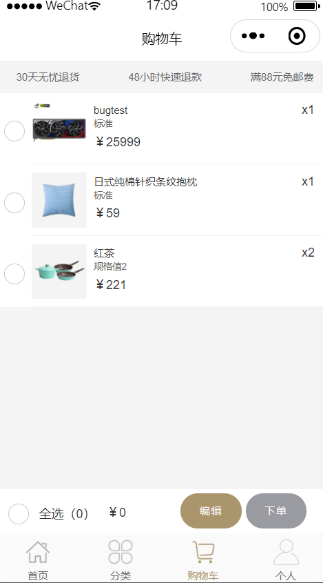
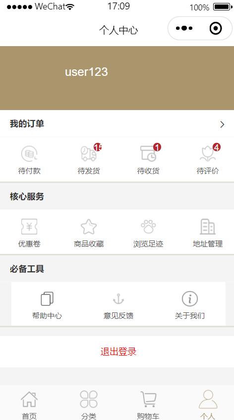
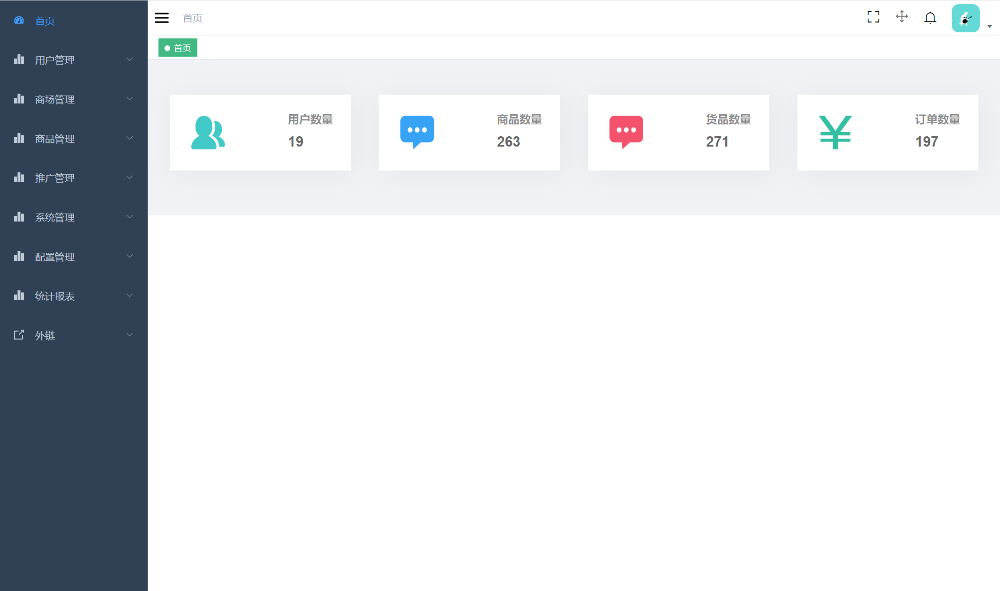
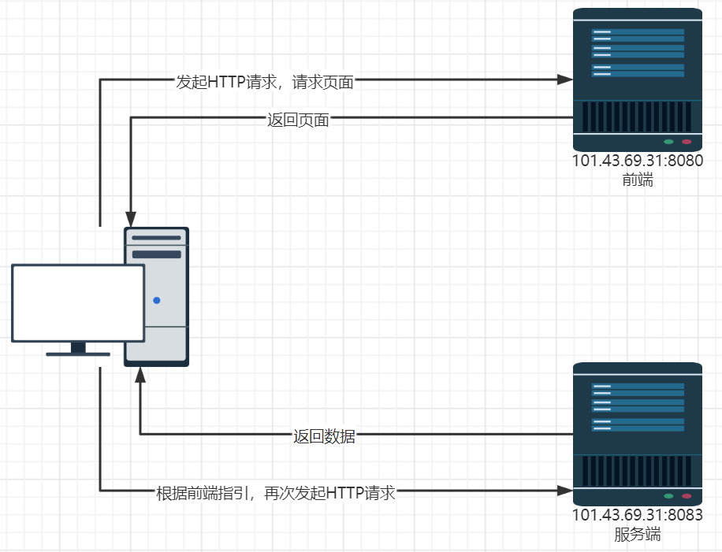
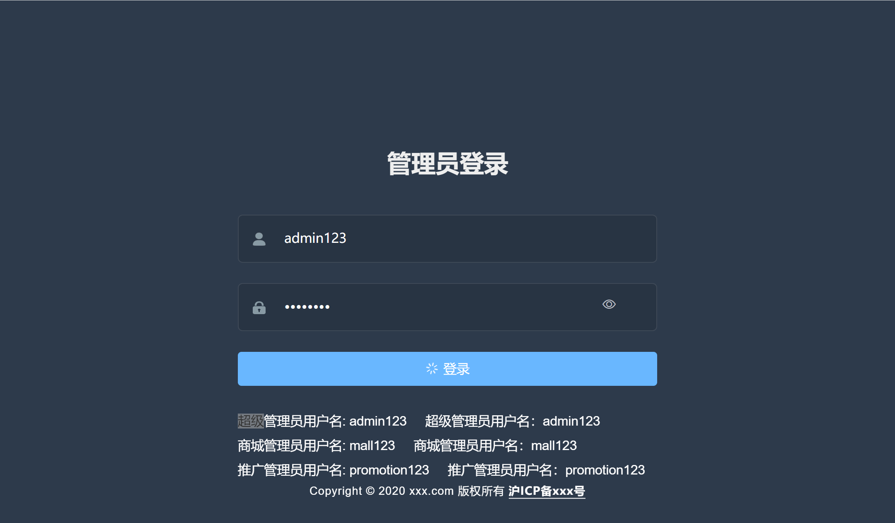
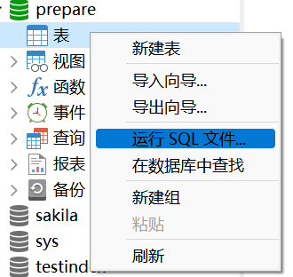
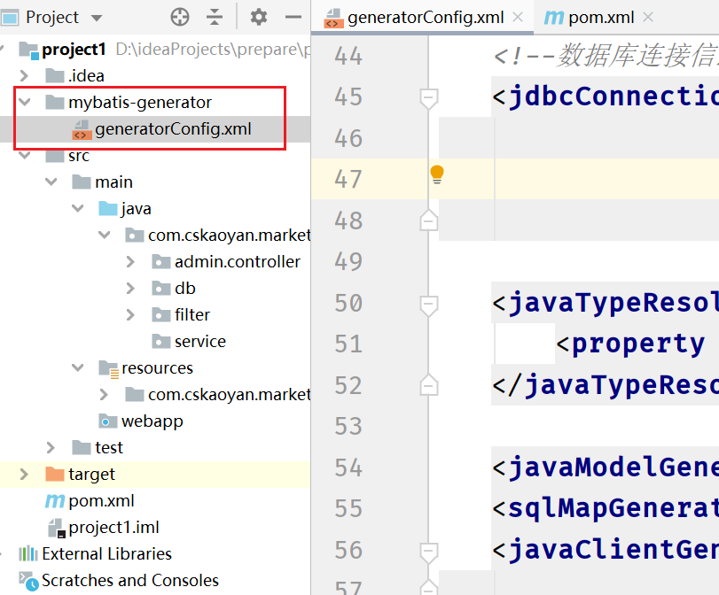
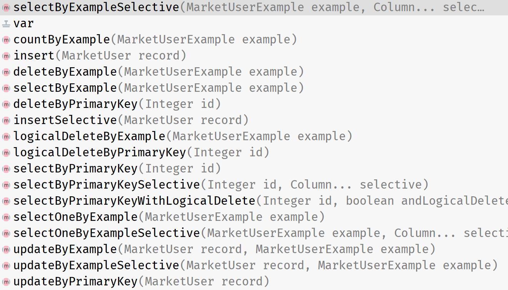
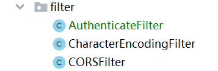

# 项目

## 概述

项目是一个小程序电商购物平台。主要有前台小程序和后台管理系统。前台小程序负责展示商品信息、用户个人信息、购物车、订单等信息。而后台管理系统负责管理维护小程序中的所有的数据。比如商品的更新、下架等，需要在后台管理系统中由管理员或者说工作人员去处理。

> 前台、后台是从使用者的角度来分析的。用户使用的终端叫做前台，管理员使用的终端叫做后台。无论前台还是后台，我们均当做前端的范畴。因为前端负责处理页面，无论前台还是后台均是用户可以看到的页面。和前端相对应的概念是后端、服务端。这也是我们今后工作时的应聘岗位，主要的目的是给前端页面提供数据。

小程序页面：






后台管理系统页面：

负责维护小程序端的功能。包含很多个模块。



## 项目架构

本项目是一个前后端分离项目。什么叫前后端分离？顾名思义就是前端和后端各司其职。前端负责提供页面显示、页面跳转等一系列和页面相关的内容，在本项目中无论前台用户系统还是后台管理系统都是页面，所以均属于前端的范畴。后端负责提供数据，比如页面中显示的商品信息、商品问答、商品评论等信息全部都是来自于后端。前端一般使用js、vue等前端框架来加以实现，后端一般使用java、python等来实现，我们今后主要的职责是后端开发，或者说服务器开发。

我们可以利用管理员账号来登录后台管理系统来加以验证。将登录过程中所有的HTTP请求抓包，进行分析，可以发现大多数请求是发往80端口号，但是有一个HTTP请求发往8083端口号，发往8083端口号的请求返回了json字符串数据，而数据就会显示在页面中。整个过程如下所示。



## 项目开发

- **企业如何开发项目**

  **首先先介绍在企业中如何开展项目**。首先如果是小公司的话，大家今后入职的部分基本都是属于技术部，或者说研发部。一个部门有一个部门主管，负责整个部门的工作。一个部门有很多个项目组，每个项目有一个组长，有的公司也叫作项目经理，负责整个项目的推进。项目根据公司的性质一般可以分为两种类型，一种是外包项目，一种是自研项目。

  每一个项目大体由如下这些人员组成：项目经理 、产品经理、UI、前端开发人员、服务端开发人员、测试人员。

  一个项目从诞生到最后部署上线大概要经历如下过程：首先是需求评审，公司这个项目需要做出一个什么样功能的产品，如果是自研产品，那么可能由多个部门之间进行沟通确定，通过对市场进行调研等得出，如果是外包产品，那么产品的功能主要由甲方来确定。需求确定之后，接下来需要由产品经理将需求记录下来，形成需求文档等。后面可以进入到开发阶段，首先UI根据产品经理绘制的图来制作页面原型图，前端开发人员将UI绘制好的原型图转变成静态html页面，此时页面中是没有数据的，**服务端开发人员负责给前端开发人员提供数据**，双方在开发过程中需要进行对接。产品研发完毕，后面需要进行测试，是否存在着潜在的bug等。

  从上面这段描述我们可以得知，前端和服务端在进行开发时，需要进行对接。那么如何能够快速高效地进行对接呢？

  比如针对管理员登录功能，用户在页面上输入管理员账号、密码，需要传递给服务端开发人员对输入的账号、密码进行确认是否匹配。那么用户页面内输入的账号、密码究竟以何种形式传递过来（是json字符串还是key=value键值对呢），并且参数的字段名称是啥这些是和哪部分是相关的呢？这些主要和前端开发人员的配置相关。所以通过上述描述，我们可以得知，**管理员在登录时，传递到后端服务器的参数可能是**

  ```js
  {"emai":"xxxx","pwd":"xxx"}
  ```

  也可能是

  ```
  username=xxx&password=xxx
  ```

  至于究竟是哪一种方式，这取决于前端在页面中是如何设置的。所以为了前端开发人员和服务端开发人员在进行对接时更加的高效，我们可以通过编写一个接口（**注意：此接口并不是指的是java中提到的interface，但是这里面提及的接口如果从功能上来看，和java的interface非常类似，都是不需要知道具体的代码实现，只需要调用对应的代码即可得到结果**）文档。接口文档其实就是指的是HTTP请求和响应传输的数据的格式。

  比如，针对管理员登录接口，我们编写接口文档

  请求地址：`/api/admin/admin/login`

  请求方法：`POST`

  请求参数：`{"emai":"xxxx","pwd":"xxx"}`

  

  响应结果：`{“code”:200,"data":{"token":"xxxx","name":"xxxxx"}}`

  **假如有上述文档，那么对于前端开发人员来说，只需要设置请求地址、请求方法、请求参数如上所示，接下来只需要对上述返回的数据类型进行处理。比如判断状态码是否200，如果是，则取出data里面的信息。**

  **同样对于服务端开发人员来说，只需要编写相应的controller来处理该请求，获取传递过来的请求参数，同时应当返回响应结果需要的响应数据**。

  接口文档一般是由服务端开发人员来进行编写。

- **本项目开发工作如何开展**

  **在本项目中，项目如何开展呢**？在本项目，给大家配置一个专业的前端开发人员是不切合实际的。所以，我们采取的方式是在网络上面预先先部署了一套服务。也就是101.43.69.31这台主机上面预先部署了后台管理系统(http://101.43.69.31:8080)以及其对应的服务端(http://101.43.69.31:8083)来提供所需数据。也就是说在这台主机上面的程序是对接成功的了。后续我们会把前端页面提供给大家，提供给大家的页面会往http://localhost:8083发起请求。也就是说，对于大家来说，需要做的事情便是编写程序部署在本地Tomcat中(注意Tomcat的端口号应该是8083)。你只需要保证本地开发环境的响应数据做到和http://101.43.69.31:8083保持一致便可以正常对接。

  说的更加直白一些，你只需要抓取http://101.43.69.31:8083返回值。本地做到和该接口具有相同的返回值即可。

  > 注:这里面的相同指的是返回数据的结构、字段名称、字段类型。返回的具体值可以不必相同。比如http://101.43.69.31:8083返回username=zhangsan，而你本地返回username=lisi这个是无所谓的。

  **最后：本项目的开发先后顺序是先做后台管理系统；后台管理系统实现之后再去实现小程序功能。**

  

## 前端代码注意事项

前端页面(后台管理系统)是一个使用`vue`开发的项目。但是大家在编写代码的过程中不需要配置`vue`等环境。我们已经先将其进行编译成静态`html`页面之后，打成jar包。

输入指令：`java -jar cskaoyan-market-admin.jar`

输入http://localhost:9527便会看到如下页面



点击登录按钮，会往http://localhost:8083发送请求，**所以我们服务端代码应当部署在`8083`端口号**。

## 后端代码注意事项

### **基础配置**

应用名同样建议设置为`ROOT`,服务器监听端口号`8083`。

`pom.xml`引入依赖

```xml
<dependencies>
        <dependency>
            <groupId>javax.servlet</groupId>
            <artifactId>javax.servlet-api</artifactId>
            <version>3.1.0</version>
            <scope>provided</scope>
        </dependency>
        <dependency>
            <groupId>mysql</groupId>
            <artifactId>mysql-connector-java</artifactId>
            <version>8.0.16</version>
            <scope>runtime</scope>
        </dependency>
        <dependency>
            <groupId>org.mybatis</groupId>
            <artifactId>mybatis</artifactId>
            <version>3.5.7</version>
        </dependency>
        <dependency>
            <groupId>org.projectlombok</groupId>
            <artifactId>lombok</artifactId>
            <version>1.18.26</version>
        </dependency>
        <dependency>
            <groupId>junit</groupId>
            <artifactId>junit</artifactId>
            <version>4.12</version>
            <scope>test</scope>
        </dependency>
    </dependencies>
```

### 跨域配置

通过抓取浏览器发往服务端的请求，我们可以发现，一共发送了两次请求。一次是`OPTIONS`请求，一次是`POST`请求。实际上发生上述现象的主要原因在于前端所在的主机端口号以及服务端所在的主机端口号不相同，为跨域。

在跨域环境下，为了保障安全性，浏览器会在发送正式请求之前，先发送一次OPTIONS请求，你可以理解为试探性请求。这一步主要是浏览器去询问后端服务器，当前网页所在的域名是否在后端服务器的许可名单中，如果得到了肯定的答复，那么才会正式的去发送请求，否则请求失败。也就是说，在每一次发送请求之前，都会先发送OPTIONS请求去取得授权。因此，我们需要去配置一个Filter来解决跨域问题。

```java
package com.cskaoyan.filter;

import javax.servlet.*;
import javax.servlet.annotation.WebFilter;
import javax.servlet.http.HttpServletRequest;
import javax.servlet.http.HttpServletResponse;
import java.io.IOException;

/**
 * @ClassName CorsFilter
 * @Description: TODO
 * @Author 远志 zhangsong@cskaoyan.onaliyun.com
 * @Date 2023/3/11 16:34
 * @Version V1.0
 **/
@WebFilter("/*")
public class CorsFilter implements Filter {
    @Override
    public void init(FilterConfig filterConfig) throws ServletException {

    }

    @Override
    public void doFilter(ServletRequest req, ServletResponse resp, FilterChain chain) throws IOException, ServletException {
        HttpServletRequest request = (HttpServletRequest) req;
        HttpServletResponse response = (HttpServletResponse) resp;
        //告诉浏览器任何来源的主机端口号均可以访问当前服务器
        response.setHeader("Access-Control-Allow-Origin", "http://localhost:9527");
        response.setHeader("Access-Control-Allow-Methods","POST,GET,OPTIONS,PUT,DELETE");
        response.setHeader("Access-Control-Allow-Headers","x-requested-with,Authorization,Content-Type,X-CskaoyanMarket-Admin-Token,X-CskaoyanMarket-Token");
        response.setHeader("Access-Control-Allow-Credentials","true");  

        //该响应的资源是否被允许与给定的origin共享 通常在允许携带cookie时需要设置
        chain.doFilter(request,response);
    }

    @Override
    public void destroy() {

    }
}
```

### `git`配置

很多文件诸如`idea`、`class`等文件信息不需要被提交到远程仓库中。所以，需要在git工作目录下(也就是`.git`隐藏目录)设置一个`.gitignore`文件

文件内容：

```
**/target
**/.idea
**/*.iml
**/out
```

特别注意：如果配置之后发生不生效。那么原因是因为这些class等文件在`.gitignore`文件创建之前已经维护了，所以不会生效。必须要在提前代码之前先设置好`.gitignore`文件。如果已经发生，则需要将这些文件删除掉再`push`到远程仓库，其他成员再次`pull`。

**养成习惯：自己在命令行使用git指令来进行操作。不要使用idea的可视化界面去操作。**

**在Gitee或者Github上面，新建好仓库之后，直接clone到本地，可以免去很多麻烦。**

```
git clone xxxxx
git pull
git add .
git commit -m message(写清楚提交的内容信息，不要直接提交abc等)
git push
```

### **数据库、表**

数据库、表以及数据会提供。大家需要做的事情便是在本地新建一个数据库，然后导入文件，创建表、插入数据。



依次运行两个文件`cskaoyan_market_table.sql`和`cskaoyan_market_data.sql`即可。

### 逆向工程

数据库表有了之后呢，我们需要有新建一个实体类对象`Bean`和数据库表对应。对象的成员变量需要和表列名相同。同时，我们还需要编写`Mapper`接口以及`Mybatis`的`Mapper`映射文件。这些工作我们可以手动去完成，也可以利用`MybatisGenerator`这个工具类库来帮助我们生成。这称之为逆向工程。

pom.xml文件中添加build配置

```xml
<build>
        <plugins>
            <plugin>
                <groupId>org.mybatis.generator</groupId>
                <artifactId>mybatis-generator-maven-plugin</artifactId>
                <version>1.3.7</version>
                <configuration>
                    <configurationFile>
                        mybatis-generator/generatorConfig.xml
                    </configurationFile>
                    <overwrite>true</overwrite>
                    <verbose>true</verbose>
                </configuration>
                <dependencies>
                    <dependency>
                        <groupId>mysql</groupId>
                        <artifactId>mysql-connector-java</artifactId>
                        <version>5.1.47</version>
                    </dependency>
                    <dependency>
                        <groupId>com.itfsw</groupId>
                        <artifactId>mybatis-generator-plugin</artifactId>
                        <version>1.3.2</version>
                    </dependency>
                </dependencies>
            </plugin>

        </plugins>

    </build>
```


对应的配置文件，需要放置在maven项目如下目录



```xml
<?xml version="1.0" encoding="UTF-8"?>
<!DOCTYPE generatorConfiguration
        PUBLIC "-//mybatis.org//DTD MyBatis Generator Configuration 1.0//EN"
        "http://mybatis.org/dtd/mybatis-generator-config_1_0.dtd">

<generatorConfiguration>

    <context id="mysqlgenerator" targetRuntime="MyBatis3">
        <property name="autoDelimitKeywords" value="true"/>
        <!--可以使用``包括字段名，避免字段名与sql保留字冲突报错-->
        <property name="beginningDelimiter" value="`"/>
        <property name="endingDelimiter" value="`"/>

        <!-- 自动生成toString方法 -->
        <plugin type="org.mybatis.generator.plugins.ToStringPlugin"/>
        <!-- 自动生成equals方法和hashcode方法 -->
        <plugin type="org.mybatis.generator.plugins.EqualsHashCodePlugin"/>

        <!-- 非官方插件 https://github.com/itfsw/mybatis-generator-plugin -->
        <!-- 查询单条数据插件 -->
        <plugin type="com.itfsw.mybatis.generator.plugins.SelectOneByExamplePlugin"/>
        <!-- 查询结果选择性返回插件 -->
        <plugin type="com.itfsw.mybatis.generator.plugins.SelectSelectivePlugin"/>
        <!-- Example Criteria 增强插件 -->
        <plugin type="com.itfsw.mybatis.generator.plugins.ExampleEnhancedPlugin"/>
        <!-- 数据Model属性对应Column获取插件 -->
        <plugin type="com.itfsw.mybatis.generator.plugins.ModelColumnPlugin"/>
        <!-- 逻辑删除插件 -->
        <plugin type="com.itfsw.mybatis.generator.plugins.LogicalDeletePlugin">
            <!-- 这里配置的是全局逻辑删除列和逻辑删除值，当然在table中配置的值会覆盖该全局配置 -->
            <!-- 逻辑删除列类型只能为数字、字符串或者布尔类型 -->
            <property name="logicalDeleteColumn" value="deleted"/>
            <!-- 逻辑删除-已删除值 -->
            <property name="logicalDeleteValue" value="1"/>
            <!-- 逻辑删除-未删除值 -->
            <property name="logicalUnDeleteValue" value="0"/>
        </plugin>

        <commentGenerator>
            <property name="suppressDate" value="true"/>
            <!--<property name="suppressAllComments" value="true"/>-->
        </commentGenerator>

        <!--数据库连接信息-->
        <jdbcConnection driverClass="com.mysql.jdbc.Driver"
                        connectionURL="jdbc:mysql://localhost:3306/project12?useUnicode=true&amp;characterEncoding=UTF-8&amp;serverTimezone=UTC&amp;verifyServerCertificate=false&amp;useSSL=false&amp;nullCatalogMeansCurrent=true"
                        userId="root"
                        password="123456"/>

        <javaTypeResolver>
            <property name="useJSR310Types" value="true"/>
        </javaTypeResolver>

        <javaModelGenerator targetPackage="com.cskaoyan.market.db.domain" targetProject="src/main/java"/>
        <sqlMapGenerator targetPackage="com.cskaoyan.market.db.mapper" targetProject="src/main/resources"/>
        <javaClientGenerator type="XMLMAPPER" targetPackage="com.cskaoyan.market.db.mapper"
                             targetProject="src/main/java"/>
        <!--表名-->
        <table tableName="market_ad">
            <generatedKey column="id" sqlStatement="MySql" identity="true"/>
        </table>
        <table tableName="market_address">
            <generatedKey column="id" sqlStatement="MySql" identity="true"/>
        </table>
        <table tableName="market_admin">
            <generatedKey column="id" sqlStatement="MySql" identity="true"/>
            <columnOverride column="role_ids" javaType="java.lang.Integer[]"
                            typeHandler="com.cskaoyan.market.db.mybatis.JsonIntegerArrayTypeHandler"/>
        </table>
        <table tableName="market_brand">
            <generatedKey column="id" sqlStatement="MySql" identity="true"/>
        </table>
        <table tableName="market_cart">
            <generatedKey column="id" sqlStatement="MySql" identity="true"/>
            <columnOverride column="specifications" javaType="java.lang.String[]"
                            typeHandler="com.cskaoyan.market.db.mybatis.JsonStringArrayTypeHandler"/>
        </table>
        <table tableName="market_category">
            <generatedKey column="id" sqlStatement="MySql" identity="true"/>
        </table>
        <table tableName="market_collect">
            <generatedKey column="id" sqlStatement="MySql" identity="true"/>
        </table>
        <table tableName="market_comment">
            <generatedKey column="id" sqlStatement="MySql" identity="true"/>
            <columnOverride column="pic_urls" javaType="java.lang.String[]"
                            typeHandler="com.cskaoyan.market.db.mybatis.JsonStringArrayTypeHandler"/>
        </table>

        <table tableName="market_feedback">
            <generatedKey column="id" sqlStatement="MySql" identity="true"/>
            <columnOverride column="pic_urls" javaType="java.lang.String[]"
                            typeHandler="com.cskaoyan.market.db.mybatis.JsonStringArrayTypeHandler"/>
        </table>

        <table tableName="market_footprint">
            <generatedKey column="id" sqlStatement="MySql" identity="true"/>
        </table>
        <table tableName="market_goods">
            <generatedKey column="id" sqlStatement="MySql" identity="true"/>
            <columnOverride column="gallery" javaType="java.lang.String[]"
                            typeHandler="com.cskaoyan.market.db.mybatis.JsonStringArrayTypeHandler"/>
        </table>
        <table tableName="market_goods_attribute">
            <generatedKey column="id" sqlStatement="MySql" identity="true"/>
        </table>
        <table tableName="market_goods_specification">
            <generatedKey column="id" sqlStatement="MySql" identity="true"/>
        </table>
        <table tableName="market_goods_product">
            <generatedKey column="id" sqlStatement="MySql" identity="true"/>
            <columnOverride column="specifications" javaType="java.lang.String[]"
                            typeHandler="com.cskaoyan.market.db.mybatis.JsonStringArrayTypeHandler"/>
        </table>
        <table tableName="market_issue">
            <generatedKey column="id" sqlStatement="MySql" identity="true"/>
        </table>
        <table tableName="market_keyword">
            <generatedKey column="id" sqlStatement="MySql" identity="true"/>
        </table>
        <table tableName="market_order">
            <generatedKey column="id" sqlStatement="MySql" identity="true"/>
        </table>
        <table tableName="market_order_goods">
            <generatedKey column="id" sqlStatement="MySql" identity="true"/>
            <columnOverride column="specifications" javaType="java.lang.String[]"
                            typeHandler="com.cskaoyan.market.db.mybatis.JsonStringArrayTypeHandler"/>
            <columnOverride column="comments" javaType="java.lang.Integer[]"
                            typeHandler="com.cskaoyan.market.db.mybatis.JsonIntegerArrayTypeHandler"/>

        </table>
        <table tableName="market_region">
            <generatedKey column="id" sqlStatement="MySql" identity="true"/>
        </table>
        <table tableName="market_search_history">
            <generatedKey column="id" sqlStatement="MySql" identity="true"/>
        </table>
        <table tableName="market_storage">
            <generatedKey column="id" sqlStatement="MySql" identity="true"/>
        </table>
        <table tableName="market_topic">
            <generatedKey column="id" sqlStatement="MySql" identity="true"/>
            <columnOverride column="goods" javaType="java.lang.Integer[]"
                            typeHandler="com.cskaoyan.market.db.mybatis.JsonIntegerArrayTypeHandler"/>
        </table>
        <table tableName="market_user">
            <generatedKey column="id" sqlStatement="MySql" identity="true"/>
        </table>
        <table tableName="market_system">
            <generatedKey column="id" sqlStatement="MySql" identity="true"/>
        </table>

        <table tableName="market_groupon_rules">
            <generatedKey column="id" sqlStatement="MySql" identity="true"/>
        </table>
        <table tableName="market_groupon">
            <generatedKey column="id" sqlStatement="MySql" identity="true"/>
        </table>
        <table tableName="market_coupon">
            <generatedKey column="id" sqlStatement="MySql" identity="true"/>
            <columnOverride column="goods_value" javaType="java.lang.Integer[]"
                            typeHandler="com.cskaoyan.market.db.mybatis.JsonIntegerArrayTypeHandler"/>
        </table>
        <table tableName="market_coupon_user">
            <generatedKey column="id" sqlStatement="MySql" identity="true"/>
        </table>
        <table tableName="market_role">
            <generatedKey column="id" sqlStatement="MySql" identity="true"/>
        </table>
        <table tableName="market_permission">
            <generatedKey column="id" sqlStatement="MySql" identity="true"/>
        </table>
        <table tableName="market_log">
            <generatedKey column="id" sqlStatement="MySql" identity="true"/>
        </table>
        <table tableName="market_notice">
            <generatedKey column="id" sqlStatement="MySql" identity="true"/>
        </table>
        <table tableName="market_notice_admin">
            <generatedKey column="id" sqlStatement="MySql" identity="true"/>
        </table>
        <table tableName="market_aftersale">
            <generatedKey column="id" sqlStatement="MySql" identity="true"/>
            <columnOverride column="pictures" javaType="java.lang.String[]"
                            typeHandler="com.cskaoyan.market.db.mybatis.JsonStringArrayTypeHandler"/>
        </table>
    </context>
</generatorConfiguration>
```

命名特征：

`xxxByExample`:通过设置不同的条件，执行前面的xxx操作。

其中在对应的mapper映射文件中，有如下条件语句：

如果当前只有唯一的一个参数，则`_parameter`就代表当前对象；如果有多个参数，则`_parameter`可以通过`get(0)`获取第一个参数。

```java
List<MarketAd> selectByExample(MarketAdExample example);
```

```xml
<select id="selectByExample" parameterType="com.cskaoyan.project2.bean.MarketAdExample" resultMap="BaseResultMap">
    select
    <if test="distinct">
      distinct
    </if>
    <include refid="Base_Column_List" />
    from market_ad
    <if test="_parameter != null">
      <include refid="Example_Where_Clause" />
    </if>
    <if test="orderByClause != null">
      order by ${orderByClause}
    </if>
  </select>
```

下面的sql片段主要时给我们拼接出where条件。`MarketAdExample`对象内有一个`oredCriteria`成员变量，该类型为`List<Criteria>`。所以`<foreach collection="oredCriteria" item="criteria" separator="or">`主要在做的事情便是遍历出里面的每一个`Criteria`。在每一个`Criteria`对象内又存在一个成员变量`criteria`，该类型为`List<Criterion>`。所以第二层foreach`<foreach collection="criteria.criteria" item="criterion">`所作的事情便是遍历每一个`Criterion`对象。所以每个`Criterion`对象就是一个条件。比如查询数据时的条件为`username like xxx and email like xxx`。那么此时便是两组条件，也就是两个`Criterion`对象。也就是对应着上述的`List<Criterion>`。

```xml
<sql id="Example_Where_Clause">
    <where>
      <foreach collection="oredCriteria" item="criteria" separator="or">
        <if test="criteria.valid">
          <trim prefix="(" prefixOverrides="and" suffix=")">
            <foreach collection="criteria.criteria" item="criterion">
              <choose>
                <when test="criterion.noValue">
                  and ${criterion.condition}
                </when>
                <when test="criterion.singleValue">
                  and ${criterion.condition} #{criterion.value}
                </when>
                <when test="criterion.betweenValue">
                  and ${criterion.condition} #{criterion.value} and #{criterion.secondValue}
                </when>
                <when test="criterion.listValue">
                  and ${criterion.condition}
                  <foreach close=")" collection="criterion.value" item="listItem" open="(" separator=",">
                    #{listItem}
                  </foreach>
                </when>
              </choose>
            </foreach>
          </trim>
        </if>
      </foreach>
    </where>
  </sql>
```

`xxxSelective`:有选择性的执行前面的xxx操作。比如`insert`时，只`insert`指定的列，其他赋默认值。

`xxxByPrimaryKey`:通过主键执行后面的操作。比如通过主键进行查询、修改等。

**最后：特别注意，特别注意，特别注意：使用Mybatis逆向工程帮助我们生成的代码也有可能会有问题的。比如字段名称中有`desc`、`order`等字段时，会在拼接时出错。**



selectByExampleSelective:根据example去查询出指定列的数据。

countByExample:根据条件去查询总个数

insert:常规插入方法

insertSelective:判断字段是否为null，如果不为null，则插入

deleteByExample:根据条件来执行删除操作

selectByPrimaryKey:根据主键的值来进行查询

### 分页插件PageHelper

`PageHelper`是一款`Mybatis`的通用分页插件。详细信息可以参考：https://github.com/pagehelper/Mybatis-PageHelper

在我们开发过程中，我们如果希望来进行分页查询，则可以使用`PageHelper`来实现快速分页。

分页插件的**原理**简单来说便是在`sql`进行预编译阶段，拼接出我们需要执行的分页`sql`。比如`select * from user` `limit xxx,xxx`

**使用**过程也比较简单：

**1.导入依赖**

```xml
<dependency>
            <groupId>com.github.pagehelper</groupId>
            <artifactId>pagehelper</artifactId>
            <version>5.2.0</version>
</dependency>
```

**2.配置使用的数据库**

需要在mybatis的主配置文件中进行相应的配置。配置数据库语言以及合理化分页等。

```xml
<?xml version="1.0" encoding="UTF-8" ?>
<!DOCTYPE configuration
        PUBLIC "-//mybatis.org//DTD Config 3.0//EN"
        "http://mybatis.org/dtd/mybatis-3-config.dtd">
<configuration>

    <plugins>
        <plugin interceptor="com.github.pagehelper.PageInterceptor">
            <property name="helperDialect" value="mysql"/>
            <property name="reasonable" value="true"/>
        </plugin>
    </plugins>

    <environments default="development">
        <environment id="development">
            <transactionManager type="JDBC"/>
            <dataSource type="POOLED">
                <property name="driver" value="com.mysql.jdbc.Driver"/>
                <property name="url" value="jdbc:mysql://localhost:3306/project12?characterEncoding=UTF-8"/>
                <property name="username" value="root"/>
                <property name="password" value="123456"/>
            </dataSource>
        </environment>
    </environments>


    <mappers>
        <package name="com.cskaoyan.market.db.mapper"/>
    </mappers>
</configuration>
```

测试代码：

紧跟着PageHelper后面的第一个查询语句会自动进行分页操作。

```java
public List<MarketAdmin> queryAll() {
        SqlSession sqlSession = MybatisUtil.openSession();
        MarketAdminMapper adminMapper = sqlSession.getMapper(MarketAdminMapper.class);
        MarketAdminExample example = new MarketAdminExample();
        PageHelper.startPage(1, 1);
        List<MarketAdmin> marketAdmins = adminMapper.selectByExample(example);
        sqlSession.commit();
        sqlSession.close();
        return marketAdmins;
    }
```

**重要提示，重要提示，重要提示**：

> **`PageHelper.startPage`方法重要提示**
>
> 只有紧跟在`PageHelper.startPage`方法后的**第一个**Mybatis的**查询（Select）**方法会被分页。
>
> **请不要配置多个分页插件**
>
> **分页插件不支持带有`for update`语句的分页**
>
> 对于带有`for update`的sql，会抛出运行时异常，对于这样的sql建议手动分页，毕竟这样的sql需要重视。
>
> **分页插件不支持嵌套结果映射**
>
> 由于嵌套结果方式会导致结果集被折叠，因此分页查询的结果在折叠后总数会减少，所以无法保证分页结果数量正确。

### 日志

在mybatis.xml主配置文件中添加如下配置项即可

```xml
<settings>
        <setting name="logImpl" value="STDOUT_LOGGING"/>
    </settings>
```


### TypeHandler

`MyBatis `在设置预处理语句（`PreparedStatement`）中的参数或从结果集中取出一个值时， 都会用类型处理器将获取到的值以合适的方式转换成` Java `类型。下表描述了一些`Mybatis`中默认的类型处理器。

#### 系统内置类型转换器

| `BooleanTypeHandler`         | `java.lang.Boolean`, `boolean`  | 数据库兼容的 `BOOLEAN`                                       |
| ---------------------------- | ------------------------------- | ------------------------------------------------------------ |
| `ByteTypeHandler`            | `java.lang.Byte`, `byte`        | 数据库兼容的 `NUMERIC` 或 `BYTE`                             |
| `ShortTypeHandler`           | `java.lang.Short`, `short`      | 数据库兼容的 `NUMERIC` 或 `SMALLINT`                         |
| `IntegerTypeHandler`         | `java.lang.Integer`, `int`      | 数据库兼容的 `NUMERIC` 或 `INTEGER`                          |
| `LongTypeHandler`            | `java.lang.Long`, `long`        | 数据库兼容的 `NUMERIC` 或 `BIGINT`                           |
| `FloatTypeHandler`           | `java.lang.Float`, `float`      | 数据库兼容的 `NUMERIC` 或 `FLOAT`                            |
| `DoubleTypeHandler`          | `java.lang.Double`, `double`    | 数据库兼容的 `NUMERIC` 或 `DOUBLE`                           |
| `BigDecimalTypeHandler`      | `java.math.BigDecimal`          | 数据库兼容的 `NUMERIC` 或 `DECIMAL`                          |
| `StringTypeHandler`          | `java.lang.String`              | `CHAR`, `VARCHAR`                                            |
| `ClobReaderTypeHandler`      | `java.io.Reader`                | -                                                            |
| `ClobTypeHandler`            | `java.lang.String`              | `CLOB`, `LONGVARCHAR`                                        |
| `NStringTypeHandler`         | `java.lang.String`              | `NVARCHAR`, `NCHAR`                                          |
| `NClobTypeHandler`           | `java.lang.String`              | `NCLOB`                                                      |
| `BlobInputStreamTypeHandler` | `java.io.InputStream`           | -                                                            |
| `ByteArrayTypeHandler`       | `byte[]`                        | 数据库兼容的字节流类型                                       |
| `BlobTypeHandler`            | `byte[]`                        | `BLOB`, `LONGVARBINARY`                                      |
| `DateTypeHandler`            | `java.util.Date`                | `TIMESTAMP`                                                  |
| `DateOnlyTypeHandler`        | `java.util.Date`                | `DATE`                                                       |
| `TimeOnlyTypeHandler`        | `java.util.Date`                | `TIME`                                                       |
| `SqlTimestampTypeHandler`    | `java.sql.Timestamp`            | `TIMESTAMP`                                                  |
| `SqlDateTypeHandler`         | `java.sql.Date`                 | `DATE`                                                       |
| `SqlTimeTypeHandler`         | `java.sql.Time`                 | `TIME`                                                       |
| `ObjectTypeHandler`          | Any                             | `OTHER` 或未指定类型                                         |
| `EnumTypeHandler`            | Enumeration Type                | VARCHAR 或任何兼容的字符串类型，用来存储枚举的名称（而不是索引序数值） |
| `EnumOrdinalTypeHandler`     | Enumeration Type                | 任何兼容的 `NUMERIC` 或 `DOUBLE` 类型，用来存储枚举的序数值（而不是名称）。 |
| `SqlxmlTypeHandler`          | `java.lang.String`              | `SQLXML`                                                     |
| `InstantTypeHandler`         | `java.time.Instant`             | `TIMESTAMP`                                                  |
| `LocalDateTimeTypeHandler`   | `java.time.LocalDateTime`       | `TIMESTAMP`                                                  |
| `LocalDateTypeHandler`       | `java.time.LocalDate`           | `DATE`                                                       |
| `LocalTimeTypeHandler`       | `java.time.LocalTime`           | `TIME`                                                       |
| `OffsetDateTimeTypeHandler`  | `java.time.OffsetDateTime`      | `TIMESTAMP`                                                  |
| `OffsetTimeTypeHandler`      | `java.time.OffsetTime`          | `TIME`                                                       |
| `ZonedDateTimeTypeHandler`   | `java.time.ZonedDateTime`       | `TIMESTAMP`                                                  |
| `YearTypeHandler`            | `java.time.Year`                | `INTEGER`                                                    |
| `MonthTypeHandler`           | `java.time.Month`               | `INTEGER`                                                    |
| `YearMonthTypeHandler`       | `java.time.YearMonth`           | `VARCHAR` 或 `LONGVARCHAR`                                   |
| `JapaneseDateTypeHandler`    | `java.time.chrono.JapaneseDate` | `DATE`                                                       |

`Mybatis`提供的默认类型转换器可以满足绝大多数情况下`JavaType`和`JdbcType`之间的类型转换。但是如果在某些场景下默认的类型转换器无法满足我们的业务场景(比如希望将存储在数据库中的json数组字符转换为java数组类型;比如希望将数据库内存取的代表性别的字段转换成对应的字符加以显示)，我们也可以自定义类型转换器。

#### 自定义类型转换器1

1.自定义类型转换器，继承`BaseTypeHandler`，实现抽象方法

2.在`Mapper.xml`中使用自定义的`TypeHandler`

比如：

我们定义了一个`Integer[]`和`Json`字符串之间的类型转换器。数据存储在数据库中是`Json`字符串类型，在`java`对象中是`Integer[]`类型。

```java
public class JsonIntegerArrayTypeHandler extends BaseTypeHandler<Integer[]> {
    private static final ObjectMapper mapper = new ObjectMapper();

    @Override
    public void setNonNullParameter(PreparedStatement ps, int i, Integer[] parameter, JdbcType jdbcType) throws SQLException {
        ps.setString(i, toJson(parameter));
    }

    @Override
    public Integer[] getNullableResult(ResultSet rs, String columnName) throws SQLException {
        return this.toObject(rs.getString(columnName));
    }

    @Override
    public Integer[] getNullableResult(ResultSet rs, int columnIndex) throws SQLException {
        return this.toObject(rs.getString(columnIndex));
    }

    @Override
    public Integer[] getNullableResult(CallableStatement cs, int columnIndex) throws SQLException {
        return this.toObject(cs.getString(columnIndex));
    }

    private String toJson(Integer[] params) {
        try {
            return mapper.writeValueAsString(params);
        } catch (Exception e) {
            e.printStackTrace();
        }
        return "[]";
    }

    private Integer[] toObject(String content) {
        if (content != null && !content.isEmpty()) {
            try {
                return (Integer[]) mapper.readValue(content, Integer[].class);
            } catch (Exception e) {
                throw new RuntimeException(e);
            }
        } else {
            return null;
        }
    }
}
```

随后在`Mapper.xml`文件中使用它

**查询时如果需要使用类型转换器，那么需要将`TypeHandler`声明在`resultMap`中；增删改如果需要使用到`TypeHandler`，那么写在对应的字段中**，如下图所示。

```xml
<?xml version="1.0" encoding="UTF-8"?>
<!DOCTYPE mapper PUBLIC "-//mybatis.org//DTD Mapper 3.0//EN" "http://mybatis.org/dtd/mybatis-3-mapper.dtd">
<mapper namespace="com.cskaoyan.market.db.mapper.MarketAdminMapper">
  <resultMap id="BaseResultMap" type="com.cskaoyan.market.db.domain.MarketAdmin">
    <!--
      WARNING - @mbg.generated
      This element is automatically generated by MyBatis Generator, do not modify.
    -->
    <id column="id" jdbcType="INTEGER" property="id" />
    <result column="username" jdbcType="VARCHAR" property="username" />
    <result column="password" jdbcType="VARCHAR" property="password" />
    <result column="last_login_ip" jdbcType="VARCHAR" property="lastLoginIp" />
    <result column="last_login_time" jdbcType="TIMESTAMP" property="lastLoginTime" />
    <result column="avatar" jdbcType="VARCHAR" property="avatar" />
    <result column="add_time" jdbcType="TIMESTAMP" property="addTime" />
    <result column="update_time" jdbcType="TIMESTAMP" property="updateTime" />
    <result column="deleted" jdbcType="BIT" property="deleted" />
    <result column="role_ids" jdbcType="VARCHAR" property="roleIds" typeHandler="com.cskaoyan.market.db.mybatis.JsonIntegerArrayTypeHandler" />
  </resultMap>
  <sql id="Example_Where_Clause">
    <!--
      WARNING - @mbg.generated
      This element is automatically generated by MyBatis Generator, do not modify.
    -->
    <where>
            <foreach collection="criteria.roleIdsCriteria" item="criterion">
              <choose>
                <when test="criterion.noValue">
                  and ${criterion.condition}
                </when>
                <when test="criterion.singleValue">
                  and ${criterion.condition} #{criterion.value,typeHandler=com.cskaoyan.market.db.mybatis.JsonIntegerArrayTypeHandler}
                </when>
                <when test="criterion.betweenValue">
                  and ${criterion.condition} #{criterion.value,typeHandler=com.cskaoyan.market.db.mybatis.JsonIntegerArrayTypeHandler} and #{criterion.secondValue,typeHandler=com.cskaoyan.market.db.mybatis.JsonIntegerArrayTypeHandler}
                </when>
                <when test="criterion.listValue">
                  and ${criterion.condition}
                  <foreach close=")" collection="criterion.value" item="listItem" open="(" separator=",">
                    #{listItem,typeHandler=com.cskaoyan.market.db.mybatis.JsonIntegerArrayTypeHandler}
                  </foreach>
                </when>
              </choose>
            </foreach>
          </trim>
        </if>
      </foreach>
    </where>
  </sql>
  <sql id="Update_By_Example_Where_Clause">
    <!--
      WARNING - @mbg.generated
      This element is automatically generated by MyBatis Generator, do not modify.
    -->
    <where>
            <foreach collection="criteria.roleIdsCriteria" item="criterion">
              <choose>
                <when test="criterion.noValue">
                  and ${criterion.condition}
                </when>
                <when test="criterion.singleValue">
                  and ${criterion.condition} #{criterion.value,typeHandler=com.cskaoyan.market.db.mybatis.JsonIntegerArrayTypeHandler}
                </when>
                <when test="criterion.betweenValue">
                  and ${criterion.condition} #{criterion.value,typeHandler=com.cskaoyan.market.db.mybatis.JsonIntegerArrayTypeHandler} and #{criterion.secondValue,typeHandler=com.cskaoyan.market.db.mybatis.JsonIntegerArrayTypeHandler}
                </when>
                <when test="criterion.listValue">
                  and ${criterion.condition}
                  <foreach close=")" collection="criterion.value" item="listItem" open="(" separator=",">
                    #{listItem,typeHandler=com.cskaoyan.market.db.mybatis.JsonIntegerArrayTypeHandler}
                  </foreach>
                </when>
              </choose>
            </foreach>
          </trim>
        </if>
      </foreach>
    </where>
  </sql>
 
  <insert id="insert" parameterType="com.cskaoyan.market.db.domain.MarketAdmin">
    <!--
      WARNING - @mbg.generated
      This element is automatically generated by MyBatis Generator, do not modify.
    -->
    <selectKey keyProperty="id" order="AFTER" resultType="java.lang.Integer">
      SELECT LAST_INSERT_ID()
    </selectKey>
    insert into market_admin (username, `password`, last_login_ip, 
      last_login_time, avatar, add_time, 
      update_time, deleted, role_ids
      )
    values (#{username,jdbcType=VARCHAR}, #{password,jdbcType=VARCHAR}, #{lastLoginIp,jdbcType=VARCHAR}, 
      #{lastLoginTime,jdbcType=TIMESTAMP}, #{avatar,jdbcType=VARCHAR}, #{addTime,jdbcType=TIMESTAMP}, 
      #{updateTime,jdbcType=TIMESTAMP}, #{deleted,jdbcType=BIT}, #{roleIds,jdbcType=VARCHAR,typeHandler=com.cskaoyan.market.db.mybatis.JsonIntegerArrayTypeHandler}
      )
  </insert>
  <insert id="insertSelective" parameterType="com.cskaoyan.market.db.domain.MarketAdmin">
    <!--
      WARNING - @mbg.generated
      This element is automatically generated by MyBatis Generator, do not modify.
    -->
    <selectKey keyProperty="id" order="AFTER" resultType="java.lang.Integer">
      SELECT LAST_INSERT_ID()
    </selectKey>
    insert into market_admin
    <trim prefix="(" suffix=")" suffixOverrides=",">
      <if test="username != null">
        username,
      </if>
      <if test="password != null">
        `password`,
      </if>
      <if test="lastLoginIp != null">
        last_login_ip,
      </if>
      <if test="lastLoginTime != null">
        last_login_time,
      </if>
      <if test="avatar != null">
        avatar,
      </if>
      <if test="addTime != null">
        add_time,
      </if>
      <if test="updateTime != null">
        update_time,
      </if>
      <if test="deleted != null">
        deleted,
      </if>
      <if test="roleIds != null">
        role_ids,
      </if>
    </trim>
    <trim prefix="values (" suffix=")" suffixOverrides=",">
      <if test="username != null">
        #{username,jdbcType=VARCHAR},
      </if>
      <if test="password != null">
        #{password,jdbcType=VARCHAR},
      </if>
      <if test="lastLoginIp != null">
        #{lastLoginIp,jdbcType=VARCHAR},
      </if>
      <if test="lastLoginTime != null">
        #{lastLoginTime,jdbcType=TIMESTAMP},
      </if>
      <if test="avatar != null">
        #{avatar,jdbcType=VARCHAR},
      </if>
      <if test="addTime != null">
        #{addTime,jdbcType=TIMESTAMP},
      </if>
      <if test="updateTime != null">
        #{updateTime,jdbcType=TIMESTAMP},
      </if>
      <if test="deleted != null">
        #{deleted,jdbcType=BIT},
      </if>
      <if test="roleIds != null">
        #{roleIds,jdbcType=VARCHAR,typeHandler=com.cskaoyan.market.db.mybatis.JsonIntegerArrayTypeHandler},
      </if>
    </trim>
  </insert>
  
  <update id="updateByExampleSelective" parameterType="map">
    <!--
      WARNING - @mbg.generated
      This element is automatically generated by MyBatis Generator, do not modify.
    -->
    update market_admin
    <set>
      <if test="record.id != null">
        id = #{record.id,jdbcType=INTEGER},
      </if>
      <if test="record.username != null">
        username = #{record.username,jdbcType=VARCHAR},
      </if>
      <if test="record.password != null">
        `password` = #{record.password,jdbcType=VARCHAR},
      </if>
      <if test="record.lastLoginIp != null">
        last_login_ip = #{record.lastLoginIp,jdbcType=VARCHAR},
      </if>
      <if test="record.lastLoginTime != null">
        last_login_time = #{record.lastLoginTime,jdbcType=TIMESTAMP},
      </if>
      <if test="record.avatar != null">
        avatar = #{record.avatar,jdbcType=VARCHAR},
      </if>
      <if test="record.addTime != null">
        add_time = #{record.addTime,jdbcType=TIMESTAMP},
      </if>
      <if test="record.updateTime != null">
        update_time = #{record.updateTime,jdbcType=TIMESTAMP},
      </if>
      <if test="record.deleted != null">
        deleted = #{record.deleted,jdbcType=BIT},
      </if>
      <if test="record.roleIds != null">
        role_ids = #{record.roleIds,jdbcType=VARCHAR,typeHandler=com.cskaoyan.market.db.mybatis.JsonIntegerArrayTypeHandler},
      </if>
    </set>
    <if test="_parameter != null">
      <include refid="Update_By_Example_Where_Clause" />
    </if>
  </update>
  <update id="updateByExample" parameterType="map">
    <!--
      WARNING - @mbg.generated
      This element is automatically generated by MyBatis Generator, do not modify.
    -->
    update market_admin
    set id = #{record.id,jdbcType=INTEGER},
      username = #{record.username,jdbcType=VARCHAR},
      `password` = #{record.password,jdbcType=VARCHAR},
      last_login_ip = #{record.lastLoginIp,jdbcType=VARCHAR},
      last_login_time = #{record.lastLoginTime,jdbcType=TIMESTAMP},
      avatar = #{record.avatar,jdbcType=VARCHAR},
      add_time = #{record.addTime,jdbcType=TIMESTAMP},
      update_time = #{record.updateTime,jdbcType=TIMESTAMP},
      deleted = #{record.deleted,jdbcType=BIT},
      role_ids = #{record.roleIds,jdbcType=VARCHAR,typeHandler=com.cskaoyan.market.db.mybatis.JsonIntegerArrayTypeHandler}
    <if test="_parameter != null">
      <include refid="Update_By_Example_Where_Clause" />
    </if>
  </update>
  <update id="updateByPrimaryKeySelective" parameterType="com.cskaoyan.market.db.domain.MarketAdmin">
    <!--
      WARNING - @mbg.generated
      This element is automatically generated by MyBatis Generator, do not modify.
    -->
    update market_admin
    <set>
      <if test="username != null">
        username = #{username,jdbcType=VARCHAR},
      </if>
      <if test="password != null">
        `password` = #{password,jdbcType=VARCHAR},
      </if>
      <if test="lastLoginIp != null">
        last_login_ip = #{lastLoginIp,jdbcType=VARCHAR},
      </if>
      <if test="lastLoginTime != null">
        last_login_time = #{lastLoginTime,jdbcType=TIMESTAMP},
      </if>
      <if test="avatar != null">
        avatar = #{avatar,jdbcType=VARCHAR},
      </if>
      <if test="addTime != null">
        add_time = #{addTime,jdbcType=TIMESTAMP},
      </if>
      <if test="updateTime != null">
        update_time = #{updateTime,jdbcType=TIMESTAMP},
      </if>
      <if test="deleted != null">
        deleted = #{deleted,jdbcType=BIT},
      </if>
      <if test="roleIds != null">
        role_ids = #{roleIds,jdbcType=VARCHAR,typeHandler=com.cskaoyan.market.db.mybatis.JsonIntegerArrayTypeHandler},
      </if>
    </set>
    where id = #{id,jdbcType=INTEGER}
  </update>
  <update id="updateByPrimaryKey" parameterType="com.cskaoyan.market.db.domain.MarketAdmin">
    <!--
      WARNING - @mbg.generated
      This element is automatically generated by MyBatis Generator, do not modify.
    -->
    update market_admin
    set username = #{username,jdbcType=VARCHAR},
      `password` = #{password,jdbcType=VARCHAR},
      last_login_ip = #{lastLoginIp,jdbcType=VARCHAR},
      last_login_time = #{lastLoginTime,jdbcType=TIMESTAMP},
      avatar = #{avatar,jdbcType=VARCHAR},
      add_time = #{addTime,jdbcType=TIMESTAMP},
      update_time = #{updateTime,jdbcType=TIMESTAMP},
      deleted = #{deleted,jdbcType=BIT},
      role_ids = #{roleIds,jdbcType=VARCHAR,typeHandler=com.cskaoyan.market.db.mybatis.JsonIntegerArrayTypeHandler}
    where id = #{id,jdbcType=INTEGER}
  </update>
</mapper>
```

#### 自定义类型转换器2

我们定义了一个性别类型转换器，用来进行显示的男性和数据库存储的状态码之间的转换。

1.首先定义自定义类型转换器，继承抽象类，实现方法

主要的逻辑便是根据状态码获取字符或者根据字符获取状态码

```java
public class GenderTypeHandler extends BaseTypeHandler<String> {
    @Override
    public void setNonNullParameter(PreparedStatement ps, int i, String parameter, JdbcType jdbcType) throws SQLException {
        ps.setInt(i, Gender.getCodeByGender(parameter));
    }

    @Override
    public String getNullableResult(ResultSet rs, String columnName) throws SQLException {
        int code = rs.getInt(columnName);
        return Gender.getGenderByCode(code);
    }

    @Override
    public String getNullableResult(ResultSet rs, int columnIndex) throws SQLException {
        int code = rs.getInt(columnIndex);
        return Gender.getGenderByCode(code);
    }

    @Override
    public String getNullableResult(CallableStatement cs, int columnIndex) throws SQLException {
        int code = cs.getInt(columnIndex);
        return Gender.getGenderByCode(code);
    }
}
```

```java
public enum Gender {

    MALE(0, "男性"),

    FEMALE(1, "女性");

    private Integer code;

    private String value;

    Gender(Integer code, String value) {
        this.code = code;
        this.value = value;
    }

    public static String getGenderByCode(int code){
        Gender[] values = Gender.values();
        for (Gender value : values) {
            if(value.code == code){
                return value.value;
            }
        }
        throw new IllegalArgumentException("参数不匹配");
    }

    public static Integer getCodeByGender(String gender){
        Gender[] values = Gender.values();
        for (Gender g : values) {
            if(g.value == gender){
                return g.code;
            }
        }
        throw new IllegalArgumentException("参数不匹配");
    }
}
```

2.在`Mapper.xml`文件中使用该自定义类型转换器

```xml
<?xml version="1.0" encoding="UTF-8"?>
<!DOCTYPE mapper PUBLIC "-//mybatis.org//DTD Mapper 3.0//EN" "http://mybatis.org/dtd/mybatis-3-mapper.dtd">
<mapper namespace="com.cskaoyan.handler.mapper.UserMapper">
  <resultMap id="BaseResultMap" type="com.cskaoyan.handler.User">
    <!--
      WARNING - @mbg.generated
      This element is automatically generated by MyBatis Generator, do not modify.
    -->
    <id column="id" jdbcType="INTEGER" property="id" />
    <result column="username" jdbcType="VARCHAR" property="username" />
    <result column="password" jdbcType="INTEGER" property="password" />
    <result column="gender" jdbcType="INTEGER" property="gender" typeHandler="com.cskaoyan.handler.mybatis.GenderTypeHandler" />
  </resultMap>

  <select id="queryAll" resultMap="BaseResultMap">
    select id,username,password,gender from user
  </select>

  <insert id="addOne" parameterType="com.cskaoyan.handler.User">
    insert into user values (null, #{username}, #{password}, #{gender,jdbcType=INTEGER,typeHandler=com.cskaoyan.handler.mybatis.GenderTypeHandler})
  </insert>

</mapper>
```

## 登录接口

### 业务分析

```
POST http://localhost:8083/admin/auth/login HTTP/1.1
Host: localhost:8083
Connection: keep-alive
Content-Length: 45
sec-ch-ua: "Chromium";v="110", "Not A(Brand";v="24", "Google Chrome";v="110"
Accept: application/json, text/plain, */*
Content-Type: application/json;charset=UTF-8
sec-ch-ua-mobile: ?0
User-Agent: Mozilla/5.0 (Windows NT 10.0; Win64; x64) AppleWebKit/537.36 (KHTML, like Gecko) Chrome/110.0.0.0 Safari/537.36
sec-ch-ua-platform: "Windows"
Origin: http://localhost:9527
Sec-Fetch-Site: same-site
Sec-Fetch-Mode: cors
Sec-Fetch-Dest: empty
Referer: http://localhost:9527/
Accept-Encoding: gzip, deflate, br
Accept-Language: zh-CN,zh;q=0.9

{"username":"admin123","password":"admin123"}
```

那么服务端，我们需要做的工作就是取到用户输入的用户名、密码信息，然后在数据库内进行校验，最终返回结果即可。那么返回的结果应当是什么呢？这就取决于前后端双方是如何对接的。在企业中，这个返回结果由前后端开发人员一起协商确定。在本项目中，只需要去抓取公网服务器上面的返回值即可。

登录失败返回值

```
HTTP/1.1 200
Vary: accept-encoding,origin,access-control-request-headers,access-control-request-method,accept-encoding
Set-Cookie: rememberMe=deleteMe; Path=/; Max-Age=0; Expires=Sun, 12-Mar-2023 13:56:05 GMT
Access-Control-Allow-Origin: *
Content-Type: application/json;charset=UTF-8
Date: Mon, 13 Mar 2023 13:56:05 GMT
Content-Length: 55

{"errno":605,"errmsg":"用户帐号或密码不正确"}
```

登录成功返回值

```
HTTP/1.1 200
Vary: accept-encoding,origin,access-control-request-headers,access-control-request-method,accept-encoding
Access-Control-Allow-Origin: *
Content-Type: application/json;charset=UTF-8
Date: Mon, 13 Mar 2023 13:57:16 GMT
Content-Length: 177

{
	"errno": 0,
	"data": {
		"adminInfo": {
			"nickName": "admin123",
			"avatar": "https://wpimg.wallstcn.com/f778738c-e4f8-4870-b634-56703b4acafe.gif"
		},
		"token": "e9ff69ef-fc99-4081-be8f-76ca3593422b"
	},
	"errmsg": "成功"
}
```

### 代码编写

新建AdminAuthController，配置url-pattern映射规则@WebServlet("/admin/auth/*")

当我们发送登录请求时，会进入到doPost方法中，该方法的主要逻辑便是方法的分发，分发到login方法中。

```java
@Override
protected void doPost(HttpServletRequest req, HttpServletResponse resp) throws ServletException, IOException {
    String requestURI = req.getRequestURI();
    String op = requestURI.replace(req.getContextPath() + "/admin/auth/", "");
    if("login".equals(op)){
        login(req, resp);
    }
}
```

在login方法中，主要的业务逻辑如下：

1.首先解析位于请求体中的json字符串

2.获取json字符串中的用户名、密码参数信息。进行常规的校验、判空处理

3.调用业务层代码，进行登录校验，校验用户名、密码是否正确；如果不匹配直接返回结果

4.如果校验通过，则需要修改一次market_admin表，需要更新最新的登录ip地址、登录时间

5.返回结果（需要抓取公网的返回值，做到返回值相同即可）

```
private void login(HttpServletRequest req, HttpServletResponse resp) throws IOException {
    String requestBody = HttpUtil.getRequestBody(req);
    String username = JacksonUtil.parseString(requestBody, "username");
    String password = JacksonUtil.parseString(requestBody, "password");
    if(StringUtils.isEmpty(username) || StringUtils.isEmpty(password)){
        resp.getWriter().println(objectMapper.writeValueAsString(ResponseUtil.badArgument()));
        return;
    }
    List<MarketAdmin> marketAdmins = adminService.login(username, password);
    if(marketAdmins.size() == 0){
        resp.getWriter().println(objectMapper.writeValueAsString(ResponseUtil.fail(AdminResponseCode.ADMIN_INVALID_ACCOUNT, "用户账号或者密码不正确")));
        return;
    }
    MarketAdmin admin = marketAdmins.get(0);
    admin.setLastLoginIp(req.getRemoteAddr());
    admin.setLastLoginTime(LocalDateTime.now());
    adminService.updateById(admin);

    Map<String, Object> adminInfo = new HashMap<String, Object>();
    adminInfo.put("nickName", admin.getUsername());
    adminInfo.put("avatar", admin.getAvatar());

    Map<Object, Object> result = new HashMap<Object, Object>();
    result.put("token", req.getSession().getId());
    result.put("adminInfo", adminInfo);
    resp.getWriter().println(objectMapper.writeValueAsString(ResponseUtil.ok(result)));
}
```

业务层代码如下：

```java
public class MarketAdminServiceImpl implements MarketAdminService {

    @Override
    public List<MarketAdmin> login(String username, String password) {
        MarketAdminExample adminExample = new MarketAdminExample();
        adminExample.or().andUsernameEqualTo(username).andPasswordEqualTo(password);
        SqlSession sqlSession = MybatisUtil.openSession();
        MarketAdminMapper mapper = sqlSession.getMapper(MarketAdminMapper.class);
        List<MarketAdmin> marketAdmins = mapper.selectByExample(adminExample);
        sqlSession.close();
        return marketAdmins;
    }

    @Override
    public void updateById(MarketAdmin admin) {
        admin.setUpdateTime(LocalDateTime.now());
        SqlSession sqlSession = MybatisUtil.openSession();
        MarketAdminMapper mapper = sqlSession.getMapper(MarketAdminMapper.class);
        mapper.updateByPrimaryKeySelective(admin);
        sqlSession.commit();
        sqlSession.close();
    }
}
```

## Admin/Info接口

后台管理系统成功登入，还需要实现info接口

该接口的响应体如下：设法做到相同的返回值即可

说明：roles的值固定超级管理员；perms固定返回*

```
{
	"errno": 0,
	"data": {
		"roles": ["超级管理员"],
		"name": "admin123",
		"perms": ["*"],
		"avatar": "https://wpimg.wallstcn.com/f778738c-e4f8-4870-b634-56703b4acafe.gif"
	},
	"errmsg": "成功"
}
```

## Dashboard接口

总控台，可以显示出当前系统的用户、商品、货品、订单等数量

接口地址：http://101.43.69.31:8083/admin/dashboard 无任何参数

响应体返回要求：

```
{
	"errno": 0,
	"data": {
		"goodsTotal": 239,
		"userTotal": 1,
		"productTotal": 244,
		"orderTotal": 11
	},
	"errmsg": "成功"
}
```

## Market/Region接口

响应体返回值格式：省-市-区/县

该接口的特征是响应体的格式比较复杂

区域的数据在数据库中存储时，对应的字段含义为：

id：编号

pid：代表的是父级编号。比如省份编号，没有父级，那么便是0；市级的pid便是省份的id

北京市编号1，pid是0------市辖区编号是32、pid1-----东城区、西城区、朝阳区 pid是32

type：表示的是分类。省份是1，市是2，县/区是3

```
{
"errno":0,
"data":{
	"total":31,
	"pages":1,
	"limit":31,
	"page":1,
	"list":[{
		"id": 3,
		"name": "河北省",
		"type": 1,
		"code": 130000,
		"children":[{
				"id": 34,
				"name": "石家庄市",
				"type": 2,
				"code": 130100,
				"children": [{
					"id": 408,
					"name": "长安区",
					"type": 3,
					"code": 130102
				}
				]
		}]
	}]
}
}
```

在开发过程中，我们遇到的第一个问题，便是返回值的数据格式和我们的实体类数据格式有较大的差异，没法直接使用。

可以再新建一个新的类，用来去存储该部分数据。取名叫做RegionVo，vo表示的是view object，也就是显示对象。

该接口主要的思路流程：

1.获取所有的类型的行政区域信息，根据type的值1、2、3分别获取省、市、区的数据信息。可以多次查询数据库或者使用Map来进行分组。

2.根据pid的值来对市、区的数据进行分类。

3.在处理省份VO显示时，需要获取当前省份下所有的城市信息，在处理某一个城市的VO信息时，需要获取该城市下所有区的信息。

最后按照要求符合条件的响应体即可。

在controller(Servlet)中负责调用service的业务逻辑，返回所有的区域信息

```java
private void list(HttpServletRequest req, HttpServletResponse resp) throws IOException {
    List<RegionVo> regionVoList = regionService.queryAll();
    resp.getWriter().println(objectMapper.writeValueAsString(ResponseUtil.okList(regionVoList)));
}
```

业务层Service的业务逻辑较为复杂。主要的思路便是分别获取省、市、区的地域信息；将市、区的地域信息按照pid父编号进行分组；将省地域信息转换成VO时，需要获取该省下面的市地域信息；在处理市地域信息时，需要获取该市下的所有区的地域信息。

```java
@Override
public List<RegionVo> queryAll() {
    SqlSession sqlSession = MybatisUtil.openSession();
    MarketRegionMapper regionMapper = sqlSession.getMapper(MarketRegionMapper.class);
    List<MarketRegion> marketRegions = regionMapper.selectByExample(new MarketRegionExample());
    sqlSession.close();
    Map<Byte, List<MarketRegion>> regionMap = groupByType(marketRegions);

    List<MarketRegion> provinceList = regionMap.get(MarketConstant.MARKET_TYPE_PROVINCE);
    List<MarketRegion> cityList = regionMap.get(MarketConstant.MARKET_TYPE_CITY);
    List<MarketRegion> areaList = regionMap.get(MarketConstant.MARKET_TYPE_AREA);

    Map<Integer, List<MarketRegion>> cityMap = groupByPid(cityList);
    Map<Integer, List<MarketRegion>> areaMap = groupByPid(areaList);
    List<RegionVo> regionVoList = new ArrayList<>();
    for (MarketRegion province : provinceList) {
        RegionVo provinceRegionVo = new RegionVo();
        provinceRegionVo.setId(province.getId());
        provinceRegionVo.setType(province.getType());
        provinceRegionVo.setCode(province.getCode());
        provinceRegionVo.setName(province.getName());
        List<MarketRegion> cities = cityMap.get(province.getId());
        List<RegionVo> citiesOfProvince = new ArrayList<>();
        for (MarketRegion city : cities) {
            RegionVo cityRegionVo = new RegionVo();
            cityRegionVo.setId(city.getId());
            cityRegionVo.setCode(city.getCode());
            cityRegionVo.setType(city.getType());
            cityRegionVo.setName(city.getName());
            List<MarketRegion> areas = areaMap.get(city.getId());
            List<RegionVo> areasOfCity = new ArrayList<>();
            for (MarketRegion area : areas) {
                RegionVo areaRegionVo = new RegionVo();
                areaRegionVo.setId(area.getId());
                areaRegionVo.setCode(area.getCode());
                areaRegionVo.setType(area.getType());
                areaRegionVo.setName(area.getName());
                areasOfCity.add(areaRegionVo);
            }
            cityRegionVo.setChildren(areasOfCity);
            citiesOfProvince.add(cityRegionVo);
        }
        provinceRegionVo.setChildren(citiesOfProvince);
        regionVoList.add(provinceRegionVo);
    }
    return regionVoList;
}
```

## Market/Goods接口

商品信息显示：按照要求返回指定数据即可。该接口无特殊需要注意的事项。

商品上架：商品上架需要有一系列前置接口。

比如列出所有的品牌和商品分类，其中商品分类又包含一级分类和二级分类。该接口的处理和Region接口的处理非常相似。

还比如文件上传接口，按照课堂上面的操作流程来即可。

商品上架：需要构建复杂的对象。商品发布页面包含基本的商品信息，商品规格也就是商品的一些具体信息，比如iphone14有不同的配色，比如蓝色、红色；有不同的容量128GB、256GB、512GB；商品库存即为不同规格组合，比如 蓝色 128GB、蓝色 256GB等，一共有6种组合；商品参数是指商品的一些说明事项，比如预购通知：本商品为预购商品，付款之后半个月内发货等。商品的基本信息存入goods表、商品的规格信息存入specification表、商品的库存存入product表、商品的参数存入attribute表。向4张表插入数据时，需要先插入商品表goods，获取商品的id编号，其他3张表的数据需要依赖于goods的编号。4张表的插入需要满足原子性，在一个事务内，即同一个SqlSession。

商品新增controller主要的业务逻辑是接收页面提交过来的信息，进行校验数据的有效性，随后负责调用业务层的代码

```java
private void create(HttpServletRequest req, HttpServletResponse resp) throws IOException {
    String requestBody = HttpUtil.getRequestBody(req);
    ObjectMapper objectMapper = JacksonUtil.getObjectMapper();
    GoodsCombineBo combineBo = objectMapper.readValue(requestBody, GoodsCombineBo.class);
    MarketGoods goods = combineBo.getGoods();
    MarketGoodsAttribute[] attributes = combineBo.getAttributes();
    MarketGoodsProduct[] products = combineBo.getProducts();
    MarketGoodsSpecification[] specifications = combineBo.getSpecifications();
    if(StringUtils.isEmpty(goods.getName()) || StringUtils.isEmpty(goods.getGoodsSn())){
        resp.getWriter().println(JacksonUtil.writeValueAsString(ResponseUtil.badArgument()));
        return;
    }
    boolean result = valid(goods, attributes, products, specifications);
    if(!result){
        resp.getWriter().println(JacksonUtil.writeValueAsString(ResponseUtil.badArgument()));
        return;
    }
    goodsService.addGoods(goods, attributes, products, specifications);
    resp.getWriter().println(JacksonUtil.writeValueAsString(ResponseUtil.ok()));
}

private boolean valid(MarketGoods goods, MarketGoodsAttribute[] attributes, MarketGoodsProduct[] products, MarketGoodsSpecification[] specifications) {
    Integer brandId = goods.getBrandId();
    if(brandId != null && brandId != 0){
        if(!goodsService.checkBrandValid(brandId)){
            //如果不是一个合法的brandId，则不可以继续运行
            return false;

        }
    }
    Integer categoryId = goods.getCategoryId();
    if(categoryId != null && categoryId != 0){
        if(!goodsService.checkCategoryValid(categoryId)){
            return false;
        }
    }
    for (MarketGoodsAttribute attribute : attributes) {
        String attr = attribute.getAttribute();
        if (StringUtil.isEmpty(attr)) {
            return false;
        }
        String value = attribute.getValue();
        if (StringUtil.isEmpty(value)) {
            return false;
        }
    }

    for (MarketGoodsSpecification specification : specifications) {
        String spec = specification.getSpecification();
        if (StringUtil.isEmpty(spec)) {
            return false;
        }
        String value = specification.getValue();
        if (StringUtil.isEmpty(value)) {
            return false;
        }
    }
    for (MarketGoodsProduct product : products) {
        Integer number = product.getNumber();
        if (number == null || number < 0) {
            return false;
        }

        BigDecimal price = product.getPrice();
        if (price == null) {
            return false;
        }

        String[] productSpecifications = product.getSpecifications();
        if (productSpecifications.length == 0) {
            return false;
        }
    }
    return true;
}
```

业务层主要的逻辑是准备数据，比如得到所有规格商品的最低价格、设置时间信息。随后插入4张表，需要满足在一个事务内，同时商品插入到goods表之后会有一个编号，其他3张表需要依赖于该编号。

```java
@Override
public Integer addGoods(MarketGoods goods, MarketGoodsAttribute[] attributes, MarketGoodsProduct[] products, MarketGoodsSpecification[] specifications) {
    SqlSession sqlSession = MybatisUtil.openSession();
    MarketGoodsMapper goodsMapper = sqlSession.getMapper(MarketGoodsMapper.class);
    MarketGoodsSpecificationMapper specificationMapper = sqlSession.getMapper(MarketGoodsSpecificationMapper.class);
    MarketGoodsAttributeMapper attributeMapper = sqlSession.getMapper(MarketGoodsAttributeMapper.class);
    MarketGoodsProductMapper productMapper = sqlSession.getMapper(MarketGoodsProductMapper.class);
    BigDecimal retailPrice = new BigDecimal(Integer.MAX_VALUE);
    for (MarketGoodsProduct product : products) {
        BigDecimal productPrice = product.getPrice();
        if(retailPrice.compareTo(productPrice) == 1){
            //有更小值出现，则将更小值赋值给它
            retailPrice = productPrice;
        }
    }
    goods.setRetailPrice(retailPrice);
    goods.setUpdateTime(LocalDateTime.now());
    goods.setAddTime(LocalDateTime.now());
    try {
        goodsMapper.insertSelective(goods);
        for (MarketGoodsSpecification sp : specifications) {
            sp.setGoodsId(goods.getId());
            sp.setAddTime(LocalDateTime.now());
            sp.setUpdateTime(LocalDateTime.now());
            specificationMapper.insertSelective(sp);
        }
        for (MarketGoodsAttribute att : attributes) {
            att.setGoodsId(goods.getId());
            att.setAddTime(LocalDateTime.now());
            att.setUpdateTime(LocalDateTime.now());
            attributeMapper.insertSelective(att);
        }
        for (MarketGoodsProduct prod : products) {
            prod.setGoodsId(goods.getId());
            prod.setAddTime(LocalDateTime.now());
            prod.setUpdateTime(LocalDateTime.now());
            productMapper.insertSelective(prod);
        }
        sqlSession.commit();
    }catch (Exception e){
        sqlSession.rollback();
        return 500;
    }finally {
        sqlSession.close();
    }
    return 200;
}
```

商品修改：

由于商品涉及到四个表，特别是market_goods_product表依赖market_goods_specification表，这导致允许所有字段都是可编辑会带来一些问题，因此这里商品编辑功能是受限制：
（1）market_goods表可以编辑字段；
（2）market_goods_specification表只能编辑pic_url字段，其他操作不支持；
（3）market_goods_product表只能编辑price, number和url字段，其他操作不支持；
（4）market_goods_attribute表支持编辑、添加和删除操作。

## 认证

后台管理系统内的接口没有条件限制，即便我们没有登录后台管理系统，但是只要知道了后台管理系统某个接口的地址，那么便可以返回相应的数据，比如http://localhost:8083/admin/goods/list?page=1&limit=20&sort=add_time&order=desc，系统存在较大的危险性。为了提升后台管理系统的安全性，我们可以对后台管理系统中除了登录/admin/auth/login、注销/admin/auth/logout之外的其他接口加上认证条件，仅登录之后才可以访问使用。

主要的流程便是编写一个AuthenticateFilter，需要针对用户的请求进行认证，除了登录、注销之外的其他全部接口，都必须要求仅登录之后才可以访问。

登录login接口登录成功之后，需要往session域里面写入数据

注销logout接口注销成功之后，需要将session域里面的数据清空

在filter中对session域里面的数据进行判断即可

```java
@WebFilter("/*")
public class AuthenticateFilter implements Filter {
    @Override
    public void init(FilterConfig filterConfig) throws ServletException {

    }

    @Override
    public void doFilter(ServletRequest req, ServletResponse resp, FilterChain chain) throws IOException, ServletException {
        //每当发送一次请求，便会经过一次该方法
        //判断当前请求是否是需要认证的地址
        HttpServletRequest request = (HttpServletRequest) req;
        String requestURI = request.getRequestURI();
        //如果访问的既不是登录也不是注销，那么我就需要认证，认证当前发送请求的用户是否登录
        //如果登录，则正常访问；如果没有登录，则不予访问
        if(!(request.getContextPath() + "/admin/auth/login").equals(requestURI) && !(request.getContextPath() + "/admin/auth/logout").equals(requestURI)){
            //既不是登录、也不是注销
            HttpSession session = request.getSession();
            Object info = session.getAttribute("info");
            if(info == null){
                //没有登录
                resp.getWriter().println(JacksonUtil.writeValueAsString(ResponseUtil.fail(AdminResponseCode.ADMIN_NOT_AUTHENTICATED, "当前接口仅允许登录后使用")));
                return;
            }
        }
        chain.doFilter(request, resp);
    }

    @Override
    public void destroy() {

    }
}
```

此时存在的问题是多个Filter执行的先后顺序会有一些影响。



此时，我们的系统内编写了三个filter，都是注解的方式配置的，那么执行的先后顺序是什么？

A.....、Ch.....、CO......

但是该filter的顺序是不可以的，因为跨域必须要在前面执行，否则如果执行A执行完毕之后，拦截了，没有进行进一步的下发，那么跨域的代码就会失效。

所以，我们这里面要求三个filter的执行先后顺序应该是CORSFilter、CharacterEncodingFilter、AuthenticateFilter

在应用根目录/WEB-INF/web.xml文件中设定filter执行的先后顺序

```xml
<?xml version="1.0" encoding="UTF-8"?>
<web-app xmlns="http://xmlns.jcp.org/xml/ns/javaee"
         xmlns:xsi="http://www.w3.org/2001/XMLSchema-instance"
         xsi:schemaLocation="http://xmlns.jcp.org/xml/ns/javaee http://xmlns.jcp.org/xml/ns/javaee/web-app_4_0.xsd"
         version="4.0">
    <filter>
        <filter-name>char</filter-name>
        <filter-class>com.cskaoyan.market.filter.CharacterEncodingFilter</filter-class>
    </filter>

    <filter>
        <filter-name>auth</filter-name>
        <filter-class>com.cskaoyan.market.filter.AuthenticateFilter</filter-class>
    </filter>

    <filter>
        <filter-name>cors</filter-name>
        <filter-class>com.cskaoyan.market.filter.CORSFilter</filter-class>
    </filter>

    <filter-mapping>
        <filter-name>cors</filter-name>
        <url-pattern>/*</url-pattern>
    </filter-mapping>

    <filter-mapping>
        <filter-name>char</filter-name>
        <url-pattern>/*</url-pattern>
    </filter-mapping>

    <filter-mapping>
        <filter-name>auth</filter-name>
        <url-pattern>/*</url-pattern>
    </filter-mapping>
</web-app>
```


进阶：

可以将登录、注销的接口放置到配置文件中，利用配置文件去读取

**1.resources目录下新建auth.txt文件，里面做如下配置**

```
/admin/auth/login
/admin/auth/logout
```

**2.新建一个Listener来读取该配置文件里面的内容**

```java
@WebListener
public class AuthenticateListener implements ServletContextListener {
    @Override
    public void contextInitialized(ServletContextEvent sce) {
        //当servletContext对象被创建的时候，会调用该方法
        //可以在当前方法中读取auth.txt里面的数据，放入context域中
        //随后在filter中读取该数据即可
        //文件位于何处？读取该文件的输入流？位于classpath目录下
        try {
            InputStream inputStream = Resources.getResourceAsStream("auth.txt");
            BufferedReader bufferedReader = new BufferedReader(new InputStreamReader(inputStream));
            //这几行代码的作用是读取位于classpath目录下的auth.txt文件里面的内容
            //因为该文件里面的内容是一行表示一个uri，所以我希望可以简化读取的流程，使用readline方法
            //读取完毕之后，将uri放入到一个list中，随后将list放入context域中
            String line = null;
            List<String> uris = new ArrayList<>();
            while ((line = bufferedReader.readLine()) != null){
                uris.add(line);
            }
            sce.getServletContext().setAttribute("uris", uris);
        } catch (IOException e) {
            e.printStackTrace();
        }
    }

    @Override
    public void contextDestroyed(ServletContextEvent sce) {

    }
}
```

**3.在AuthenticateFilter中读取context域里面的uri信息**

```java
public class AuthenticateFilter implements Filter {
    @Override
    public void init(FilterConfig filterConfig) throws ServletException {

    }

    @Override
    public void doFilter(ServletRequest req, ServletResponse resp, FilterChain chain) throws IOException, ServletException {
        //每当发送一次请求，便会经过一次该方法
        //判断当前请求是否是需要认证的地址
        HttpServletRequest request = (HttpServletRequest) req;
        String requestURI = request.getRequestURI();
        //如果访问的既不是登录也不是注销，那么我就需要认证，认证当前发送请求的用户是否登录
        //如果登录，则正常访问；如果没有登录，则不予访问
        ServletContext servletContext = req.getServletContext();
        List<String> uris = (List<String>) servletContext.getAttribute("uris");
        //replaceURI是URI去掉应用名之后的部分，比如 /admin/auth/login去掉应用名ROOT，还是原样
        String replaceURI = requestURI.replace(request.getContextPath(), "");
        if(!uris.contains(replaceURI)){
            HttpSession session = request.getSession();
            Object info = session.getAttribute("info");
            if(info == null){
                //没有登录
                resp.getWriter().println(JacksonUtil.writeValueAsString(ResponseUtil.fail(AdminResponseCode.ADMIN_NOT_AUTHENTICATED, "当前接口仅允许登录后使用")));
                return;
            }
        }
        chain.doFilter(request, resp);
    }

    @Override
    public void destroy() {

    }
}
```

